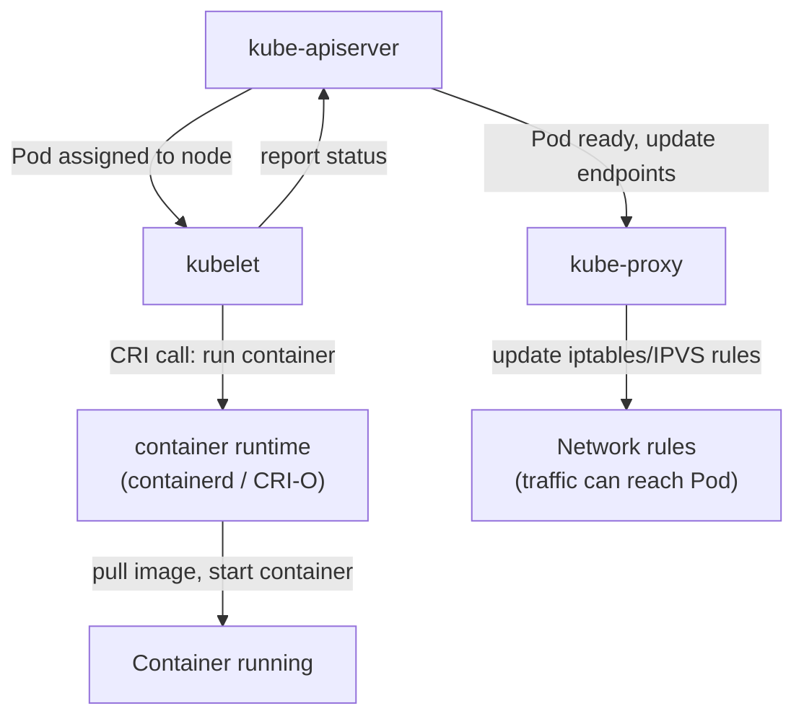

# Worker Node Components

If the control plane is the brain that plans and decides, the worker nodes are the hands that actually do the work. Every container your application runs in lives on a worker node. But a worker node is not just a machine with containers on it , it has a specific set of software components that allow it to participate in the cluster, receive instructions from the control plane, run workloads correctly, and handle network traffic. Without these components, a node is just a computer; with them, it becomes a fully integrated member of the cluster.

This lesson dives into the three essential components present on every worker node: the `kubelet`, `kube-proxy`, and the container runtime. Understanding what each one does , and how they cooperate , will give you a complete picture of what happens between the moment you run `kubectl apply` and the moment your container is actually serving traffic.

## kubelet: The Node Agent

The `kubelet` is the most important component on a worker node. It is an agent , a long-running process that runs on every node and acts as the liaison between that node and the control plane.

Its primary responsibility is to ensure that the containers described in a Pod specification are actually running on the node. Here is how that works in practice: when the scheduler assigns a Pod to a node, it writes the node's name into the Pod object in `etcd` (via the API server). The kubelet on that node is watching the API server for exactly this kind of event. The moment it sees a new Pod assigned to its node, the kubelet reads the Pod specification , which containers to run, which images to use, what volumes to mount, what environment variables to set , and instructs the container runtime to make it happen.

The kubelet does not stop there. After the container starts, the kubelet continuously monitors it. If the container crashes, the kubelet detects it and restarts it (according to the Pod's restart policy). The kubelet also runs any health checks (called liveness and readiness probes) defined in the Pod spec, and reports the results back to the API server so the cluster knows whether the container is healthy.

An important nuance: the kubelet does not manage containers that were not created through Kubernetes. If you were to manually start a container on a node using the container runtime directly, the kubelet would not know about it and would not manage it. The kubelet's world is defined entirely by Pod specifications received from the API server.

:::info
The kubelet also runs on the control plane node in most cluster setups , that is how the control plane components themselves (the API server, scheduler, etc.) are managed as pods. You can verify this by checking which node the `kube-apiserver` pod runs on: it will be the control plane node, managed by the kubelet on that node.
:::

## kube-proxy: The Network Enabler

Every Pod in a Kubernetes cluster gets its own IP address. This is fundamental to how Kubernetes networking works , you can always reach a Pod directly via its IP. But Pod IPs are ephemeral: when a Pod is deleted and replaced, the new Pod gets a new IP address. If other services were talking to the old IP, they would break.

This is where Kubernetes Services come in. A Service provides a stable endpoint , a single IP address and DNS name , that remains constant even as the underlying Pods come and go. But how does traffic sent to a Service IP actually reach one of the Pods behind it? That is the job of `kube-proxy`.

`kube-proxy` runs on every node and maintains a set of network rules (using the Linux kernel's iptables or IPVS subsystems) that redirect traffic destined for a Service IP to one of the actual Pod IPs backing that Service. When a new Pod is added or removed from a Service (because its labels match or stop matching the Service selector), `kube-proxy` updates the network rules to reflect the change.

Think of `kube-proxy` as a traffic director standing at every intersection in the city. When a package (network packet) arrives addressed to "City Hall" (the Service IP), the traffic director knows the current location of City Hall's staff (the Pod IPs) and redirects the package to the right address. The sender does not need to know where the individual staff members are , they just address everything to City Hall, and the traffic director handles the rest.

:::warning
Despite its name, `kube-proxy` does not proxy traffic in the traditional sense (i.e., it does not forward packets through a user-space process). In modern clusters, it programs kernel-level rules that redirect packets efficiently without involving a proxy process for each connection. The name is a historical artifact.
:::

## Container Runtime: The Execution Engine

The container runtime is the software that actually does the work of starting, stopping, and managing containers on a node. Kubernetes does not include a container runtime itself , it delegates all container operations to an external runtime via a standardized interface called the **Container Runtime Interface** (CRI).

The CRI is a plugin API that allows Kubernetes to work with any container runtime that implements it. This design makes Kubernetes runtime-agnostic: as long as a runtime speaks CRI, Kubernetes can use it. The two most common runtimes in modern Kubernetes clusters are:

**containerd** is the most widely used runtime today. It was extracted from Docker and is a lightweight, high-performance runtime focused on running containers reliably. When you install Kubernetes with most cluster tools, containerd is the default.

**CRI-O** is an alternative runtime designed specifically for Kubernetes, following a minimal-footprint philosophy. It implements just enough functionality to satisfy the CRI specification and no more.

:::info
You may have heard of Docker as a container runtime. Docker was used as the Kubernetes runtime for many years, but support for Docker as a runtime (via a bridge component called "dockershim") was removed in Kubernetes 1.24. Today, Docker the tool is still commonly used for building and pushing container images, but the runtime in Kubernetes clusters is containerd or CRI-O , both of which run the same OCI-compliant container images that Docker produces.
:::

## How the Three Components Work Together

When a new Pod is scheduled to a node, here is the precise sequence of events involving all three components:

1. The `kube-scheduler` writes the assigned node name to the Pod object in the API server.
2. The `kubelet` on that node is watching the API server and detects the new assignment.
3. The `kubelet` reads the Pod specification and calls the container runtime (via CRI) to pull the required image and start the container.
4. The container runtime pulls the image (if not cached), creates the container, and starts it.
5. The `kubelet` begins monitoring the container and reporting its status back to the API server.
6. Meanwhile, `kube-proxy` detects that a new Pod is ready and updates the network rules so that Service traffic can reach it.

From the moment you press Enter on `kubectl apply` to the moment traffic is flowing into your container, all three node components play an essential role.



## Hands-On Practice

Let's inspect the node components running in your cluster.

Check which node components are running as pods:

```
kubectl get pods -n kube-system -o wide
```

Look at the output and find the `kube-proxy` pod. In a multi-node cluster, there will be one `kube-proxy` pod per node , it is deployed as a DaemonSet, which is a special Kubernetes workload type that guarantees exactly one pod per node.

Confirm that `kube-proxy` is indeed a DaemonSet:

```
kubectl get daemonset -n kube-system
```

Expected output:

```
NAME         DESIRED   CURRENT   READY   UP-TO-DATE   AVAILABLE   NODE SELECTOR            AGE
kube-proxy   2         2         2       2            2           kubernetes.io/os=linux   50m
```

The numbers under DESIRED and CURRENT match the number of nodes in your cluster.

Now, let's verify the container runtime on a node. The `kubectl get nodes -o wide` command shows it in the `CONTAINER-RUNTIME` column:

```
kubectl get nodes -o wide
```

Expected output (excerpt):

```
NAME           STATUS   ...   CONTAINER-RUNTIME
controlplane   Ready    ...   containerd://1.7.0
node01         Ready    ...   containerd://1.7.0
```

Both nodes are running `containerd` as their container runtime.

Let's deploy a simple pod and watch the kubelet bring it to life:

```
kubectl run test-pod --image=busybox --command -- sleep 3600
```

Then watch the pod status change in real time:

```
kubectl get pod test-pod -w
```

Expected output progression:

```
NAME       READY   STATUS              RESTARTS   AGE
test-pod   0/1     Pending             0          1s
test-pod   0/1     ContainerCreating   0          2s
test-pod   1/1     Running             0          4s
```

The `Pending` state means the scheduler has assigned the pod to a node but the kubelet has not yet pulled the image. `ContainerCreating` means the kubelet has instructed the container runtime to pull the image and start the container. `Running` means the container is live. Press `Ctrl+C` to stop watching.

Describe the pod to see detailed events showing exactly which node component acted at each step:

```
kubectl describe pod test-pod
```

Scroll to the `Events` section at the bottom:

```
Events:
  Type    Reason     Age   From               Message
  ----    ------     ----  ----               -------
  Normal  Scheduled  30s   default-scheduler  Successfully assigned default/test-pod to node01
  Normal  Pulling    29s   kubelet            Pulling image "busybox"
  Normal  Pulled     27s   kubelet            Successfully pulled image "busybox"
  Normal  Created    27s   kubelet            Created container test-pod
  Normal  Started    27s   kubelet            Started container test-pod
```

This event log is a perfect trace of the lifecycle: the scheduler assigned it, the kubelet pulled the image, created the container, and started it. Clean up when done:

```
kubectl delete pod test-pod
```

## Wrapping Up

Every worker node runs three critical components: the `kubelet` acts as the node's agent, receiving Pod assignments and ensuring containers run; `kube-proxy` maintains network rules so that Service traffic reaches the right Pods; and the container runtime (typically `containerd`) is the engine that actually creates and manages containers via the CRI. Together, these three components turn a raw machine into a fully productive member of a Kubernetes cluster. With the architecture of both the control plane and worker nodes now clear, you are ready to start working with the core Kubernetes objects , starting with the smallest deployable unit of all: the Pod.
