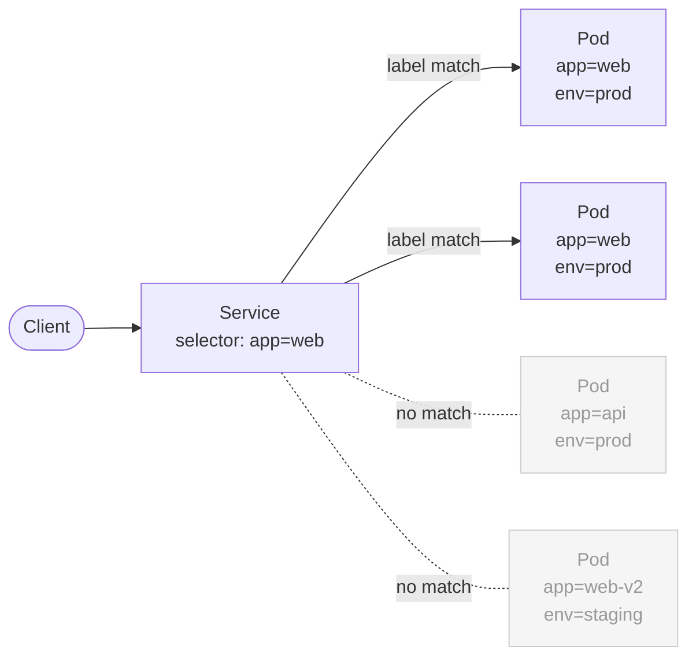

# What Are Labels?

Kubernetes clusters grow fast. A modest production system can have dozens of Deployments, hundreds of Pods, and several Services all living in the same namespace. Without a way to organize and query those objects, you'd quickly be lost in a sea of resource names. Labels are Kubernetes's elegant answer to that problem.

:::info
A label is a key-value pair attached to any Kubernetes object. Labels let you filter, organize, and connect resources in a flexible, decentralized way.
:::

## The Sticky-Note Analogy

Imagine a large filing cabinet filled with hundreds of folders, one for each microservice or component. Without organization, finding everything related to "production" or the "payments" team would mean reading every folder. Labels in Kubernetes are like sticky notes on those folders: you can put as many as you like, then ask the filing system "give me every folder with `env=production`" and it hands you exactly those, nothing more.

## What Labels Actually Are

Technically, a label is a key-value pair stored in the `metadata.labels` field of any Kubernetes object. Both the key and the value are plain strings:

```yaml
apiVersion: v1
kind: Pod
metadata:
  name: web-frontend
  labels:
    app: web
    env: production
    team: platform
spec:
  containers:
    - name: nginx
      image: nginx:1.25
```

You can attach labels to any Kubernetes resource: Pods, Deployments, Services, Nodes, Namespaces, ConfigMaps, anything at all.

## Why Labels Are Everywhere

Labels aren't just for human convenience, they are the primary wiring mechanism inside Kubernetes:

- **Services** use label selectors to decide which Pods receive traffic. No label match, no traffic.
- **Deployments and ReplicaSets** use label selectors to identify the Pods they manage and maintain the correct replica count.
- **NetworkPolicies** use label selectors to define which Pods can talk to which others, without hardcoding IPs.
- **Scheduling** uses labels on Nodes with `nodeSelector` or affinity rules to steer Pods onto specific machines.

The diagram below illustrates the most common relationship, a Service using a label selector to find its backing Pods:



The Service sees four Pods in the namespace but only forwards traffic to the two that carry `app=web`. The others are invisible to it.

## Label Syntax Rules

Labels follow a specific syntax enforced by the Kubernetes API. Understanding these rules will save you from frustrating validation errors.

- **Keys** consist of an optional DNS subdomain prefix and a name, separated by `/`. The name must be 63 characters or fewer, may contain alphanumerics, hyphens (`-`), underscores (`_`), and dots (`.`), and must start and end with an alphanumeric character. The optional prefix (e.g. `app.kubernetes.io`) must be a valid DNS subdomain.
- **Values** follow the same character rules as key names and are also limited to 63 characters. Values can also be empty strings.

| Key | Value |
|---|---|
| `app` | `web` |
| `env` | `production` |
| `version` | `1.4.2` |
| `app.kubernetes.io/name` | `mysql` |
| `team` | `platform-infra` |

:::warning
Label keys and values have a 63-character limit and a restricted character set. If you try to use a long URL, a full sentence, or a JSON blob, the API will reject it. Use **annotations** for large or unstructured metadata, covered in lesson 3.
:::

## Filtering with `-l`

One of the most practical uses of labels is filtering `kubectl` output. The `-l` flag (short for `--selector`) narrows the results to only matching objects:

```bash
# Show all Pods with app=web
kubectl get pods -l app=web

# Show all Pods in production
kubectl get pods -l env=production

# Combine multiple labels (AND logic)
kubectl get pods -l app=web,env=production

# Show all resources with a given label, across kinds
kubectl get all -l team=platform
```

This is invaluable when debugging: instead of scrolling through a long list of every Pod in a namespace, you can instantly narrow the view to exactly the resources you care about.

:::info
You can use `-l` with almost every `kubectl get` command. It also works with `kubectl delete`, making it easy, and dangerous, to delete a whole group of resources at once. Always double-check your selector before running `kubectl delete -l`.
:::

## Hands-On Practice

Open the built-in terminal and follow along with these exercises.

**1. Create a Pod with labels**

```bash
kubectl run web --image=nginx:1.25 --labels="app=web,env=production,team=platform"
```

**2. Verify the labels are attached**

```bash
kubectl get pod web --show-labels
```

**3. Create a second Pod with different labels**

```bash
kubectl run api --image=nginx:1.25 --labels="app=api,env=production,team=backend"
```

**4. Filter Pods by label**

```bash
# Only the web Pod
kubectl get pods -l app=web

# Both Pods share env=production
kubectl get pods -l env=production

# Only the web Pod (AND logic)
kubectl get pods -l app=web,env=production
```

**5. Add a label to an existing Pod**

```bash
kubectl label pod web version=1.0.0
kubectl get pod web --show-labels
```

**6. Remove a label from a Pod**

```bash
# The trailing minus sign removes the label
kubectl label pod web version-
kubectl get pod web --show-labels
```

**7. Clean up**

```bash
kubectl delete pod web api
```

Open the cluster visualizer (telescope icon in the right panel) after step 1 and step 3 to see the Pods appear with their label metadata. Notice how labels show up as tags on each resource card.

## Wrapping Up

Labels are key-value pairs attached to any Kubernetes object. They serve two purposes: human organization (filtering with `kubectl -l`) and internal wiring (Services, Deployments, and NetworkPolicies all rely on them). Keys and values are limited to 63 characters, for richer metadata like URLs or JSON configs, use annotations instead.
