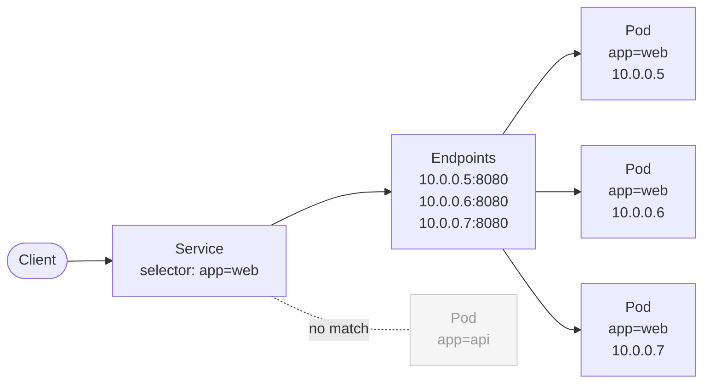

# Label Selectors

Labels would be little more than decorative metadata if there were no way to query them. Label selectors are the query language of Kubernetes — the mechanism that turns a static collection of key-value pairs into a dynamic, filterable, connectable system. Wherever you see one Kubernetes object pointing at another, a label selector is almost certainly doing the work behind the scenes.

## Selectors as a Query Language

Think of label selectors the way you'd think of a search filter on a shopping website. You browse thousands of products, but you can narrow the list by selecting "color: blue", "size: medium", and "brand: X". The website returns only products that match all three criteria simultaneously. Label selectors work the same way: you describe the labels you're looking for, and Kubernetes returns every object that has all of them.

There are two families of selectors: **equality-based** and **set-based**. They have different syntax and expressiveness, and different parts of the Kubernetes API use one or the other (or both).

## Equality-Based Selectors

Equality-based selectors are the simpler form. They compare the value of a label key directly.

- `key=value` or `key==value` — matches objects where the key exists and its value equals the given string.
- `key!=value` — matches objects where the key does not exist, or its value is anything other than the given string.

You'll use these directly in `kubectl` with the `-l` flag, and you'll see them in Service and NetworkPolicy manifests:

```bash
kubectl get pods -l env=production
kubectl get pods -l env!=staging
kubectl get pods -l app=web,env=production
```

When you list multiple expressions separated by commas, they form an **AND** — the object must satisfy every condition. There is no built-in OR at this syntax level.

Services use equality-based selectors in their `.spec.selector` field:

```yaml
apiVersion: v1
kind: Service
metadata:
  name: web-svc
spec:
  selector:
    app: web
    env: production
  ports:
    - port: 80
      targetPort: 8080
```

This Service will route traffic to any Pod that simultaneously carries `app=web` AND `env=production`. A Pod with only one of those labels is ignored.

## Set-Based Selectors

Set-based selectors are more expressive. They let you match against a set of possible values rather than a single one, and they can test for the mere existence of a key regardless of its value.

- `key in (v1, v2)` — matches objects where the key's value is one of the listed values.
- `key notin (v1, v2)` — matches objects where the key doesn't exist, or its value is not in the list.
- `key` — matches objects where the key exists (any value).
- `!key` — matches objects where the key does not exist at all.

These are especially useful in `kubectl` when you need flexible filtering:

```bash
# Pods in either staging or production
kubectl get pods -l "env in (staging,production)"

# Pods that are NOT canary builds
kubectl get pods -l "track notin (canary)"

# Any Pod that has a 'version' label at all
kubectl get pods -l version

# Pods with no 'version' label
kubectl get pods -l '!version'
```

:::info
When using set-based selectors on the command line, wrap the expression in quotes to prevent your shell from misinterpreting the parentheses.
:::

## `matchLabels` and `matchExpressions` in Specs

Deployments, ReplicaSets, and StatefulSets need to identify which Pods they own. They express this in their `.spec.selector` field, which supports both selector families through two sub-fields: `matchLabels` and `matchExpressions`.

`matchLabels` is a shorthand for equality-based selectors. Each key-value pair is treated as `key=value`:

```yaml
selector:
  matchLabels:
    app: web
    env: production
```

`matchExpressions` is an array of set-based rules. Each entry has a `key`, an `operator` (`In`, `NotIn`, `Exists`, or `DoesNotExist`), and an optional `values` list:

```yaml
selector:
  matchExpressions:
    - key: env
      operator: In
      values:
        - staging
        - production
    - key: track
      operator: NotIn
      values:
        - canary
    - key: app
      operator: Exists
```

You can combine both fields in the same selector — an object must satisfy all `matchLabels` entries AND all `matchExpressions` entries. It's AND all the way down.

:::warning
The `spec.selector` of a Deployment or ReplicaSet is **immutable** after creation. If you need to change the selector, you must delete the resource and recreate it. Attempting to patch the selector will be rejected by the API server.
:::

## How Services Build Their Endpoints List

This is where selectors become truly powerful. When you create a Service with a selector, Kubernetes starts a continuous watch. Every time a Pod is created, updated, or deleted anywhere in the namespace, the Endpoints controller re-evaluates which Pods match the Service's selector. The resulting list of IP addresses and ports becomes the Service's Endpoints object — and that's what kube-proxy (or whatever CNI you're using) uses to forward traffic.



The beauty of this design is that it's entirely dynamic. Scale up from 3 Pods to 10, and the Endpoints list grows automatically. A Pod crashes, and within seconds it's removed from the Endpoints list and traffic stops going to it. The Service itself never changes — only its backing Endpoints do.

## The Most Common Pitfall: Selector Mismatch

The single most frequent mistake when working with label selectors is a mismatch between the selector and the actual labels on the Pods. This is especially easy to get wrong when writing Deployment manifests, because you have to define labels in two places: the `.spec.selector` and the `.spec.template.metadata.labels`.

```yaml
apiVersion: apps/v1
kind: Deployment
metadata:
  name: web
spec:
  replicas: 3
  selector:
    matchLabels:
      app: web        # <-- must match the template labels below
  template:
    metadata:
      labels:
        app: web      # <-- must match the selector above
    spec:
      containers:
        - name: nginx
          image: nginx:1.25
```

If the selector says `app: web` but the template labels say `app: webapp`, the Deployment will fail validation — the API server checks this at creation time for Deployments. For Services, there's no such validation: the Service will be created successfully, but its Endpoints list will be empty, and no traffic will ever reach your Pods. This causes a maddening situation where the Service exists, the Pods exist, but requests simply time out.

:::warning
If a Service is returning connection timeouts and you're sure the Pods are running, the first thing to check is whether the Service's selector matches the actual labels on the Pods. Run `kubectl describe service <name>` and look at the `Endpoints:` line — if it shows `<none>`, the selector isn't matching anything.
:::

## AND Logic Is the Only Logic

It's worth repeating: Kubernetes label selectors only support AND logic natively. There is no OR operator in a selector expression. If you need something like "select Pods from team A or team B", you have two options: give both teams' Pods a shared label (like `division: engineering`) and select on that, or use a set-based `In` expression (`team in (team-a, team-b)`).

Understanding this constraint upfront will help you design your label taxonomy in a way that actually supports the queries you'll need to run.

## Hands-On Practice

Open the terminal and work through these exercises to see selectors in action.

**1. Create Pods with varied labels**

```bash
kubectl run web-prod --image=nginx:1.25 --labels="app=web,env=production,track=stable"
kubectl run web-staging --image=nginx:1.25 --labels="app=web,env=staging,track=stable"
kubectl run api-prod --image=nginx:1.25 --labels="app=api,env=production,track=stable"
kubectl run web-canary --image=nginx:1.25 --labels="app=web,env=production,track=canary"
```

**2. Practice equality-based selectors**

```bash
kubectl get pods -l app=web
kubectl get pods -l env=production
kubectl get pods -l app=web,env=production
```

**3. Practice set-based selectors**

```bash
kubectl get pods -l "env in (staging,production)"
kubectl get pods -l "track notin (canary)"
kubectl get pods -l "track notin (canary),app=web"
```

**4. Create a Service and inspect its Endpoints**

```bash
kubectl expose pod web-prod --name=web-svc --port=80 --selector="app=web,env=production,track=stable"
kubectl describe service web-svc
# Look at the Endpoints line — it should list the IPs of matching Pods
kubectl get endpoints web-svc
```

**5. Deliberately break the selector and observe empty Endpoints**

```bash
kubectl delete service web-svc
kubectl expose pod web-prod --name=web-svc --port=80 --selector="app=doesnotexist"
kubectl get endpoints web-svc
# Endpoints should show <none>
```

**6. Clean up**

```bash
kubectl delete pod web-prod web-staging api-prod web-canary
kubectl delete service web-svc
```
