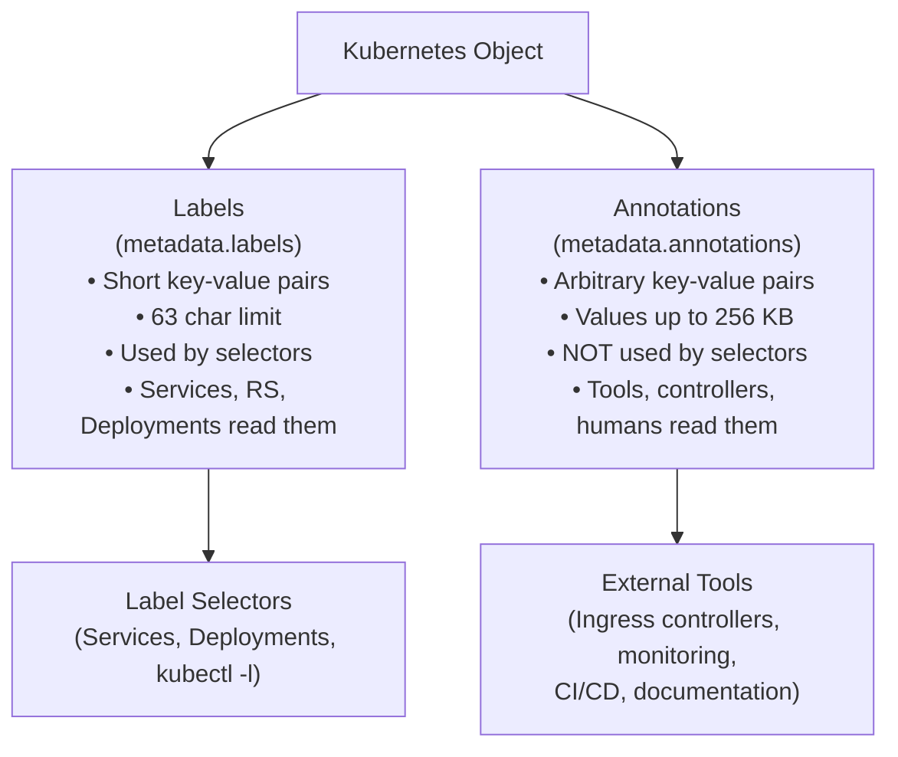

# Annotations

Labels and annotations are often introduced together, and for good reason , they're siblings, not twins. Both live in the `metadata` section of a Kubernetes object, and both store key-value pairs. But they serve completely different purposes, and confusing the two leads to subtle bugs and a messier cluster. This lesson explains what annotations are, why they exist alongside labels, and how to use them effectively.

## The Library Book Analogy

Imagine a library's cataloguing system. Every book has a call number , a short, structured code like `QA76.73.P98` , printed on the spine. Librarians use that number to shelve books and patrons use it to find them on the shelves. The call number is designed to be searched and sorted: it's the library's equivalent of a label.

But a book also has a lot more information attached to it: the ISBN, the publisher's notes on the back cover, margin annotations left by previous readers, a stamp showing which branch it came from, a slip of paper with the last three due dates. None of that information is used to locate the book on the shelf. It's there for humans and systems that need richer context once they've already found the book.

Annotations are exactly those richer notes. They are metadata attached to a Kubernetes object that is not meant for selecting or filtering , they're meant for informing tools, operators, and humans.

## Labels vs. Annotations at a Glance

The fundamental rule is simple:

- **Labels** are for selection and identification. They must conform to strict size and character rules. Kubernetes uses them internally to wire objects together.
- **Annotations** are for information. They have looser rules (values can be large, up to 256 KB), and Kubernetes itself mostly ignores their contents , but tools, controllers, and humans read them.



## What Annotations Are Used For

Annotations serve as a communication channel between the people and systems that deploy software and the tools that operate it. Here are the most common use cases you'll encounter in real clusters.

**Ownership and contact information.** It's useful to know who owns a resource , especially in large organizations where dozens of teams share a cluster. Many teams annotate their resources with an on-call contact or a link to a runbook:

```yaml
annotations:
  contact: "platform-team@example.com"
  runbook: "https://wiki.example.com/runbooks/web-service"
```

**Build and deploy metadata.** CI/CD pipelines often annotate resources with the Git commit SHA, the build number, or the pipeline URL that produced the current deployment. This creates a direct audit trail:

```yaml
annotations:
  git-commit: "a3f2c1d"
  build-number: "1042"
  deploy-pipeline: "https://ci.example.com/pipelines/1042"
```

**Tool configuration.** This is perhaps the most powerful use of annotations. Many Kubernetes ecosystem tools use annotations as a configuration interface, because they can't add new fields to the core Kubernetes API. Ingress controllers are the canonical example:

```yaml
annotations:
  nginx.ingress.kubernetes.io/rewrite-target: /
  nginx.ingress.kubernetes.io/ssl-redirect: "true"
  nginx.ingress.kubernetes.io/proxy-body-size: "10m"
```

Prometheus uses annotations on Pods and Services to configure scraping:

```yaml
annotations:
  prometheus.io/scrape: "true"
  prometheus.io/port: "9090"
  prometheus.io/path: "/metrics"
```

The cert-manager operator reads annotations on Ingress objects to know which TLS certificates to issue and renew automatically. Velero uses them to control backup behavior. Karpenter uses them to influence node provisioning decisions. The pattern is everywhere: if a Kubernetes-native tool needs configuration that doesn't fit into the core API, it reaches for annotations.

:::info
Annotations are not validated or interpreted by the Kubernetes API server itself (with a few rare exceptions). It's the external tools that give them meaning. This makes annotations an extensible configuration layer that works without modifying the Kubernetes source code.
:::

## Annotation Key Syntax

Annotation keys follow the same format as label keys: an optional DNS subdomain prefix, a slash, and a name. The name must be 63 characters or fewer. The difference is in values: while label values are limited to 63 characters and a restricted character set, annotation values can be arbitrary strings up to 256 KB. This means you can store JSON, YAML snippets, long descriptions, and even small data blobs in an annotation value.

```yaml
annotations:
  # Short string
  team: platform

  # Long description
  description: "This service handles payment processing for the checkout flow."

  # JSON config consumed by a sidecar
  sidecar.config/options: '{"timeout": 30, "retries": 3, "circuit_breaker": true}'
```

## Viewing Annotations

The easiest way to see annotations on a resource is `kubectl describe`. After the basic metadata, there's a dedicated `Annotations:` section:

```bash
kubectl describe pod my-pod
```

```
Name:         my-pod
Namespace:    default
Annotations:  contact: platform-team@example.com
              git-commit: a3f2c1d
              runbook: https://wiki.example.com/runbooks/web-service
...
```

If you want to extract a specific annotation value programmatically , for example, in a shell script , use `kubectl get` with a `jsonpath` expression:

```bash
kubectl get pod my-pod -o jsonpath='{.metadata.annotations.contact}'
```

For nested or prefixed keys, use the bracket notation:

```bash
kubectl get pod my-pod -o jsonpath='{.metadata.annotations.nginx\.ingress\.kubernetes\.io/rewrite-target}'
```

## Adding and Updating Annotations

You can add an annotation to any existing resource with `kubectl annotate`:

```bash
kubectl annotate pod my-pod contact="platform-team@example.com"
```

If the annotation already exists and you need to change its value, add the `--overwrite` flag:

```bash
kubectl annotate pod my-pod contact="new-team@example.com" --overwrite
```

To remove an annotation, append a trailing minus sign to the key:

```bash
kubectl annotate pod my-pod contact-
```

You can also define annotations directly in your YAML manifests, which is the preferred approach for anything that should be persisted and version-controlled:

```yaml
apiVersion: v1
kind: Pod
metadata:
  name: my-pod
  labels:
    app: web
  annotations:
    contact: "platform-team@example.com"
    git-commit: "a3f2c1d"
    runbook: "https://wiki.example.com/runbooks/web-service"
spec:
  containers:
    - name: nginx
      image: nginx:1.25
```

:::warning
Annotations cannot be used in label selectors. If you annotate a Pod with `env: production` instead of labeling it, a Service with `selector: env: production` will not find that Pod. Selection works only through labels. If you store something in an annotation thinking you'll filter on it later, you'll be surprised to find that `kubectl get pods -l` cannot see it.
:::

## Hands-On Practice

Follow along in the terminal to practice viewing and managing annotations.

**1. Create a Pod with annotations in a manifest**

```bash
kubectl apply -f - <<EOF
apiVersion: v1
kind: Pod
metadata:
  name: annotated-pod
  labels:
    app: web
  annotations:
    contact: "platform-team@example.com"
    runbook: "https://wiki.example.com/runbooks/web"
    git-commit: "a3f2c1d"
spec:
  containers:
    - name: nginx
      image: nginx:1.25
EOF
```

**2. View annotations with `kubectl describe`**

```bash
kubectl describe pod annotated-pod
# Scroll up to find the Annotations: section
```

**3. Extract a specific annotation with jsonpath**

```bash
kubectl get pod annotated-pod -o jsonpath='{.metadata.annotations.contact}'
echo ""
kubectl get pod annotated-pod -o jsonpath='{.metadata.annotations.runbook}'
echo ""
```

**4. Add a new annotation to the running Pod**

```bash
kubectl annotate pod annotated-pod build-number="1042"
kubectl describe pod annotated-pod | grep -A5 Annotations
```

**5. Update an existing annotation**

```bash
kubectl annotate pod annotated-pod contact="new-team@example.com" --overwrite
kubectl get pod annotated-pod -o jsonpath='{.metadata.annotations.contact}'
echo ""
```

**6. Remove an annotation**

```bash
kubectl annotate pod annotated-pod build-number-
kubectl describe pod annotated-pod | grep -A5 Annotations
```

**7. View all annotations as JSON**

```bash
kubectl get pod annotated-pod -o jsonpath='{.metadata.annotations}' | python3 -m json.tool
```

**8. Clean up**

```bash
kubectl delete pod annotated-pod
```
