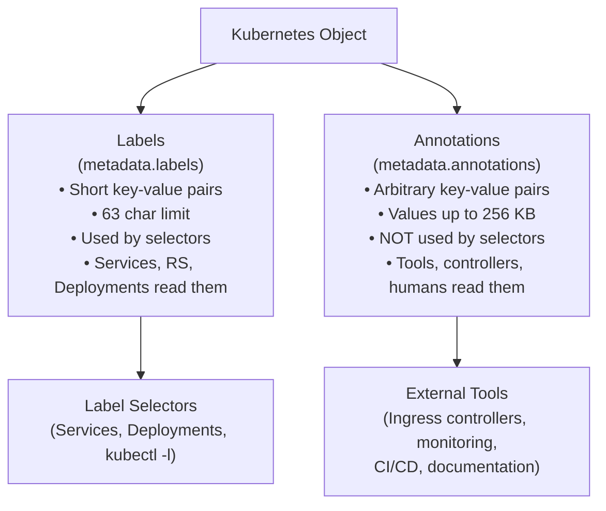

# Annotations

Labels and annotations are often introduced together, and for good reason, they're siblings, not twins. Both live in the `metadata` section of a Kubernetes object, and both store key-value pairs. But they serve completely different purposes, and confusing the two leads to subtle bugs and a messier cluster.

## Labels vs. Annotations at a Glance

The fundamental rule is simple:

- **Labels** are for selection and identification. They must conform to strict size and character rules. Kubernetes uses them internally to wire objects together.
- **Annotations** are for information. They have looser rules (values can be up to 256 KB), and Kubernetes itself mostly ignores their contents, but tools, controllers, and humans read them.



## What Annotations Are Used For

Annotations serve as a communication channel between the people who deploy software and the tools that operate it. Common use cases:

**Ownership and contact information**, who owns a resource and where to find the runbook:

```yaml
annotations:
  contact: 'platform-team@example.com'
  runbook: 'https://wiki.example.com/runbooks/web-service'
```

**Build and deploy metadata**, a direct audit trail from CI/CD:

```yaml
annotations:
  git-commit: 'a3f2c1d'
  build-number: '1042'
  deploy-pipeline: 'https://ci.example.com/pipelines/1042'
```

**Tool configuration**, many ecosystem tools use annotations as their configuration interface, since they can't add new fields to the core Kubernetes API:

```yaml
annotations:
  nginx.ingress.kubernetes.io/rewrite-target: /
  nginx.ingress.kubernetes.io/ssl-redirect: 'true'
  nginx.ingress.kubernetes.io/proxy-body-size: '10m'
```

```yaml
annotations:
  prometheus.io/scrape: 'true'
  prometheus.io/port: '9090'
  prometheus.io/path: '/metrics'
```

This pattern is everywhere in the Kubernetes ecosystem:

- **cert-manager** reads Ingress annotations to know which TLS certificates to issue and renew automatically.
- **Velero** uses them to control backup behavior per resource.
- **Karpenter** uses them to influence node provisioning decisions.

:::info
Annotations are not validated or interpreted by the Kubernetes API server itself (with a few rare exceptions). External tools give them meaning. This makes annotations an extensible configuration layer that works without modifying the Kubernetes source code.
:::

## Annotation Key Syntax

Annotation keys follow the same format as label keys: an optional DNS subdomain prefix, a slash, and a name (63 characters or fewer). The key difference is in values: while label values are limited to 63 characters and a restricted character set, annotation values can be arbitrary strings up to 256 KB, including JSON, YAML snippets, long descriptions, or small data blobs.

```yaml
annotations:
  # Short string
  team: platform

  # Long description
  description: 'This service handles payment processing for the checkout flow.'

  # JSON config consumed by a sidecar
  sidecar.config/options: '{"timeout": 30, "retries": 3, "circuit_breaker": true}'
```

## Viewing Annotations

The easiest way to see annotations on a resource is `kubectl describe`. After the basic metadata, there's a dedicated `Annotations:` section:

```bash
kubectl describe pod my-pod
```

```
Name:         my-pod
Namespace:    default
Annotations:  contact: platform-team@example.com
              git-commit: a3f2c1d
              runbook: https://wiki.example.com/runbooks/web-service
...
```

To extract a specific annotation value programmatically, use `kubectl get` with a `jsonpath` expression:

```bash
kubectl get pod my-pod -o jsonpath='{.metadata.annotations.contact}'
```

For prefixed keys containing dots, escape the dots in the jsonpath key path:

```bash
kubectl get pod my-pod -o jsonpath='{.metadata.annotations.nginx\.ingress\.kubernetes\.io/rewrite-target}'
```

## Adding and Updating Annotations

Add an annotation to any existing resource with `kubectl annotate`. Update it with `--overwrite`, or remove it with a trailing minus sign:

```bash
kubectl annotate pod my-pod contact="platform-team@example.com"
kubectl annotate pod my-pod contact="new-team@example.com" --overwrite
kubectl annotate pod my-pod contact-
```

Defining annotations directly in YAML manifests is the preferred approach for anything that should be version-controlled:

In this simulator, annotations declared in `metadata.annotations` are interpreted during `kubectl apply -f ...` and persisted on the created or updated resource.

```yaml
apiVersion: v1
kind: Pod
metadata:
  name: my-pod
  labels:
    app: web
  annotations:
    contact: 'platform-team@example.com'
    git-commit: 'a3f2c1d'
    runbook: 'https://wiki.example.com/runbooks/web-service'
spec:
  containers:
    - name: nginx
      image: nginx:1.28
```

:::warning
Annotations cannot be used in label selectors. If you annotate a Pod with `env: production` instead of labeling it, a Service with `selector: env: production` will not find that Pod. If you store something in an annotation thinking you'll filter on it later, `kubectl get pods -l` cannot see it.
:::

## Hands-On Practice

Follow along in the terminal to practice viewing and managing annotations.

**1. Create a Pod with annotations in a manifest**

```yaml
# annotated-pod.yaml
apiVersion: v1
kind: Pod
metadata:
  name: annotated-pod
  labels:
    app: web
  annotations:
    contact: 'platform-team@example.com'
    runbook: 'https://wiki.example.com/runbooks/web'
    git-commit: 'a3f2c1d'
spec:
  containers:
    - name: nginx
      image: nginx:1.28
```

```bash
kubectl apply -f annotated-pod.yaml
```

**2. View annotations with `kubectl describe`**

```bash
kubectl describe pod annotated-pod
# Scroll up to find the Annotations: section
```

**3. Extract a specific annotation with jsonpath**

```bash
kubectl get pod annotated-pod -o jsonpath='{.metadata.annotations.contact}'
kubectl get pod annotated-pod -o jsonpath='{.metadata.annotations.runbook}'
```

**4. Add a new annotation to the running Pod**

```bash
kubectl annotate pod annotated-pod build-number="1042"
kubectl describe pod annotated-pod
```

**5. Update an existing annotation**

```bash
kubectl annotate pod annotated-pod contact="new-team@example.com" --overwrite
kubectl get pod annotated-pod -o jsonpath='{.metadata.annotations.contact}'
```

**6. Remove an annotation**

```bash
kubectl annotate pod annotated-pod build-number-
kubectl describe pod annotated-pod
```

**7. View all annotations**

```bash
kubectl get pod annotated-pod -o jsonpath='{.metadata.annotations}'
```

**8. Clean up**

```bash
kubectl delete pod annotated-pod
```

## Wrapping Up

Annotations and labels are complementary: labels wire objects together and enable selection; annotations carry richer metadata for tools, operators, and humans. Annotation values can be up to 256 KB, making them the right home for URLs, JSON configs, CI metadata, and contact info. Just remember: you cannot filter on annotations with `kubectl -l`.
