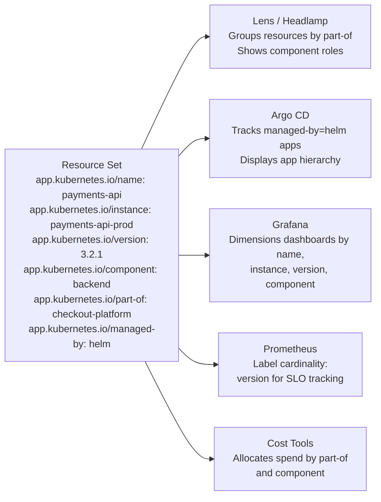

# Recommended Labels, The `app.kubernetes.io/*` Convention

Labels are flexible by design. Kubernetes doesn't force any particular naming scheme, you're free to call your labels whatever you like. That freedom is powerful, but it creates a common problem: every team invents its own conventions, and the result is a cluster where no two applications look the same to the tools that need to understand them.

:::info
The Kubernetes project recommends a standard set of labels under the `app.kubernetes.io/` prefix. Following this convention means dashboards, cost tools, and deployment systems work out of the box, without per-team configuration.
:::

## The Problem with Ad-Hoc Labels

Imagine three teams deploying to a shared cluster: the platform team labels Pods with `service=payments-api` and `release=v2.1.0`; the backend team uses `name=orders-service` and `tag=latest`; the frontend team uses `component=dashboard` with no version label at all. Each convention makes sense within its own context, but to a monitoring dashboard or cost analysis tool, the cluster looks like chaos.

The inconsistency also makes on-call debugging harder. When an alert fires, a responder needs to quickly identify what application is affected, who owns it, what version is running, and what larger system it belongs to. With ad-hoc labels, that information might exist, but in completely different keys for every service.

## The Standard: `app.kubernetes.io/`

The prefix `app.kubernetes.io` clearly signals that these are standardized Kubernetes application labels, distinct from vendor-specific or team-specific labels. They are documented in the official Kubernetes documentation and adopted by Helm, Kustomize, Argo CD, Lens, Grafana, and dozens of other tools. When you follow this convention, the ecosystem "just works", dashboards populate automatically, cost attribution becomes straightforward, and any engineer can look at any resource and immediately understand its context.

## The Recommended Labels

| Label                          | Purpose                                                   | Example                                     |
| ------------------------------ | --------------------------------------------------------- | ------------------------------------------- |
| `app.kubernetes.io/name`       | The canonical name of the application                     | `mysql`, `my-web-app`                       |
| `app.kubernetes.io/instance`   | A unique name for this specific instance                  | `mysql-prod`, `my-web-app-eu-west`          |
| `app.kubernetes.io/version`    | The version of the application (not the resource version) | `5.7.21`, `1.4.2`, `2024-11-01-gitsha`      |
| `app.kubernetes.io/component`  | The role this resource plays in the architecture          | `frontend`, `backend`, `database`, `worker` |
| `app.kubernetes.io/part-of`    | The larger application or system this belongs to          | `checkout-platform`, `data-pipeline`        |
| `app.kubernetes.io/managed-by` | The tool managing the lifecycle of this resource          | `helm`, `kustomize`, `argo-cd`, `kubectl`   |

## Putting It All Together

Here's what a well-labeled Deployment manifest looks like following the recommended convention:

```yaml
apiVersion: apps/v1
kind: Deployment
metadata:
  name: payments-api
  labels:
    app.kubernetes.io/name: payments-api
    app.kubernetes.io/instance: payments-api-prod
    app.kubernetes.io/version: '3.2.1'
    app.kubernetes.io/component: backend
    app.kubernetes.io/part-of: checkout-platform
    app.kubernetes.io/managed-by: helm
spec:
  replicas: 3
  selector:
    matchLabels:
      app.kubernetes.io/name: payments-api
      app.kubernetes.io/instance: payments-api-prod
  template:
    metadata:
      labels:
        app.kubernetes.io/name: payments-api
        app.kubernetes.io/instance: payments-api-prod
        app.kubernetes.io/version: '3.2.1'
        app.kubernetes.io/component: backend
        app.kubernetes.io/part-of: checkout-platform
        app.kubernetes.io/managed-by: helm
    spec:
      containers:
        - name: payments-api
          image: myregistry/payments-api:3.2.1
```

Notice that the Pod template carries all the same labels as the Deployment itself. Tools that inspect individual Pods (like Grafana or Prometheus) need to read these labels directly from the Pod, not just from the parent Deployment.

## How Tools Use These Labels

The diagram below shows a single resource set labeled following the convention, and the tools that automatically consume those labels without additional configuration:



Each tool benefits in a specific way:

- **Grafana** uses `name` and `version` as dashboard dimensions, making it trivial to compare latency or error rates across versions, without custom dashboard configuration.
- **Lens and Headlamp** use `part-of` to build a visual hierarchy, grouping the frontend, backend, database, and worker of `checkout-platform` under a single application node.
- **Argo CD** uses `managed-by` to distinguish Helm-managed apps from directly applied resources, and `instance` to track state across environments.
- **Cost analysis tools** like Kubecost use `part-of` and `component` to allocate infrastructure spend by application and component.

## Helm Uses These Labels by Default

If you use Helm, you get most of these labels for free. Helm's standard chart templates include the recommended labels automatically, populated from `Chart.yaml` and `values.yaml`. When you run `helm install my-release my-chart`, Helm stamps every created resource with `app.kubernetes.io/name: my-chart`, `app.kubernetes.io/instance: my-release`, and `app.kubernetes.io/managed-by: Helm`. This is why Helm charts are immediately legible in cluster dashboards, they speak the common label language out of the box.

:::info
You don't have to use all six recommended labels on every resource. Start with `name`, `instance`, and `component`, those three alone make your cluster dramatically more organized and tool-friendly. Add the rest as your workflow and tooling evolves.
:::

:::warning
Don't use the `app.kubernetes.io/` prefix for your own team-specific labels. That prefix is reserved for the standard labels. For custom labels, use your own domain as a prefix (e.g., `mycompany.io/cost-center`) to avoid future conflicts with new Kubernetes-standard labels that might be introduced under the same prefix.
:::

## Hands-On Practice

Let's deploy a small application using the recommended label convention and see how filtering becomes effortless.

**1. Deploy a frontend component**

```bash
kubectl apply -f - <<EOF
apiVersion: apps/v1
kind: Deployment
metadata:
  name: frontend
  labels:
    app.kubernetes.io/name: my-web-app
    app.kubernetes.io/instance: my-web-app-prod
    app.kubernetes.io/version: "2.0.0"
    app.kubernetes.io/component: frontend
    app.kubernetes.io/part-of: checkout-platform
    app.kubernetes.io/managed-by: kubectl
spec:
  replicas: 2
  selector:
    matchLabels:
      app.kubernetes.io/name: my-web-app
      app.kubernetes.io/component: frontend
  template:
    metadata:
      labels:
        app.kubernetes.io/name: my-web-app
        app.kubernetes.io/instance: my-web-app-prod
        app.kubernetes.io/version: "2.0.0"
        app.kubernetes.io/component: frontend
        app.kubernetes.io/part-of: checkout-platform
        app.kubernetes.io/managed-by: kubectl
    spec:
      containers:
        - name: nginx
          image: nginx:1.25
EOF
```

**2. Deploy a backend component**

```bash
kubectl apply -f - <<EOF
apiVersion: apps/v1
kind: Deployment
metadata:
  name: backend
  labels:
    app.kubernetes.io/name: payments-api
    app.kubernetes.io/instance: payments-api-prod
    app.kubernetes.io/version: "3.1.0"
    app.kubernetes.io/component: backend
    app.kubernetes.io/part-of: checkout-platform
    app.kubernetes.io/managed-by: kubectl
spec:
  replicas: 3
  selector:
    matchLabels:
      app.kubernetes.io/name: payments-api
      app.kubernetes.io/component: backend
  template:
    metadata:
      labels:
        app.kubernetes.io/name: payments-api
        app.kubernetes.io/instance: payments-api-prod
        app.kubernetes.io/version: "3.1.0"
        app.kubernetes.io/component: backend
        app.kubernetes.io/part-of: checkout-platform
        app.kubernetes.io/managed-by: kubectl
    spec:
      containers:
        - name: nginx
          image: nginx:1.25
EOF
```

**3. Query by platform and by component**

```bash
# All resources in the checkout-platform
kubectl get all -l app.kubernetes.io/part-of=checkout-platform

# Only the frontend Pods
kubectl get pods -l app.kubernetes.io/component=frontend

# Only the backend Pods
kubectl get pods -l app.kubernetes.io/component=backend

# All Pods managed by kubectl
kubectl get pods -l app.kubernetes.io/managed-by=kubectl
```

**4. Show labels in the output**

```bash
kubectl get pods -l app.kubernetes.io/part-of=checkout-platform --show-labels
```

**5. Clean up**

```bash
kubectl delete deployment frontend backend
```

Open the cluster visualizer after deploying both components, notice how resources organized with the recommended labels display richer, more structured metadata in the visualization.

## Wrapping Up

The `app.kubernetes.io/*` labels are a community-standard naming convention that the entire Kubernetes ecosystem understands. Using them consistently enables dashboards, cost tools, and deployment systems to work out of the box. Start with `name`, `instance`, and `component`, then add the rest as your workflow evolves.
