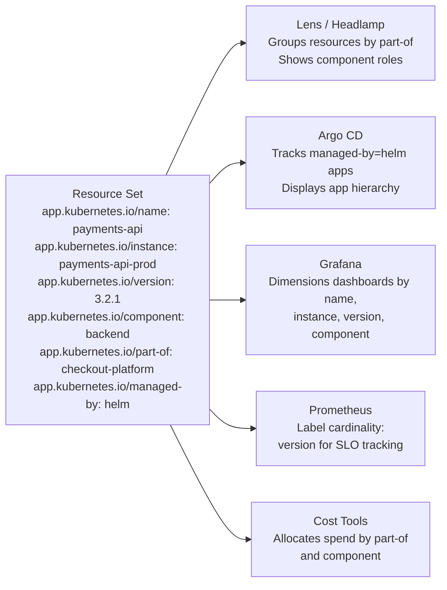

# Recommended Labels — The `app.kubernetes.io/*` Convention

Labels are flexible by design. Kubernetes doesn't force you to use any particular naming scheme — you're free to call your labels whatever you like. That freedom is powerful, but it also creates a common problem: every team ends up inventing its own conventions, and the result is a cluster where no two applications look the same to the tools that need to understand them.

## The Problem with Ad-Hoc Labels

Imagine three teams at the same company, each deploying services to a shared cluster. The platform team labels their Pods with `service=payments-api` and `release=v2.1.0`. The backend team uses `name=orders-service` and `tag=latest`. The frontend team uses `component=dashboard` with no version label at all. Each convention makes sense within its own context, but from the outside — from the perspective of a monitoring dashboard, a cluster visualization tool, or a cost analysis tool — the cluster looks like chaos.

Dashboards like Grafana need to group resources by application. Argo CD needs to know which resources belong to which app. Lens needs to display a sensible hierarchy. When every team uses different label keys, these tools either can't do their job or require complex per-team configuration. The inconsistency also makes on-call debugging harder: when an alert fires, the responder needs to quickly identify what application is affected, who owns it, what version is running, and what larger system it belongs to. With ad-hoc labels, that information might exist — but in completely different keys for every service.

## The Standard: `app.kubernetes.io/`

To solve this, the Kubernetes project recommends a set of well-known labels under the `app.kubernetes.io/` prefix. These are documented in the official Kubernetes documentation and are adopted by Helm, Kustomize, Argo CD, Lens, Grafana, and dozens of other tools. When you follow this convention, the ecosystem "just works" — dashboards populate automatically, cost attribution becomes straightforward, and any engineer can look at any resource and immediately understand its context.

The prefix `app.kubernetes.io` clearly signals that these are standardized Kubernetes application labels, distinct from any vendor-specific or team-specific labels you might also use.

## The Recommended Labels

Here is the full set of recommended labels, what each one means, and an example of what its value looks like.

**`app.kubernetes.io/name`** — The name of the application itself, regardless of instance or environment. This is the canonical name of the software being deployed.

> Example: `mysql`, `redis`, `my-web-app`

**`app.kubernetes.io/instance`** — A unique name that distinguishes this particular instance of the application. Two deployments of the same app in different environments (or two separate installations of the same Helm chart) would share the same `name` but have different `instance` values.

> Example: `mysql-prod`, `mysql-staging`, `my-web-app-eu-west`

**`app.kubernetes.io/version`** — The version of the application currently deployed. This is not the Kubernetes resource version — it's the version of your software.

> Example: `5.7.21`, `1.4.2`, `2024-11-01-gitsha`

**`app.kubernetes.io/component`** — The role this specific resource plays within the application architecture. A complex application might have multiple components: a frontend, a backend API, a database, a cache, a worker process.

> Example: `frontend`, `backend`, `database`, `cache`, `worker`

**`app.kubernetes.io/part-of`** — The name of the larger application or system that this component belongs to. This is especially useful in microservice architectures where many individual services are logically part of one product.

> Example: `my-web-app`, `checkout-platform`, `data-pipeline`

**`app.kubernetes.io/managed-by`** — The tool that manages the lifecycle of this resource. This helps both humans and tools understand whether they should be managing a resource manually or deferring to an automated system.

> Example: `helm`, `kustomize`, `argo-cd`, `kubectl`

## Putting It All Together

Here's what a well-labeled Deployment manifest looks like following the recommended convention:

```yaml
apiVersion: apps/v1
kind: Deployment
metadata:
  name: payments-api
  labels:
    app.kubernetes.io/name: payments-api
    app.kubernetes.io/instance: payments-api-prod
    app.kubernetes.io/version: "3.2.1"
    app.kubernetes.io/component: backend
    app.kubernetes.io/part-of: checkout-platform
    app.kubernetes.io/managed-by: helm
spec:
  replicas: 3
  selector:
    matchLabels:
      app.kubernetes.io/name: payments-api
      app.kubernetes.io/instance: payments-api-prod
  template:
    metadata:
      labels:
        app.kubernetes.io/name: payments-api
        app.kubernetes.io/instance: payments-api-prod
        app.kubernetes.io/version: "3.2.1"
        app.kubernetes.io/component: backend
        app.kubernetes.io/part-of: checkout-platform
        app.kubernetes.io/managed-by: helm
    spec:
      containers:
        - name: payments-api
          image: myregistry/payments-api:3.2.1
```

Notice that the Pod template carries all the same labels as the Deployment itself. This is important: tools that inspect individual Pods (like Grafana or Prometheus) need to be able to read these labels directly from the Pod, not just from the parent Deployment.

## How Tools Use These Labels

The diagram below shows a single resource set labeled following the convention, and the multiple tools that automatically consume those labels without any additional configuration:



**Grafana** dashboards built on top of Prometheus metrics can use `app.kubernetes.io/name` and `app.kubernetes.io/version` as label dimensions, making it trivial to compare latency or error rates across versions — without any custom dashboard configuration.

**Lens and Headlamp** use `app.kubernetes.io/part-of` to build a visual hierarchy of your cluster, grouping the frontend, backend, database, and worker components of `checkout-platform` under a single application node in the graph.

**Argo CD** uses `app.kubernetes.io/managed-by` to understand which applications are Helm-managed versus directly applied. It also respects the `instance` label when tracking the state of individual app instances across environments.

**Cost analysis tools** like Kubecost use `app.kubernetes.io/part-of` and `app.kubernetes.io/component` to allocate infrastructure spend by application and component, giving you a clear picture of what each service costs.

## Helm Uses These Labels by Default

If you use Helm to deploy applications, you get most of these labels for free. Helm's standard chart templates include the recommended labels automatically, populated from the chart's `Chart.yaml` and `values.yaml`. When you run `helm install my-release my-chart`, Helm stamps every created resource with labels like `app.kubernetes.io/name: my-chart`, `app.kubernetes.io/instance: my-release`, and `app.kubernetes.io/managed-by: Helm`. This is one reason why Helm charts are so legible in cluster dashboards — they speak the common label language out of the box.

:::info
You don't have to use all six recommended labels on every resource. Start with `name`, `instance`, and `component` — those three alone make your cluster dramatically more organized and tool-friendly. Add the rest as your workflow and tooling evolves.
:::

:::warning
Don't use the `app.kubernetes.io/` prefix for your own team-specific labels. That prefix is reserved for the standard labels. If you have custom labels, use your own domain as a prefix (e.g., `mycompany.io/cost-center`) to avoid future conflicts with new Kubernetes-standard labels that might be introduced under the same prefix.
:::

## Hands-On Practice

Let's deploy a small application using the recommended label convention and see how filtering becomes effortless.

**1. Deploy a frontend component**

```bash
kubectl apply -f - <<EOF
apiVersion: apps/v1
kind: Deployment
metadata:
  name: frontend
  labels:
    app.kubernetes.io/name: my-web-app
    app.kubernetes.io/instance: my-web-app-prod
    app.kubernetes.io/version: "2.0.0"
    app.kubernetes.io/component: frontend
    app.kubernetes.io/part-of: checkout-platform
    app.kubernetes.io/managed-by: kubectl
spec:
  replicas: 2
  selector:
    matchLabels:
      app.kubernetes.io/name: my-web-app
      app.kubernetes.io/component: frontend
  template:
    metadata:
      labels:
        app.kubernetes.io/name: my-web-app
        app.kubernetes.io/instance: my-web-app-prod
        app.kubernetes.io/version: "2.0.0"
        app.kubernetes.io/component: frontend
        app.kubernetes.io/part-of: checkout-platform
        app.kubernetes.io/managed-by: kubectl
    spec:
      containers:
        - name: nginx
          image: nginx:1.25
EOF
```

**2. Deploy a backend component**

```bash
kubectl apply -f - <<EOF
apiVersion: apps/v1
kind: Deployment
metadata:
  name: backend
  labels:
    app.kubernetes.io/name: payments-api
    app.kubernetes.io/instance: payments-api-prod
    app.kubernetes.io/version: "3.1.0"
    app.kubernetes.io/component: backend
    app.kubernetes.io/part-of: checkout-platform
    app.kubernetes.io/managed-by: kubectl
spec:
  replicas: 3
  selector:
    matchLabels:
      app.kubernetes.io/name: payments-api
      app.kubernetes.io/component: backend
  template:
    metadata:
      labels:
        app.kubernetes.io/name: payments-api
        app.kubernetes.io/instance: payments-api-prod
        app.kubernetes.io/version: "3.1.0"
        app.kubernetes.io/component: backend
        app.kubernetes.io/part-of: checkout-platform
        app.kubernetes.io/managed-by: kubectl
    spec:
      containers:
        - name: nginx
          image: nginx:1.25
EOF
```

**3. Query by platform and by component**

```bash
# All resources in the checkout-platform
kubectl get all -l app.kubernetes.io/part-of=checkout-platform

# Only the frontend Pods
kubectl get pods -l app.kubernetes.io/component=frontend

# Only the backend Pods
kubectl get pods -l app.kubernetes.io/component=backend

# All Pods managed by kubectl
kubectl get pods -l app.kubernetes.io/managed-by=kubectl
```

**4. Show labels in the output**

```bash
kubectl get pods -l app.kubernetes.io/part-of=checkout-platform --show-labels
```

**5. Clean up**

```bash
kubectl delete deployment frontend backend
```

Open the cluster visualizer after deploying both components — notice how resources organized with the recommended labels display richer, more structured metadata in the visualization.
