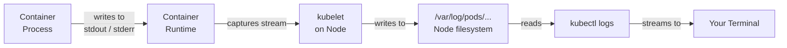

# Container Logging Basics

When something goes wrong with an application running in Kubernetes, the first question is always: what did the application say? Logs are the primary window into what a container is doing, why it failed, and what it was working on before it crashed. Kubernetes provides a built-in logging mechanism that is simple, consistent, and powerful enough for most day-to-day debugging tasks — but it works best when you understand how it actually functions under the hood.

## How Container Logging Works

Containers are expected to follow a single, universal convention: **write all log output to standard output (stdout) and standard error (stderr)**. Not to log files. Not to a database. Not to a syslog socket. Just to the two streams that the operating system provides to every process by default.

This might feel counterintuitive if you come from a background where applications write to `/var/log/app.log` or similar. But in a containerized, ephemeral environment, writing logs to a file inside the container creates serious problems. When the container crashes and a new one starts, the log file from the previous container is gone. When the Pod is rescheduled to a different node, the log files don't follow it. You end up with logs scattered across nodes, rotated away, or simply lost.

By writing to stdout and stderr instead, containers delegate log management to the container runtime and the Kubernetes node. The container doesn't need to know anything about where the logs go or how they're stored — it just writes to its natural output streams.

## What Happens to Those Logs

Once a container writes to stdout or stderr, the **kubelet** running on that node intercepts those streams via the container runtime (containerd, CRI-O, etc.). The kubelet writes the output to log files on the node's filesystem, typically under `/var/log/pods/<namespace>_<pod-name>_<uid>/<container-name>/`. Each running container gets its own log file, and these files are what `kubectl logs` reads when you ask to see a container's logs.



This architecture means that logs are local to the node where the Pod ran. They are not centralized, not replicated, and not permanent. If the node itself is decommissioned or the log files are rotated away, the logs are gone.

## The `kubectl logs` Command

The basic syntax is straightforward:

```bash
kubectl logs <pod-name>
```

This prints all available log output from the (first or only) container in the Pod. Let's look at the most useful flags:

**`-f` or `--follow`**: Stream logs in real time, like `tail -f`. The command stays open and new log lines appear as they are produced. Press `Ctrl+C` to stop.

```bash
kubectl logs -f my-pod
```

**`--tail=N`**: Show only the last N lines. Useful when a Pod has been running for a while and has accumulated a large log history.

```bash
kubectl logs --tail=50 my-pod
```

**`--since=<duration>` or `--since-time=<timestamp>`**: Show logs from a specific time window. The duration format is `1h`, `30m`, `2h30m`, etc. The timestamp format is RFC 3339 (`2024-01-15T14:00:00Z`).

```bash
kubectl logs --since=1h my-pod
kubectl logs --since-time="2024-01-15T14:00:00Z" my-pod
```

**`-c <container-name>`**: In a multi-container Pod, each container has its own log stream. Use this flag to specify which container you want to see.

```bash
kubectl logs my-pod -c sidecar-container
```

**`--all-containers=true`**: See logs from all containers in the Pod simultaneously, with each line prefixed by the container name.

```bash
kubectl logs my-pod --all-containers=true
```

## The Invaluable `--previous` Flag

One of the most important flags for debugging is `--previous` (or `-p`):

```bash
kubectl logs --previous my-pod
```

This shows the logs from the *previous* (now terminated) instance of the container. When a container crashes and Kubernetes restarts it, the new container starts with a fresh log stream — the old logs from before the crash are gone from the current stream. The `--previous` flag lets you look back at what the crashed container wrote before it died.

This is absolutely essential for debugging `CrashLoopBackOff`. When a container is in a crash loop, it keeps restarting and its current log stream might be nearly empty (if it crashes immediately at startup). `--previous` shows you the last gasp of the previous run.

:::info
`--previous` only works if the previous container instance's logs are still present on the node. If the node was rebooted, the Pod was rescheduled to a different node, or the log files have been rotated, the previous logs may not be available.
:::

## Log Rotation on Nodes

Nodes don't keep logs forever. By default, Kubernetes configures the container runtime to rotate log files when they exceed approximately 10 MB in size, keeping the last 5 rotated files. This means at most around 50 MB of logs per container are retained on any given node.

The rotation limits can be configured at the kubelet level via `containerLogMaxSize` and `containerLogMaxFiles`. In practice, most teams find that these defaults are adequate for debugging immediate issues, but inadequate for any kind of historical analysis or forensic investigation after incidents.

## Logs Are Not Forever: Plan for a Log Aggregation System

:::warning
`kubectl logs` is a debugging tool, not a logging strategy. In production, you must ship logs to a centralized system. If a node is replaced or recycled (common in cloud environments with auto-scaling node groups), all logs on that node are permanently lost. If your application crashes at 3 AM and is auto-restarted before your on-call engineer wakes up, the only evidence of the crash will be in a log aggregation system — not in `kubectl logs`.
:::

Production logging typically involves a **log shipping agent** running as a DaemonSet on every node. This agent reads the container log files and forwards them to a centralized backend. Common choices include:

- **ELK Stack** (Elasticsearch, Logstash, Kibana) or its more modern variant the EFK stack (with Fluentd or Fluent Bit instead of Logstash)
- **Grafana Loki** with Promtail — a lightweight, label-based log aggregation system designed for Kubernetes
- **Datadog**, **Splunk**, **Coralogix**, or other commercial observability platforms

Regardless of which system you use, the principle is the same: the container writes to stdout/stderr, the kubelet captures it to the node filesystem, and a DaemonSet agent ships it to your central system before the local logs can be rotated or lost.

## Hands-On Practice

In this exercise you'll deploy a simple Pod that produces log output, and explore the various `kubectl logs` flags.

**Step 1: Create a Pod that produces logs**

```bash
kubectl apply -f - <<EOF
apiVersion: v1
kind: Pod
metadata:
  name: logger-pod
spec:
  containers:
    - name: logger
      image: busybox
      command:
        - /bin/sh
        - -c
        - |
          i=1
          while true; do
            echo "Log line $i at $(date)"
            i=$((i+1))
            sleep 2
          done
EOF
```

Wait for it to start:

```bash
kubectl wait --for=condition=Ready pod/logger-pod --timeout=30s
```

**Step 2: View logs**

```bash
kubectl logs logger-pod
```

Expected output (will vary):

```
Log line 1 at Mon Jan 15 14:00:00 UTC 2024
Log line 2 at Mon Jan 15 14:00:02 UTC 2024
Log line 3 at Mon Jan 15 14:00:04 UTC 2024
```

**Step 3: Follow logs in real time**

```bash
kubectl logs -f logger-pod
```

You'll see new lines appearing every 2 seconds. Press `Ctrl+C` to stop.

**Step 4: Show only the last 3 lines**

```bash
kubectl logs --tail=3 logger-pod
```

**Step 5: Show logs from the last 30 seconds**

```bash
kubectl logs --since=30s logger-pod
```

**Step 6: Test the `--previous` flag**

Create a Pod that crashes immediately so it enters CrashLoopBackOff:

```bash
kubectl apply -f - <<EOF
apiVersion: v1
kind: Pod
metadata:
  name: crasher-pod
spec:
  containers:
    - name: crasher
      image: busybox
      command: ["/bin/sh", "-c", "echo 'About to crash'; exit 1"]
EOF
```

Wait a moment for it to crash and restart, then view the previous container's logs:

```bash
kubectl logs --previous crasher-pod
```

Expected output:

```
About to crash
```

**Step 7: Clean up**

```bash
kubectl delete pod logger-pod crasher-pod
```
