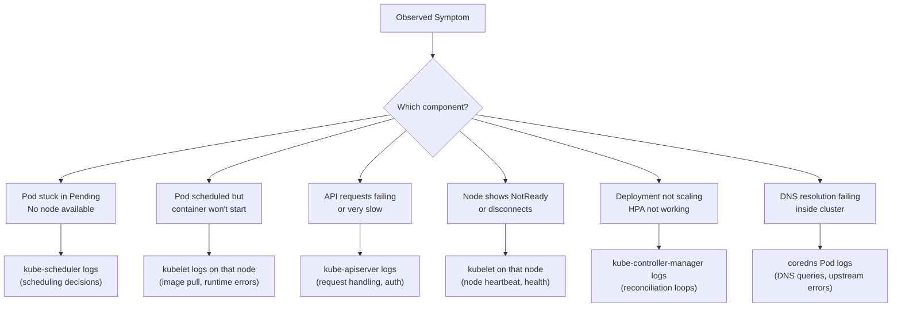

# Monitoring Cluster Component Logs

So far in this module we've looked at logging for your own application containers. But Kubernetes itself is composed of several components that generate their own logs, the API server, the scheduler, the controller manager, etcd, CoreDNS, and the kubelet. When something goes wrong at the infrastructure level, these component logs are where you look for answers.

:::info
Knowing how to access system component logs efficiently is an essential skill for any Kubernetes operator, whether you're debugging a node that won't accept Pods, an API server returning errors, or PVCs that won't bind.
:::

## Where System Components Run

The answer depends on how your cluster was set up.

On **managed Kubernetes clusters** (GKE, EKS, AKS, and most cloud-hosted options), the control plane runs on infrastructure managed by your cloud provider. You typically don't have direct node access to the control plane machines. However, the control plane components, or at least some of them, may still be accessible via `kubectl logs` through their operator-managed representations. Some providers expose control plane logs through their own logging systems (CloudWatch Logs for EKS, Cloud Logging for GKE).

On **self-managed clusters built with kubeadm**, the control plane components run as **static Pods** in the `kube-system` namespace. Static Pods are managed directly by the kubelet on the control plane node, not by the API server, but they appear as regular Pods in `kubectl get pods` and their logs are fully accessible via `kubectl logs`.

On **older or manually installed clusters**, some components may run as **systemd services** on the node itself rather than as containers. In that case, `kubectl logs` won't work and you need to use `journalctl` on the node.

## Static Pods: The Common Case

If your cluster was installed with kubeadm (which is the most common way to build a cluster for the CKA exam and for self-managed production use), the control plane components run as static Pods. You can list them with:

```bash
kubectl get pods -n kube-system
```

Expected output (control plane node):

```
NAME                                READY   STATUS    RESTARTS   AGE
etcd-controlplane                   1/1     Running   0          2d
kube-apiserver-controlplane         1/1     Running   0          2d
kube-controller-manager-controlplane 1/1   Running   0          2d
kube-scheduler-controlplane         1/1     Running   0          2d
coredns-76f75df574-8hfw2            1/1     Running   0          2d
coredns-76f75df574-pkbzj            1/1     Running   0          2d
kube-proxy-7p4rs                    1/1     Running   0          2d
metrics-server-6d94bc8694-xkl9v     1/1     Running   0          1d
```

Notice the naming convention for static Pods: they are named `<component>-<node-name>`. So `kube-apiserver-controlplane` is the API server running on the node named `controlplane`. If you have multiple control plane nodes, each will have its own set.

## Viewing Control Plane Logs

Once you know the Pod name, viewing logs is the same as for any other Pod:

```bash
kubectl logs -n kube-system kube-apiserver-controlplane
kubectl logs -n kube-system kube-scheduler-controlplane
kubectl logs -n kube-system kube-controller-manager-controlplane
kubectl logs -n kube-system etcd-controlplane
```

Add `-f` to follow in real time, `--tail=100` to see the last 100 lines, or `--since=10m` to see only the last 10 minutes of output:

```bash
kubectl logs -n kube-system kube-apiserver-controlplane --tail=50 --since=5m
```

:::info
Static Pod manifests are stored on the control plane node at `/etc/kubernetes/manifests/`. If a static Pod is behaving strangely, it's worth inspecting its manifest directly on the node. Changes to these YAML files take effect immediately, the kubelet on that node watches this directory and reacts to changes.
:::

## Which Component to Check for Which Symptom

One of the most valuable things you can learn is the mapping between a cluster symptom and the component most likely responsible. This knowledge makes debugging dramatically faster.



When a Pod is stuck in `Pending`, the scheduler is the first place to look, it logs the exact reason it couldn't place the Pod. When the API server is throwing 503 errors, the apiserver logs will contain details about overload, authentication failures, or webhook timeouts. When a Deployment isn't reconciling properly, the controller-manager logs contain the reconciliation loop output.

## CoreDNS Logs

CoreDNS is the cluster's internal DNS server and runs as a regular Deployment (not a static Pod). DNS problems are one of the most common sources of frustration in Kubernetes, so knowing how to check CoreDNS logs is especially valuable:

```bash
kubectl logs -n kube-system -l k8s-app=kube-dns --tail=50
```

Using `-l k8s-app=kube-dns` selects all CoreDNS Pods at once using the label selector, which is convenient when there are multiple replicas. CoreDNS will log DNS query failures, upstream resolution issues, and plugin errors.

## Node-Level Logs: The kubelet

The kubelet runs as a systemd service directly on each node, it is not itself a containerized process (it can't be, because it's responsible for managing containers). This means you cannot access kubelet logs with `kubectl logs`. Instead, you need to SSH into the node and use `journalctl`:

```bash
# On the node itself:
journalctl -u kubelet -f
journalctl -u kubelet --since "10 minutes ago"
journalctl -u kubelet --since "2024-01-15 14:00:00"
```

The `-u kubelet` flag filters for the kubelet systemd unit; `-f` follows the log in real time. The kubelet logs are extremely detailed and include information about every Pod on that node: image pulls, container creation, volume mounting, liveness probe results, and more.

:::warning
On some distributions and managed clusters, you may not have SSH access to nodes. In those environments, managed node logging tools (like CloudWatch Agent, Fluentd DaemonSets, or vendor-specific agents) are your only option for node-level logs. Plan your logging architecture accordingly.
:::

## Log Verbosity Levels

Kubernetes components support adjustable verbosity via the `-v` flag. The verbosity scale runs from 0 (minimal, only critical messages) to 10 (extremely verbose, every internal operation logged). In production, components typically run at `-v=2` or `-v=4`. When debugging a specific issue, you might temporarily increase the verbosity to see more detail.

The verbosity levels have informal conventions:

- **`-v=0`**: Always-visible messages, cluster-level errors
- **`-v=1`**: Standard informational messages
- **`-v=2`**: Steady-state health information, changes to the system
- **`-v=4`**: Debug-level verbosity
- **`-v=6`**: Request-level information (shows each API request)
- **`-v=8`**: API request/response bodies
- **`-v=10`**: Complete dump of HTTP messages and request contents

In practice, if you're asked to increase verbosity for debugging, `-v=6` or `-v=8` are the most commonly useful levels, they show the API request traffic without the full body dump of level 10.

## Hands-On Practice

**Step 1: List all Pods in kube-system**

```bash
kubectl get pods -n kube-system
```

Take note of the control plane component Pod names. They will follow the pattern `<component>-<node-name>`.

**Step 2: View API server logs**

```bash
kubectl logs -n kube-system kube-apiserver-$(kubectl get node -o jsonpath='{.items[0].metadata.name}') --tail=20
```

This command dynamically injects the first node's name into the Pod name. You should see a stream of API server audit log entries and request handling output.

**Step 3: View scheduler logs**

```bash
kubectl logs -n kube-system kube-scheduler-$(kubectl get node -o jsonpath='{.items[0].metadata.name}') --tail=20
```

**Step 4: Create a Pod and check the scheduler log**

Create a Pod:

```bash
kubectl run scheduler-test --image=nginx
```

Then read the scheduler log to see it being assigned to a node:

```bash
kubectl logs -n kube-system kube-scheduler-$(kubectl get node -o jsonpath='{.items[0].metadata.name}') --tail=30
```

You should see a line mentioning the Pod being assigned to a node, such as:

```
"Successfully assigned default/scheduler-test to node-1"
```

**Step 5: View CoreDNS logs**

```bash
kubectl logs -n kube-system -l k8s-app=kube-dns --tail=20
```

**Step 6: Test a DNS lookup and see it in CoreDNS logs**

Follow CoreDNS logs:

```bash
kubectl logs -n kube-system -l k8s-app=kube-dns -f &
COREDNS_PID=$!
```

Then trigger a DNS lookup from inside the cluster:

```bash
kubectl exec scheduler-test -- nslookup kubernetes.default.svc.cluster.local
```

You may see the DNS query appear in the CoreDNS log output. Stop the background log follow:

```bash
kill $COREDNS_PID
```

**Step 7: Check controller-manager logs for reconciliation activity**

```bash
kubectl logs -n kube-system kube-controller-manager-$(kubectl get node -o jsonpath='{.items[0].metadata.name}') --tail=30
```

**Step 8: Clean up**

```bash
kubectl delete pod scheduler-test
```

With the combination of `kubectl logs` for system Pods, `journalctl` for kubelet, and `kubectl get events`, you now have a complete toolkit for diagnosing problems at every layer of the cluster, from your own applications all the way down to the infrastructure components that keep Kubernetes running.
