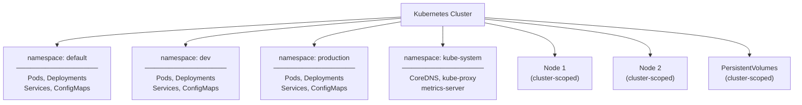

# What Are Namespaces?

Imagine you work in a large office building. The building has one lobby, one set of elevators, and a shared address , but inside, each floor belongs to a different department. The accounting team on floor three does not interfere with the engineering team on floor seven. Each floor has its own rooms, its own equipment, and its own set of people. They are all under the same roof, but they are effectively isolated from each other.

Kubernetes namespaces work the same way. They are a mechanism for dividing a single physical cluster into multiple virtual clusters, each with its own isolated space for resources. Everything in a namespace coexists under the same Kubernetes cluster, but the resources in one namespace are kept separate from the resources in another.

## The Problem Namespaces Solve

Without namespaces, everything in a Kubernetes cluster lives in one giant pile. Every pod, service, deployment, and ConfigMap shares the same flat space. This creates four concrete problems as a cluster grows:

- **Naming collisions** if two teams both want a deployment named `api`, only one can win. Every resource name must be globally unique across the entire cluster.
- **Visibility overload** `kubectl get pods` returns every pod from every team and environment. Finding what you care about becomes like searching an unsorted library.
- **Coarse-grained access control** RBAC cannot cleanly express "Team A manages their resources, not Team B's" when everything shares a single space.
- **No resource fairness** a runaway application can consume all cluster CPU, starving everyone else. Without boundaries, quotas cannot be enforced per team or environment.

## Namespaced vs Cluster-Scoped Resources

Not all Kubernetes resources live inside namespaces. There are two categories: **namespaced resources** and **cluster-scoped resources**.

Namespaced resources belong to a specific namespace and are invisible from other namespaces (by default). The resources you work with day-to-day are typically namespaced:

- Pods
- Deployments
- Services
- ConfigMaps
- Secrets
- PersistentVolumeClaims
- Ingresses

Cluster-scoped resources, on the other hand, exist at the cluster level , they do not belong to any namespace and are visible cluster-wide:

- Nodes
- PersistentVolumes
- Namespaces themselves
- ClusterRoles and ClusterRoleBindings
- StorageClasses

The intuition here is straightforward: a Node is a physical or virtual machine , it does not "belong" to any team. A PersistentVolume is a piece of storage that might be shared across namespaces. These things naturally live outside of any namespace boundary.

You can always check whether a resource type is namespaced using `kubectl api-resources`:

```bash
# Show only namespaced resources
kubectl api-resources --namespaced=true

# Show only cluster-scoped resources
kubectl api-resources --namespaced=false
```

:::info
When you look at the output of `kubectl api-resources`, the NAMESPACED column shows `true` or `false` for each resource type. This is a quick reference any time you are unsure whether a resource lives inside a namespace.
:::

## The Four Built-In Namespaces

When you first create a Kubernetes cluster, four namespaces are created automatically. Each has a specific purpose, and understanding them helps you navigate the cluster with confidence.

- **default**: The namespace where objects land when you do not specify one. Perfect for learning and experimentation.
- **kube-system**: Home to all Kubernetes system components , DNS, the API server, the controller manager, and more.
- **kube-public**: Publicly readable by all users, including unauthenticated ones. Contains basic cluster information.
- **kube-node-lease**: Used internally by nodes to report heartbeats. You will rarely interact with this one directly.

These four namespaces are covered in depth in the next lesson.

## How Namespaces Organize a Cluster



Each namespace is its own isolated environment within the same cluster. Pods in the `dev` namespace cannot directly reference services in the `production` namespace by their short name , they need to use the full DNS name. Nodes and PersistentVolumes, being cluster-scoped, are shared across all namespaces.

:::warning
Namespaces provide **logical isolation**, not **security isolation**. By default, pods in different namespaces can still communicate with each other over the network. If you need to enforce network-level isolation between namespaces, you must configure NetworkPolicies. Similarly, access control isolation requires RBAC to be configured explicitly.
:::

## Hands-On Practice

Open the terminal on the right and explore namespaces in your cluster.

```bash
# List all namespaces in the cluster
kubectl get namespaces

# Short form
kubectl get ns

# See resources in a specific namespace
kubectl get pods -n kube-system

# List namespaced resource types
kubectl api-resources --namespaced=true

# List cluster-scoped resource types
kubectl api-resources --namespaced=false

# Create your first namespace
kubectl create namespace my-team

# Verify it was created
kubectl get namespaces

# Deploy a pod into your new namespace
kubectl run hello --image=nginx -n my-team

# See the pod , only visible in the right namespace
kubectl get pods             # not visible here (wrong namespace)
kubectl get pods -n my-team  # visible here

# See all pods across all namespaces
kubectl get pods -A

# Clean up
kubectl delete namespace my-team
# This deletes the namespace AND the pod inside it
```

Notice the difference between `kubectl get pods` (scoped to the default namespace) and `kubectl get pods -A` (everything cluster-wide). This is one of the most common sources of confusion for new Kubernetes users, internalize it early.
