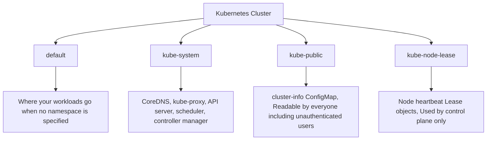

# The Four Built-In Kubernetes Namespaces

Every Kubernetes cluster starts its life with four namespaces already created. These are not optional , they are part of the Kubernetes system itself, and each one serves a specific purpose. As a Kubernetes practitioner, knowing what lives in each namespace and what the rules of engagement are will save you from confusion and, occasionally, from accidentally breaking your cluster.

## A Map of the Four Namespaces



Let us walk through each one in detail.

## default: Where Your Work Lives

The `default` namespace is exactly what its name suggests , it is where Kubernetes places any resource that does not specify a namespace. When you run `kubectl run my-pod --image=nginx` without a `-n` flag, the pod lands in `default`. When you run `kubectl get pods` without specifying a namespace, you are looking at `default`.

This makes `default` the most visible namespace in a fresh cluster, and it is perfectly fine to use for learning and experimentation. In a tutorial, a workshop, or a personal practice cluster, having everything in one namespace is simple and convenient.

In production, however, running workloads in `default` is considered poor practice. There is no natural boundary between applications or teams, and applying RBAC and resource quotas meaningfully is harder. For production, create named namespaces that reflect your applications, teams, or environments.

:::info
You can check what is currently in the `default` namespace with `kubectl get all`. In a brand-new cluster this will usually just show the `kubernetes` service, which is the entry point for pods to communicate with the Kubernetes API server.
:::

## kube-system: The Engine Room

The `kube-system` namespace is the home of all Kubernetes system components. These are the processes that make the cluster work , the control plane components and the infrastructure-level services that run on every node.

What you typically find in `kube-system`:

- **CoreDNS**: The cluster's internal DNS server. It resolves service names like `my-service.my-namespace.svc.cluster.local` to IP addresses, enabling service discovery.
- **kube-proxy**: Runs on every node and manages the iptables or IPVS rules that route traffic to services.
- **metrics-server**: Collects CPU and memory usage metrics from nodes and pods, enabling `kubectl top` and the Horizontal Pod Autoscaler.
- **etcd**: The cluster's key-value store (in single-node clusters where etcd runs as a pod).
- **kube-scheduler**, **kube-controller-manager**, **kube-apiserver**: The core control plane components, though in managed clusters (like EKS, GKE, AKS) these run outside of the cluster's visible namespaces.

```bash
# See what's running in kube-system
kubectl get pods -n kube-system
```

You will see a list of system pods, each with a name that usually ends in the node name they are bound to (for daemonset-style components like kube-proxy) or with a hash suffix.

:::warning
Do not modify resources in `kube-system` unless you are explicitly following a documented procedure and you know what you are doing. Deleting or misconfiguring a CoreDNS pod, for example, will break all internal service discovery in the cluster. Editing a kube-proxy configuration incorrectly can disrupt all network traffic routing. The components in `kube-system` are the foundation everything else depends on.
:::

## kube-public: The Public Notice Board

The `kube-public` namespace is readable by all users in the cluster, including unauthenticated users. This makes it a special case , most namespaces require proper authentication and authorization to access, but `kube-public` is intentionally open.

In practice, `kube-public` contains almost nothing. The one notable thing you will find there is the `cluster-info` ConfigMap, which stores basic information about the cluster including the API server URL. This is what `kubectl cluster-info` reads to display the cluster's address.

```bash
kubectl get configmaps -n kube-public
kubectl get configmap cluster-info -n kube-public -o yaml
```

In most clusters, `kube-public` is essentially empty beyond that ConfigMap. It exists as a convention , a designated place for information that needs to be world-readable , but it is rarely used in practice. You can technically create resources here, but there is almost never a good reason to do so.

## kube-node-lease: Heartbeats from Nodes

The `kube-node-lease` namespace is the most technical of the four, and it is the one you will interact with the least. It exists for a specific performance optimization in how nodes report their health to the control plane.

In earlier versions of Kubernetes, nodes reported their health by updating their Node object in etcd every few seconds. This put significant write pressure on etcd, which is a consistency-critical component that can become a bottleneck.

To solve this, Kubernetes introduced **Lease objects** in the `kube-node-lease` namespace. Each node has a corresponding Lease object that it updates with a timestamp at a regular interval (the heartbeat). The control plane's node controller watches these Lease objects to determine whether a node is still alive. If a node stops updating its Lease, the controller marks the node as `NotReady` and begins taking action on the pods it was running.

```bash
# See the Lease objects , one per node
kubectl get leases -n kube-node-lease
```

Each Lease object is small and simple. Because Lease objects are separate from the full Node objects, updating them is a much lighter write operation, reducing the load on etcd significantly , especially important in large clusters with hundreds of nodes.

You will never need to manage Lease objects manually. They are entirely managed by the kubelet running on each node.

## Comparing the Four Namespaces

| Namespace         | Purpose                            | Managed by           | Should you touch it?                                     |
| ----------------- | ---------------------------------- | -------------------- | -------------------------------------------------------- |
| `default`         | Your workloads                     | You                  | Yes , for learning. Use named namespaces for production. |
| `kube-system`     | Kubernetes system components       | Kubernetes           | Only with care and reason                                |
| `kube-public`     | World-readable cluster information | Kubernetes           | Rarely , read-only is fine                               |
| `kube-node-lease` | Node heartbeat Leases              | Kubernetes (kubelet) | Never                                                    |

## Hands-On Practice

Open the terminal on the right and explore each of the four built-in namespaces.

```bash
# List all four built-in namespaces
kubectl get namespaces

# --- default ---
# See what is in the default namespace
kubectl get all -n default

# The kubernetes service is the API server endpoint
kubectl get service kubernetes -n default -o yaml

# --- kube-system ---
# See all the system components
kubectl get pods -n kube-system

# Check CoreDNS , it is the cluster's internal DNS
kubectl get pods -n kube-system -l k8s-app=kube-dns

# Describe a CoreDNS pod to see its configuration
kubectl describe pod -n kube-system -l k8s-app=kube-dns | head -80

# Check kube-proxy daemonset
kubectl get daemonset -n kube-system

# --- kube-public ---
# List resources (usually just the cluster-info ConfigMap)
kubectl get all -n kube-public
kubectl get configmaps -n kube-public

# Read the cluster-info (no auth required!)
kubectl get configmap cluster-info -n kube-public -o yaml

# Shortcut to display cluster info
kubectl cluster-info

# --- kube-node-lease ---
# See the Lease objects , one per node
kubectl get leases -n kube-node-lease

# Describe a Lease to see the heartbeat timestamp
kubectl get leases -n kube-node-lease -o jsonpath='{.items[0].metadata.name}'
kubectl describe lease <lease-name> -n kube-node-lease
```

After working through these commands, you should have a clear picture of what each built-in namespace contains and why it exists. The most important takeaway: leave `kube-system` and `kube-node-lease` alone unless you have a specific, well-understood reason to interact with them.
