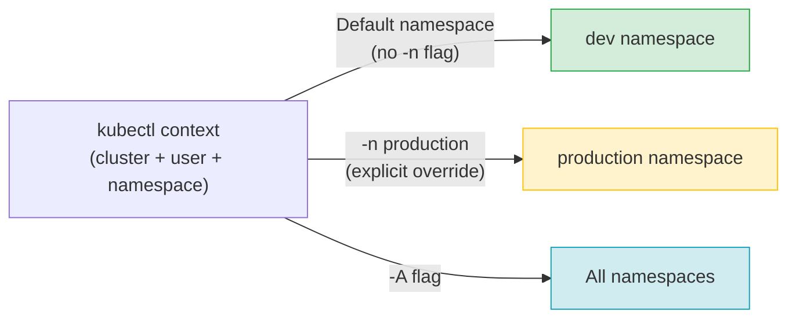

# Working Across Namespaces

Now that you understand what namespaces are and why the built-in ones exist, it is time to get practical. Most real-world Kubernetes work involves switching between namespaces, targeting specific ones for commands, and sometimes querying across all of them at once. This lesson covers the mechanics of working with namespaces day to day , including how to change your default namespace so you stop having to type `-n my-namespace` on every command.

:::info
Three tools cover most day-to-day namespace navigation: `-n <name>` targets a specific namespace, `-A` queries all namespaces at once, and `kubectl config set-context --current --namespace=<name>` sets your default so you stop repeating `-n` on every command.
:::

## Targeting a Specific Namespace

Every kubectl command that works with namespaced resources accepts a `-n` flag (short for `--namespace`) that tells it which namespace to operate in. Without this flag, kubectl targets the namespace configured in your current context (which defaults to `default` unless you have changed it).

```bash
# List pods in a specific namespace
kubectl get pods -n kube-system

# Create a resource in a specific namespace
kubectl run my-pod --image=nginx -n staging

# Apply a manifest to a specific namespace
kubectl apply -f deployment.yaml -n production

# Delete a resource in a specific namespace
kubectl delete pod my-pod -n staging
```

The `-n` flag is explicit and precise. It is the right choice when you want to be absolutely clear about which namespace you are targeting, especially in scripts and automation where ambiguity is dangerous.

## Listing Resources Across All Namespaces

Sometimes you do not know which namespace a resource is in, or you want a global view of everything in the cluster. The `-A` flag (short for `--all-namespaces`) retrieves resources across every namespace and adds a NAMESPACE column to the output so you can see where each resource lives.

```bash
# All pods everywhere
kubectl get pods -A

# All deployments everywhere
kubectl get deployments -A

# All services everywhere, with extra details
kubectl get services -A -o wide
```

The `-A` flag is particularly useful when you are trying to find a specific pod or service and you cannot remember which namespace it is in. It is also the right flag for cluster-wide health checks , "are there any pods not in Running state anywhere in the cluster?"

:::info
`-A` is equivalent to `--all-namespaces`. Both work identically. Most experienced users use `-A` because it is faster to type.
:::

## Your Current Context and Default Namespace

Every kubectl operation runs against a **context**. A context is a combination of three things: a cluster (which API server to talk to), a user (which credentials to use), and a namespace (the default namespace for commands that do not specify one). Contexts are stored in your kubeconfig file, usually at `~/.kube/config`.

To see your current context and its configured default namespace:

```bash
kubectl config get-contexts
```

The output shows a table of all configured contexts. The one marked with an asterisk (`*`) is the currently active context. The NAMESPACE column shows what default namespace is configured for each context.

```bash
# See just the current context
kubectl config current-context

# See the full detail of the current context
kubectl config view --minify
```

If the NAMESPACE column is empty for your current context, kubectl will default to the `default` namespace for every command.

## Changing Your Default Namespace

Typing `-n my-namespace` on every command gets tedious quickly when you are working in a particular namespace for an extended period. The clean solution is to update your current context to use that namespace as the default:

```bash
kubectl config set-context --current --namespace=dev
```

After running this command, all subsequent kubectl commands will automatically target the `dev` namespace , no `-n` flag needed. You can verify the change:

```bash
kubectl config get-contexts
# The NAMESPACE column for your current context now shows 'dev'

kubectl get pods
# This now lists pods in 'dev', not 'default'
```

To switch back to the `default` namespace:

```bash
kubectl config set-context --current --namespace=default
```

:::warning
Changing your default namespace persists until you change it again. If you switch to `production` and forget about it, you might accidentally run commands against production when you thought you were in `dev`. Always be aware of your current context and namespace, especially when working with multiple environments. Running `kubectl config get-contexts` before executing significant operations is a good habit.
:::

## How Namespace Context Works



The context sets your "home base." The `-n` flag is an explicit override. The `-A` flag ignores the context namespace entirely and queries everything.

## Creating Namespaces

You can create a namespace imperatively:

```bash
kubectl create namespace dev
kubectl create namespace staging
kubectl create namespace production
```

Or declaratively via a manifest file:

```yaml
apiVersion: v1
kind: Namespace
metadata:
  name: dev
  labels:
    environment: development
```

```bash
kubectl apply -f namespace.yaml
```

The declarative approach is preferred for namespaces that are part of a long-lived setup, because it makes the namespace definition part of your version-controlled configuration.

## Cross-Namespace Communication via DNS

Resources in different namespaces can still communicate over the network , Kubernetes does not block inter-namespace traffic by default. The key is using the correct DNS name.

Within a namespace, a service is reachable by its short name:

```bash
# From a pod in the 'dev' namespace, reaching a service in the same namespace
curl http://my-service
```

To reach a service in a _different_ namespace, you use the fully qualified DNS name:

```bash
# Full form: <service-name>.<namespace>.svc.cluster.local
curl http://my-service.production.svc.cluster.local
```

The full DNS format is `<service-name>.<namespace>.svc.cluster.local`. You can shorten this to `<service-name>.<namespace>` and CoreDNS will resolve it, but the full form is the most explicit and reliable.

:::info
The ability to communicate across namespaces via DNS is what allows a shared service (like a database or a logging agent) to be accessed by workloads in different namespaces. If you want to _prevent_ cross-namespace communication for security reasons, you need to implement NetworkPolicies , covered in a later lesson.
:::

## Hands-On Practice

Open the terminal on the right and practice switching between and working across namespaces.

```bash
# --- Inspect your current context ---
kubectl config get-contexts
kubectl config current-context
kubectl config view --minify | grep namespace

# --- Create namespaces ---
kubectl create namespace dev
kubectl create namespace staging

# Verify
kubectl get namespaces

# --- Deploy resources into specific namespaces ---
kubectl run dev-pod --image=nginx -n dev
kubectl run staging-pod --image=nginx -n staging

# Verify , they are invisible from the default namespace
kubectl get pods
kubectl get pods -n dev
kubectl get pods -n staging

# See everything at once
kubectl get pods -A

# --- Target specific namespaces ---
kubectl describe pod dev-pod -n dev
kubectl logs dev-pod -n dev

# --- Change your default namespace ---
kubectl config set-context --current --namespace=dev

# Now kubectl get pods targets 'dev' automatically
kubectl get pods

# Switch to staging
kubectl config set-context --current --namespace=staging
kubectl get pods

# Switch back to default
kubectl config set-context --current --namespace=default
kubectl get pods

# --- Cross-namespace DNS (conceptual demo) ---
# Create a service in dev namespace
kubectl create deployment web --image=nginx -n dev
kubectl expose deployment web --port=80 -n dev

# From a pod, the full DNS name to reach it from another namespace would be:
# http://web.dev.svc.cluster.local

# You can verify the DNS name resolves from inside a pod
kubectl run dns-test --image=busybox --rm -it --restart=Never -- \
  nslookup web.dev.svc.cluster.local

# --- Clean up ---
kubectl delete namespace dev staging
kubectl config set-context --current --namespace=default
```

Confident namespace navigation is one of the clearest markers of growing Kubernetes experience. Once you internalize the `-n` flag, the `-A` flag, and how to change your context's default namespace, you will move through multi-namespace environments with ease.
