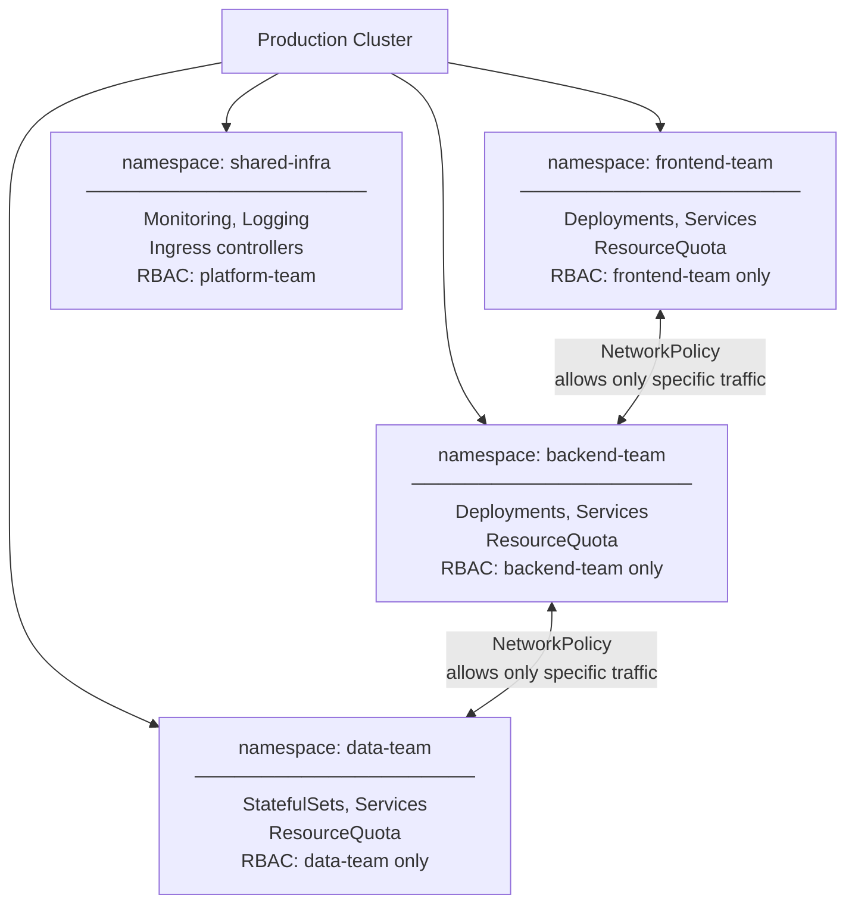

# When and How to Use Multiple Namespaces

Creating namespaces is easy. Knowing *when* and *how* to use them well is a design question that has a meaningful impact on your cluster's maintainability, security, and operational clarity. This lesson explores the most common patterns for namespace usage, the situations where multiple namespaces add real value, and just as importantly, the situations where they add unnecessary complexity.

## Use Case 1: Environment Separation

One of the most intuitive uses for namespaces is separating environments — development, staging, and production — within the same cluster. Instead of running three separate clusters, you run one and use namespaces to keep the environments apart.

```
dev-namespace:        frontend:v1-dev, backend:v1-dev, postgres:dev
staging-namespace:    frontend:v1-staging, backend:v1-staging, postgres:staging
production-namespace: frontend:v1, backend:v1, postgres:prod
```

This approach saves infrastructure costs and simplifies cluster management, since you are operating and upgrading one control plane instead of three. It is popular in small-to-medium organizations where maintaining separate clusters for every environment would be overkill.

The tradeoff is that environments share the same nodes and, to some extent, the same failure domain. A bug that takes down a node affects all environments on that node. For production systems that require the strongest possible isolation, separate clusters are the more appropriate choice. For most teams, however, same-cluster environment separation with good resource quotas and network policies is a practical and effective solution.

## Use Case 2: Team Separation

In organizations where multiple teams share a Kubernetes cluster, giving each team its own namespace establishes clear ownership boundaries. The frontend team works in `frontend`, the backend team in `backend`, the data engineering team in `data`. Each team can deploy, manage, and troubleshoot their own resources without ever seeing or accidentally touching another team's work.

Combined with RBAC (Role-Based Access Control), you can grant each team full admin rights within their own namespace while preventing them from modifying other namespaces. This creates a self-service model: teams are autonomous within their space, and the platform team owns the cluster-level configuration.

```bash
# Grant a team admin rights in their own namespace
# (using a Role and RoleBinding within the namespace)
kubectl create rolebinding team-admin \
  --clusterrole=admin \
  --group=frontend-team \
  -n frontend
```

## Use Case 3: Resource Quotas

Without constraints, any single namespace — or the workloads running in it — can consume all the CPU and memory in the cluster, starving everyone else. Kubernetes **ResourceQuotas** solve this by setting hard limits on what a namespace is allowed to consume.

```yaml
apiVersion: v1
kind: ResourceQuota
metadata:
  name: team-quota
  namespace: frontend
spec:
  hard:
    requests.cpu: "4"
    requests.memory: 8Gi
    limits.cpu: "8"
    limits.memory: 16Gi
    pods: "20"
```

With this quota in place, the `frontend` namespace can never consume more than 4 CPU cores (requests) or 8Gi of memory (requests), regardless of how many pods it tries to run. Any pod creation that would push the namespace over quota is rejected with a clear error.

Resource quotas only make sense when applied at the namespace level. This is one of the strongest practical arguments for using multiple namespaces in a shared cluster: they give you the attachment point for fair-use policies that protect everyone sharing the infrastructure.

## Use Case 4: Network Isolation

By default, all pods in a Kubernetes cluster can communicate with all other pods — across namespace boundaries, across nodes, everywhere. Namespaces alone do not provide network isolation. But when you add **NetworkPolicies**, namespaces become the natural unit of isolation.

A NetworkPolicy that says "only traffic from the same namespace is allowed" gives you a meaningful security boundary between teams or environments:

```yaml
apiVersion: networking.k8s.io/v1
kind: NetworkPolicy
metadata:
  name: deny-cross-namespace
  namespace: production
spec:
  podSelector: {}  # applies to all pods in the namespace
  ingress:
  - from:
    - podSelector: {}  # only from pods in the same namespace
```

This kind of policy ensures that a compromised pod in the `dev` namespace cannot make requests to the `production` database, even though they are in the same cluster.

## The Multi-Namespace Cluster Pattern



## When NOT to Use Multiple Namespaces

More namespaces is not always better. For small teams, learning environments, or single-tenant clusters, using the `default` namespace (or one custom namespace) is perfectly fine. Adding namespaces introduces overhead: you have to remember to pass `-n` to every command, set up separate RBAC and quotas for each namespace, and mentally track which resources live where.

A single person running a personal Kubernetes cluster does not need three environments in three namespaces. A five-person startup with one application does not need a namespace-per-team structure. Start simple, and add namespaces as genuine needs arise — not in anticipation of needs that may never materialize.

:::warning
**Anti-pattern: namespace per microservice.** It might seem clean to give each microservice its own namespace, but this creates significant operational overhead with little benefit. If your application has twenty microservices, twenty namespaces means twenty sets of RBAC bindings, twenty ResourceQuotas to maintain, and twenty places to look when debugging. Namespaces are team and environment boundaries, not application component boundaries. Keep microservices of the same application in the same namespace.
:::

## Namespaces Are Not a Complete Security Boundary

This point deserves clear emphasis: namespaces provide **logical isolation**, not security isolation on their own. A pod in namespace A can, by default, make network requests to a pod in namespace B. A user with cluster-admin privileges can read secrets from any namespace. A misbehaving admission controller can affect the whole cluster.

Namespaces are the *attachment point* for security controls, not the controls themselves. The full picture of namespace-level security requires:

- **RBAC**: to control who can do what in which namespace
- **NetworkPolicies**: to control which pods can communicate with which other pods
- **ResourceQuotas**: to prevent one namespace from monopolizing cluster resources
- **LimitRanges**: to set default resource requests and limits so pods without explicit limits do not run unconstrained

Namespaces organize the space. The policies fill in the walls.

:::info
In high-security multi-tenant environments, namespaces are sometimes combined with separate node pools (using taints and tolerations) to achieve stronger hardware-level isolation. Some organizations use completely separate clusters as the only true security boundary. The right level of isolation depends on your threat model and regulatory requirements.
:::

## Recommended Naming Conventions

Choosing consistent namespace naming from the beginning saves confusion as your cluster grows. Two patterns work well in practice.

The `<env>-<team>` pattern works well when you have multiple environments per team:

```
dev-frontend
staging-frontend
prod-frontend
dev-backend
staging-backend
prod-backend
```

The `<app>-<env>` pattern works well when your organization thinks in terms of applications or products first:

```
myapp-dev
myapp-staging
myapp-prod
```

Either way, consistency matters more than the specific convention. Pick one, document it, and apply it uniformly.

## Hands-On Practice

Open the terminal on the right and practice building a multi-namespace structure.

```bash
# --- Create a team namespace structure ---
kubectl create namespace frontend
kubectl create namespace backend
kubectl create namespace shared

# Verify
kubectl get namespaces

# --- Deploy workloads into each namespace ---
kubectl create deployment web --image=nginx -n frontend
kubectl create deployment api --image=nginx -n backend
kubectl create deployment monitoring --image=prom/prometheus -n shared

# Check all pods across namespaces
kubectl get pods -A

# --- Apply a ResourceQuota to the frontend namespace ---
cat <<EOF | kubectl apply -f -
apiVersion: v1
kind: ResourceQuota
metadata:
  name: frontend-quota
  namespace: frontend
spec:
  hard:
    pods: "10"
    requests.cpu: "2"
    requests.memory: 4Gi
    limits.cpu: "4"
    limits.memory: 8Gi
EOF

# Check the quota
kubectl describe quota -n frontend

# --- Apply a basic NetworkPolicy to isolate the backend namespace ---
cat <<EOF | kubectl apply -f -
apiVersion: networking.k8s.io/v1
kind: NetworkPolicy
metadata:
  name: deny-cross-namespace-ingress
  namespace: backend
spec:
  podSelector: {}
  policyTypes:
  - Ingress
  ingress:
  - from:
    - podSelector: {}
EOF

# --- Check what is running in each namespace ---
kubectl get all -n frontend
kubectl get all -n backend
kubectl get all -n shared

# --- Check cross-namespace DNS resolution ---
kubectl expose deployment api --port=80 -n backend
kubectl run test --image=busybox --rm -it --restart=Never -n frontend -- \
  nslookup api.backend.svc.cluster.local

# --- View namespace details ---
kubectl describe namespace frontend
kubectl describe namespace backend

# --- Clean up ---
kubectl delete namespace frontend backend shared
```

As you practice, think about what structure would make sense for a real project you are working on. The goal of namespaces is to make your cluster *easier* to navigate and operate, not harder. If the structure you design causes you to constantly fight with `-n` flags and cross-namespace complexity, it is probably too granular. Start coarse-grained and split namespaces only when you have a concrete operational reason to do so.
