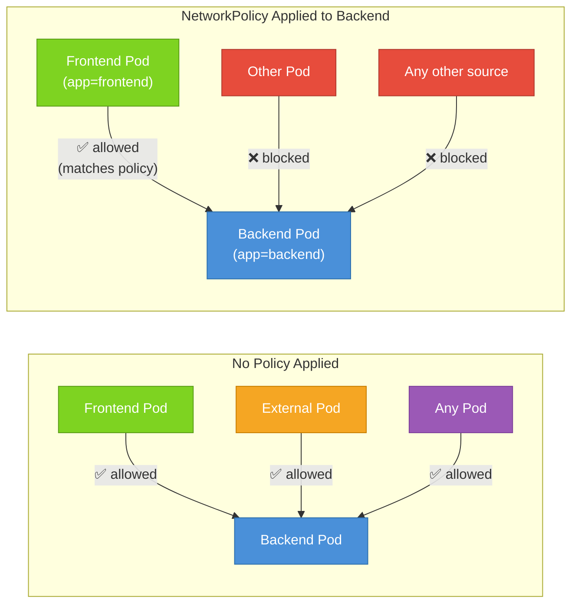

# What Are NetworkPolicies?

When you first spin up a Kubernetes cluster, every Pod can talk to every other Pod. Send a request from your frontend Pod to your database Pod. From your database Pod to your logging service. From your logging sidecar to your payment processor. There are no firewalls, no access controls, no barriers of any kind. It's a completely flat network, and every workload trusts every other workload by default.

For learning and experimentation, that's perfectly fine. But in production, this openness is a serious liability. Imagine a vulnerability is discovered in one of your third-party dependencies. An attacker exploits it and gains code execution inside a running container. In a default Kubernetes cluster, that compromised container can now reach your database, your internal API, your secrets store, and anything else running in the cluster — all without any additional privilege escalation. A single breach becomes a full compromise.

**NetworkPolicy** is Kubernetes's answer to this problem. It lets you define, at the Pod level, exactly which inbound and outbound traffic is permitted. Everything not explicitly permitted is denied. Think of it as a declarative, label-driven firewall living inside your cluster.

## The Open Office Analogy

Imagine a large open-plan office where every employee can freely walk up to anyone else's desk and start a conversation. No access badges, no locked doors, no restricted zones. That's your default Kubernetes cluster. It's friendly and easy to navigate — but if someone untrustworthy wanders in off the street, they can reach any desk.

Now imagine the office installs a security system. Certain areas require a badge to enter. The accounting department has a door that only opens for people with the "Finance" badge. The server room requires an "Infrastructure" badge. Most people can still move around freely in common areas, but sensitive zones are now protected. Only explicitly permitted people can enter.

NetworkPolicies work the same way. You attach them to groups of Pods using **label selectors**, just like any other Kubernetes selector. A policy that selects Pods with the label `app=database` defines who is allowed to connect to those Pods — and nothing else can get through.

## The Critical Caveat: CNI Plugin Support

Here's something that surprises many people: NetworkPolicies are **defined** by Kubernetes, but **enforced** by your CNI (Container Network Interface) plugin. Kubernetes itself just stores the policy objects. The actual packet filtering happens at the network layer, which is the CNI plugin's responsibility.

This means that **if your CNI plugin doesn't support NetworkPolicies, the policies you create will have no effect**. They'll exist in the API, they'll describe your intentions — but traffic will flow freely regardless.

:::warning
**Flannel** — a popular, simple CNI plugin — does not support NetworkPolicies. If you're running Flannel, your NetworkPolicy manifests are silently ignored. Plugins that do support NetworkPolicies include **Calico**, **Cilium**, **Weave Net**, and **Antrea**. Always verify your CNI before relying on NetworkPolicies for security.
:::

Before writing any policies, confirm what CNI your cluster uses. In managed Kubernetes offerings (GKE, EKS, AKS), the CNI is typically configured by the cloud provider, and each has its own defaults and options for policy enforcement.

## How Selection Works

A NetworkPolicy is scoped to a **namespace**. It selects a set of Pods within that namespace using a `podSelector`. Once a policy selects a Pod, that Pod's traffic is governed by the rules in the policy.

The logic follows two key rules:

The first rule is that **if no NetworkPolicy selects a Pod, that Pod is wide open**. All ingress and all egress traffic is allowed. This is the default state for every Pod in a fresh namespace.

The second rule is that **if any NetworkPolicy selects a Pod, only traffic explicitly allowed by some policy is permitted**. The Pod moves from an "allow everything" stance to a "deny everything except..." stance. This is an important asymmetry: creating a policy doesn't just add rules — it changes the Pod's entire default posture for the traffic types covered by that policy.



## Policies Are Additive

Multiple NetworkPolicies can apply to the same Pod simultaneously. When that happens, the allowed traffic is the **union** of all the policies — meaning traffic is permitted if *any* applicable policy allows it. Policies can never cancel out or override each other. You can only add permission; you cannot use one policy to revoke what another policy has granted.

This additive nature means you can build up your security model incrementally: start with a blanket deny-all policy, then add targeted allow policies for each specific traffic flow your application requires.

:::info
NetworkPolicies are a **namespace-scoped** resource. A policy in the `production` namespace can only select Pods in the `production` namespace. To secure multiple namespaces, you create policies in each one — or use a CNI like Cilium that supports cluster-wide policies as an extension.
:::

## What NetworkPolicies Cannot Do

It's worth being clear about what NetworkPolicies are not. They are not a service mesh. They don't do mutual TLS, traffic encryption, retries, or circuit breaking. They operate at the IP/port level — think Layer 3 and Layer 4 of the network stack — not at the application layer. They also cannot log or audit traffic. If a connection is blocked, you won't get an automatic record of the attempt unless your CNI has additional observability features.

They also don't apply to host-network Pods (Pods that set `hostNetwork: true`). Those Pods bypass the Pod network entirely and communicate using the node's IP, so standard NetworkPolicies don't govern them.

Finally, NetworkPolicies do not replace RBAC (Role-Based Access Control). RBAC controls who can interact with the Kubernetes API. NetworkPolicies control which Pods can talk to which other Pods over the network. They are complementary, not interchangeable.

## Hands-On Practice

Let's see the default open networking behavior and then apply a policy to see the difference. Use the terminal on the right panel.

**1. Create two test Pods in the default namespace:**

```bash
kubectl run frontend --image=nginx:1.25 --labels="app=frontend"
kubectl run backend --image=nginx:1.25 --labels="app=backend"
```

**2. Wait for them to be running, then note the backend's IP:**

```bash
kubectl get pods -o wide
```

You should see both Pods listed with their IP addresses. Note the IP of `backend`.

**3. Verify the frontend can reach the backend (default behavior — no policy):**

```bash
kubectl exec frontend -- curl -s --connect-timeout 3 <BACKEND-IP>
```

Replace `<BACKEND-IP>` with the actual IP from step 2. You should see the nginx welcome HTML, confirming that by default, all Pod-to-Pod traffic is open.

**4. Apply a NetworkPolicy that blocks all ingress to the backend:**

```bash
kubectl apply -f - <<EOF
apiVersion: networking.k8s.io/v1
kind: NetworkPolicy
metadata:
  name: deny-all-ingress-to-backend
  namespace: default
spec:
  podSelector:
    matchLabels:
      app: backend
  policyTypes:
    - Ingress
  ingress: []
EOF
```

**5. Retry the curl from frontend to backend:**

```bash
kubectl exec frontend -- curl -s --connect-timeout 3 <BACKEND-IP>
```

This time the request should time out or be refused, demonstrating that the policy is now being enforced by your CNI.

**6. Check the policy was created:**

```bash
kubectl get networkpolicies
kubectl describe networkpolicy deny-all-ingress-to-backend
```

**7. Clean up:**

```bash
kubectl delete pod frontend backend
kubectl delete networkpolicy deny-all-ingress-to-backend
```

You've now seen the fundamental shift that NetworkPolicies introduce: from a fully open network to a controlled one. In the next lesson, we'll explore the full structure of a NetworkPolicy manifest so you can write precise, nuanced traffic rules.
