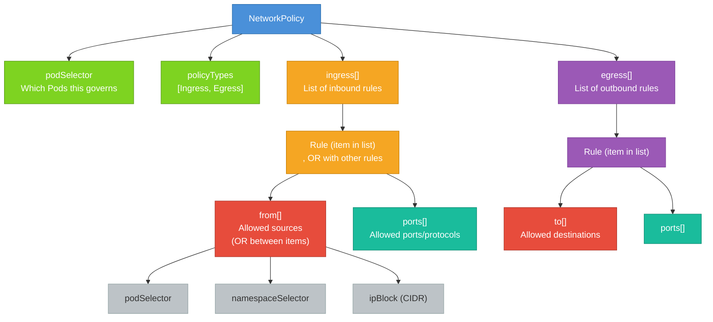

# NetworkPolicy Structure

Now that you understand what NetworkPolicies do conceptually, it's time to get familiar with how they're actually written. Like all Kubernetes resources, a NetworkPolicy is a YAML manifest that follows a predictable structure. Once you internalize this structure, you'll be able to read and write policies confidently , and more importantly, you'll be able to reason about what a policy does or doesn't allow just by reading it.

## The Top-Level Shape

A NetworkPolicy manifest looks like this at the highest level:

```yaml
apiVersion: networking.k8s.io/v1
kind: NetworkPolicy
metadata:
  name: my-policy
  namespace: default
spec:
  podSelector: ...
  policyTypes: [...]
  ingress: [...]
  egress: [...]
```

The `apiVersion` is always `networking.k8s.io/v1`. The `kind` is `NetworkPolicy`. Everything meaningful lives under `spec`, which has four key fields: `podSelector`, `policyTypes`, `ingress`, and `egress`. Let's walk through each one.

## podSelector: Which Pods This Policy Governs

The `podSelector` field determines which Pods in the namespace this policy applies to. It uses the same label-matching syntax you've already seen throughout Kubernetes.

```yaml
podSelector:
  matchLabels:
    app: backend
```

This selects all Pods in the namespace that have the label `app=backend`. Any Pod that doesn't have that label is completely unaffected by this policy.

There's a special case worth knowing: an **empty podSelector** (`podSelector: {}`) selects all Pods in the namespace without exception. This is frequently used for "default deny" policies that lock down an entire namespace, which we'll explore in the advanced lesson.

## policyTypes: Declaring Your Intent

The `policyTypes` field is a list that tells Kubernetes which directions of traffic this policy addresses. The two possible values are `Ingress` and `Egress`.

```yaml
policyTypes:
  - Ingress
  - Egress
```

This field matters more than it might seem. If you include `Ingress` in `policyTypes`, Kubernetes activates ingress filtering for the selected Pods using the rules you define in the `ingress` section. If you include `Ingress` but leave the `ingress` section empty (or omit it), the result is a **deny-all ingress:**  no inbound traffic is allowed.

The same logic applies to `Egress`. Including it activates egress filtering. Including it with an empty or absent `egress` list means no outbound traffic is allowed.

:::warning
Omitting `policyTypes` entirely means Kubernetes will infer it from the presence or absence of `ingress` and `egress` sections. To avoid surprises, always be explicit and declare `policyTypes` yourself.
:::

## ingress: Rules for Inbound Traffic

The `ingress` field is a list of rules. Each rule defines a set of allowed sources (`from`) and optionally restricts which ports and protocols are permitted. Traffic is allowed if it matches **at least one** rule in the list.

```yaml
ingress:
  - from:
      - podSelector:
          matchLabels:
            app: frontend
    ports:
      - protocol: TCP
        port: 8080
```

This rule says: allow inbound TCP connections on port 8080 from Pods labeled `app=frontend`. Anything else , a different port, a different source Pod , is blocked.

## egress: Rules for Outbound Traffic

The `egress` field mirrors the `ingress` field, but for outbound traffic. Instead of `from`, you use `to`.

```yaml
egress:
  - to:
      - podSelector:
          matchLabels:
            app: database
    ports:
      - protocol: TCP
        port: 5432
```

This allows the selected Pods to make outbound TCP connections on port 5432 to Pods labeled `app=database`. All other outbound traffic is blocked.

## A Complete Example

Let's put this together with a realistic, fully-annotated example. Suppose you have a backend service that should only accept HTTP traffic from the frontend, on a specific port.

```yaml
apiVersion: networking.k8s.io/v1
kind: NetworkPolicy
metadata:
  name: allow-frontend-to-backend
  namespace: default
spec:
  podSelector:
    matchLabels:
      app: backend
  policyTypes:
    - Ingress
  ingress:
    - from:
        - podSelector:
            matchLabels:
              app: frontend
      ports:
        - protocol: TCP
          port: 8080
```

Reading this aloud: "In the `default` namespace, Pods labeled `app=backend` will only accept inbound TCP connections on port 8080 from Pods labeled `app=frontend`. All other inbound traffic is denied."

Notice that `policyTypes` only contains `Ingress`. This means egress from the backend is **not restricted** by this policy. The backend Pods can still make outbound connections anywhere. That's intentional here , we're only locking down who can reach the backend, not what the backend can reach.

## The from and to Arrays: OR vs AND Logic

This is where NetworkPolicy gets subtle, and it's a common source of confusion. The `from` (and `to`) array supports three types of selectors:

- **podSelector**: matches Pods by their labels within the same namespace as the policy
- **namespaceSelector**: matches all Pods in namespaces whose labels match
- **ipBlock**: matches traffic from (or to) a CIDR IP range

You can have multiple items in the `from` array. Each item in the array is treated with **OR logic:**  traffic is allowed if it matches any one of them.

```yaml
from:
  - podSelector:
      matchLabels:
        app: frontend
  - podSelector:
      matchLabels:
        app: monitoring
```

This allows traffic from frontend Pods OR from monitoring Pods. Either source is permitted.

But here's the important nuance: when you put multiple fields **inside a single item** in the `from` array, they use **AND logic**. Both conditions must be true simultaneously.

```yaml
from:
  - podSelector:
      matchLabels:
        app: frontend
    namespaceSelector:
      matchLabels:
        env: production
```

This is a single item in the array with two fields. It only allows traffic from Pods labeled `app=frontend` that are also in a namespace labeled `env=production`. A frontend Pod in a different namespace would be blocked. This AND behavior is essential for multi-namespace security.

:::info
The difference between one list item with multiple fields (AND) versus multiple list items (OR) is one of the trickiest aspects of NetworkPolicy syntax. When in doubt, draw it out: each list item (`-`) is an independent path that traffic can match. Fields within one list item all have to match at once.
:::

## The Structure as a Diagram

Here's a visual breakdown of how the spec fields relate to each other:



## Ports: Restricting Further

The `ports` array within each ingress or egress rule lets you narrow down which ports and protocols are matched. If you omit `ports` entirely from a rule, the rule matches all ports and protocols , be intentional about this.

Each port entry can specify:

- `protocol`: `TCP`, `UDP`, or `SCTP`. Defaults to `TCP` if omitted.
- `port`: a port number (e.g., `8080`) or a named port (e.g., `"http"`)
- `endPort`: optionally specify a range when combined with `port` (covered in the advanced lesson)

If you want to allow both TCP and UDP on the same port, you need two separate entries in the `ports` list , one for each protocol.

## Hands-On Practice

Let's apply the `allow-frontend-to-backend` policy and verify it works as expected. Use the terminal on the right panel.

**1. Create test Pods with the correct labels:**

```bash
kubectl run frontend --image=nginx:1.25 --labels="app=frontend"
kubectl run backend --image=nginx:1.25 --labels="app=backend"
kubectl run other --image=nginx:1.25 --labels="app=other"
```

**2. Get the backend Pod's IP:**

```bash
kubectl get pods -o wide
```

Note the IP address of the `backend` Pod.

**3. Apply the NetworkPolicy:**

```bash
kubectl apply -f - <<EOF
apiVersion: networking.k8s.io/v1
kind: NetworkPolicy
metadata:
  name: allow-frontend-to-backend
  namespace: default
spec:
  podSelector:
    matchLabels:
      app: backend
  policyTypes:
    - Ingress
  ingress:
    - from:
        - podSelector:
            matchLabels:
              app: frontend
      ports:
        - protocol: TCP
          port: 80
EOF
```

**4. Test from the frontend (should succeed):**

```bash
kubectl exec frontend -- curl -s --connect-timeout 3 <BACKEND-IP>
```

You should receive an nginx HTML response.

**5. Test from the other Pod (should be blocked):**

```bash
kubectl exec other -- curl -s --connect-timeout 3 <BACKEND-IP>
```

This time the request should time out , the `other` Pod doesn't have the `app=frontend` label, so the policy blocks it.

**6. Inspect the policy:**

```bash
kubectl describe networkpolicy allow-frontend-to-backend
```

Look at the `PodSelector` and `Allowing ingress traffic` sections , they cleanly summarize the policy in human-readable form.

**7. Clean up:**

```bash
kubectl delete pod frontend backend other
kubectl delete networkpolicy allow-frontend-to-backend
```

You now understand the complete structure of a NetworkPolicy manifest. In the next two lessons, we'll go deep on ingress rules and egress rules separately, covering all the edge cases and patterns you'll encounter in real clusters.
