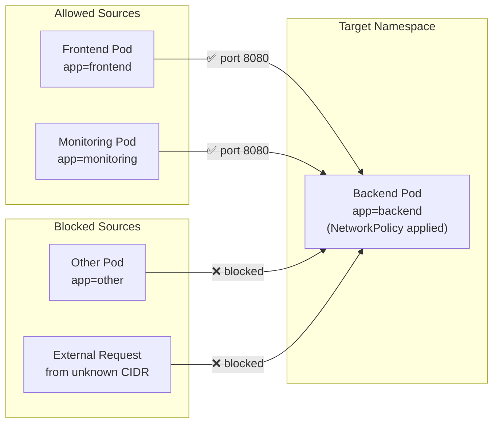

# Ingress Rules, Controlling Inbound Traffic

When people talk about "locking down" a Kubernetes workload, they usually mean controlling who can reach it. An ingress rule specifies which traffic is permitted to flow _into_ the selected Pods. Every connection attempt that doesn't match a rule is silently dropped.

:::info
An ingress rule is a **whitelist**: traffic is allowed if it matches at least one rule in the `ingress[]` list. Everything else is dropped silently.
:::

## How Ingress Rules Are Structured

Each item in the `ingress[]` list represents a single allowed traffic pattern. It has two optional sub-fields:

- `from[]` describes _where_ the traffic can come from
- `ports[]` describes _which ports and protocols_ are allowed

If you include both `from` and `ports` in the same rule, traffic must match both conditions simultaneously: allowed source AND allowed port. If you omit `ports`, that rule matches any port. If you omit `from`, it matches any source. Either omission can be a significant security gap, so be deliberate.

## The Three Types of Sources

Each item inside the `from[]` array can be one of three things:

**podSelector** matches Pods by their labels, within the same namespace as the NetworkPolicy.

```yaml
from:
  - podSelector:
      matchLabels:
        app: frontend
```

**namespaceSelector** matches all Pods in any namespace whose labels match. Use this for cross-namespace traffic, such as allowing an observability namespace to scrape metrics.

```yaml
from:
  - namespaceSelector:
      matchLabels:
        kubernetes.io/metadata.name: monitoring
```

:::info
The label `kubernetes.io/metadata.name` is automatically applied to every namespace and equals the namespace's own name. This makes it easy to target a specific namespace by name without adding custom labels.
:::

**ipBlock** matches traffic from a specific CIDR IP range, useful for allowing traffic from outside the cluster (e.g., an office VPN). You can also exclude sub-ranges with `except`.

```yaml
from:
  - ipBlock:
      cidr: 10.0.0.0/8
      except:
        - 10.1.0.0/16
```

## AND vs OR Logic in from[]

This is where NetworkPolicy gets subtle, and it's a common source of confusion.

**Multiple items in the `from[]` array = OR logic.** Traffic matching any one item is allowed.

```yaml
from:
  - podSelector:
      matchLabels:
        app: frontend
  - podSelector:
      matchLabels:
        app: monitoring
```

The selected Pods accept traffic from frontend Pods **OR** monitoring Pods.

**Multiple fields inside a single item = AND logic.** Both conditions must be true simultaneously.

```yaml
from:
  - podSelector:
      matchLabels:
        app: frontend
    namespaceSelector:
      matchLabels:
        env: production
```

This permits traffic only from Pods labeled `app=frontend` that _also_ reside in namespaces labeled `env=production`. A frontend Pod in a development namespace would be blocked. A production namespace Pod without the `app=frontend` label would also be blocked.

In short: each list item (`-`) is an independent OR path; fields within one item all have to match at once (AND).

## Traffic Flow Diagram



## The Deny-All Ingress Pattern

One of the most powerful patterns is a blanket "deny all inbound traffic" policy. Create a NetworkPolicy that selects all Pods with an empty `podSelector` and declares ingress as managed, but provides no ingress rules.

```yaml
apiVersion: networking.k8s.io/v1
kind: NetworkPolicy
metadata:
  name: default-deny-ingress
  namespace: default
spec:
  podSelector: {}
  policyTypes:
    - Ingress
  ingress: []
```

The empty `podSelector: {}` selects every Pod in the namespace. The empty `ingress: []` means no traffic rules are defined, so no inbound traffic is allowed. Every Pod becomes unreachable, unless you create additional policies that explicitly open specific paths.

This is the starting point for a defense-in-depth security model: start locked down, then open only what you need.

## Allow Ingress From the Same Namespace Only

A common intermediate policy allows traffic from other Pods in the same namespace, but blocks cross-namespace access.

```yaml
apiVersion: networking.k8s.io/v1
kind: NetworkPolicy
metadata:
  name: allow-same-namespace
  namespace: default
spec:
  podSelector: {}
  policyTypes:
    - Ingress
  ingress:
    - from:
        - podSelector: {}
```

The inner `podSelector: {}` matches all Pods in the same namespace as the policy. Result: all Pods in this namespace can receive traffic from any other Pod in this namespace, but not from anywhere else.

:::warning
This pattern doesn't restrict egress at all. The Pods can still initiate outbound connections to anywhere. If you also need to restrict outbound traffic, you'll need a separate egress policy.
:::

## Restricting to Specific Ports

When you know exactly which port your service listens on, always specify it.

```yaml
ingress:
  - from:
      - podSelector:
          matchLabels:
            app: frontend
    ports:
      - protocol: TCP
        port: 8080
      - protocol: TCP
        port: 9090
```

This allows the frontend to connect on port 8080 or 9090. Connections to any other port are blocked, even from the frontend. Named ports work here too: if your Pod spec defines a `containerPort` with a name like `http`, you can write `port: "http"` in the policy.

## Hands-On Practice

Let's experiment with ingress rules and observe exactly how the policies filter traffic. Use the terminal on the right panel.

**1. Create three Pods with different labels:**

```bash
kubectl run app-pod --image=nginx:1.28 --labels="app=app"
kubectl run allowed-client --image=busybox:1.36 --labels="role=allowed" -- sleep 3600
kubectl run blocked-client --image=busybox:1.36 --labels="role=blocked" -- sleep 3600
```

**2. Get the IP of the app Pod:**

```bash
kubectl get pods -o wide
```

**3. Verify both clients can reach the app Pod before any policy:**

```bash
kubectl exec allowed-client -- wget -qO- --timeout=3 <APP-IP>
kubectl exec blocked-client -- wget -qO- --timeout=3 <APP-IP>
```

Both should return the nginx welcome page.

**4. Apply an ingress policy allowing only the allowed client:**

```yaml
# allow-only-allowed-client-networkpolicy.yaml
apiVersion: networking.k8s.io/v1
kind: NetworkPolicy
metadata:
  name: allow-only-allowed-client
  namespace: default
spec:
  podSelector:
    matchLabels:
      app: app
  policyTypes:
    - Ingress
  ingress:
    - from:
        - podSelector:
            matchLabels:
              role: allowed
      ports:
        - protocol: TCP
          port: 80
```

```bash
kubectl apply -f allow-only-allowed-client-networkpolicy.yaml
```

**5. Test both clients again:**

```bash
kubectl exec allowed-client -- wget -qO- --timeout=3 <APP-IP>
kubectl exec blocked-client -- wget -qO- --timeout=3 <APP-IP>
```

The allowed client should still work. The blocked client should now time out.

**6. Apply the deny-all pattern:**

```yaml
# default-deny-ingress-networkpolicy.yaml
apiVersion: networking.k8s.io/v1
kind: NetworkPolicy
metadata:
  name: default-deny-ingress
  namespace: default
spec:
  podSelector: {}
  policyTypes:
    - Ingress
  ingress: []
```

```bash
kubectl apply -f default-deny-ingress-networkpolicy.yaml
```

Because NetworkPolicies are **additive**, the allowed client can still reach the app on port 80, the allow policy is still in place and grants that specific path. The deny-all policy has no rules to override it with; it only tightens Pods that had no policy before.

**7. Clean up:**

```bash
kubectl delete pod app-pod allowed-client blocked-client
kubectl delete networkpolicy allow-only-allowed-client default-deny-ingress
```

You now have a thorough understanding of ingress rules and the patterns you can build with them. In the next lesson, we'll look at the other direction: egress rules, which control what your Pods are allowed to connect to.
