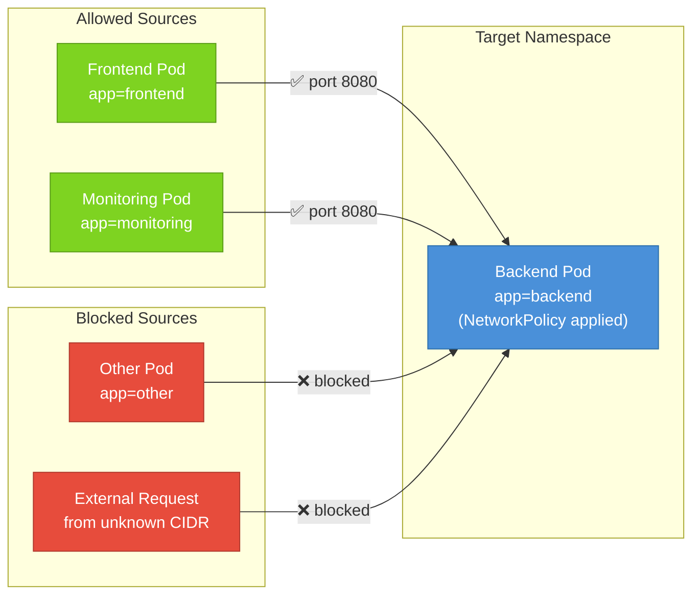

# Ingress Rules — Controlling Inbound Traffic

When people talk about "locking down" a Kubernetes workload, they usually mean controlling who can reach it. That's exactly what ingress rules do. An ingress rule inside a NetworkPolicy specifies which traffic is permitted to flow *into* the selected Pods. Every connection attempt that doesn't match a rule is silently dropped.

Think of ingress rules as the bouncer at the entrance of a club. The bouncer has a list. If your name is on the list, you get in. If it isn't, it doesn't matter how hard you try — you're not getting through.

## How Ingress Rules Are Structured

Each item in the `ingress[]` list represents a single allowed traffic pattern. It has two optional sub-fields:

- `from[]` — describes *where* the traffic can come from
- `ports[]` — describes *which ports and protocols* are allowed

If you include both `from` and `ports` in the same rule, traffic must match both conditions simultaneously: it must come from an allowed source AND arrive on an allowed port. You can think of each rule as a row in a firewall allowlist, where both source and port have to match.

If you omit `ports` from a rule, that rule matches any port. If you omit `from`, that rule matches any source. Either omission can be a significant security gap, so be deliberate about what you include.

## The Three Types of Sources

Each item inside the `from[]` array can be one of three things:

**podSelector** matches Pods by their labels, within the same namespace as the NetworkPolicy. This is the most common source type and is used when you want to allow traffic from specific workloads you control.

```yaml
from:
  - podSelector:
      matchLabels:
        app: frontend
```

**namespaceSelector** matches all Pods in any namespace whose labels match the selector. This is how you permit cross-namespace traffic. For example, you might allow your observability namespace to scrape metrics from all your application namespaces.

```yaml
from:
  - namespaceSelector:
      matchLabels:
        kubernetes.io/metadata.name: monitoring
```

:::info
The label `kubernetes.io/metadata.name` is automatically applied to every namespace and equals the namespace's own name. This makes it easy to target a specific namespace by name without adding custom labels.
:::

**ipBlock** matches traffic originating from a specific CIDR IP range. This is useful for allowing traffic from outside the cluster — for example, from an office VPN range or a specific external service. You can also specify `except` blocks to exclude sub-ranges.

```yaml
from:
  - ipBlock:
      cidr: 10.0.0.0/8
      except:
        - 10.1.0.0/16
```

## AND Logic Within a Single from Item

When you put both `podSelector` and `namespaceSelector` inside the same item in the `from[]` list, both conditions must be satisfied simultaneously. This is AND logic.

```yaml
from:
  - podSelector:
      matchLabels:
        app: frontend
    namespaceSelector:
      matchLabels:
        env: production
```

This permits traffic only from Pods labeled `app=frontend` that reside in namespaces labeled `env=production`. A frontend Pod in a development namespace would be blocked. A production namespace Pod without the `app=frontend` label would also be blocked. Both conditions must be true at the same time.

Contrast this with two separate items in the list, which use OR logic:

```yaml
from:
  - podSelector:
      matchLabels:
        app: frontend
  - namespaceSelector:
      matchLabels:
        env: production
```

This allows traffic from *any* Pod labeled `app=frontend` in the same namespace, **OR** any Pod in any namespace labeled `env=production`. The two conditions are independent. This distinction trips up almost everyone the first time they encounter it.

## OR Logic Between Multiple from Items

As stated above, each separate item in the `from[]` array is an OR condition. Traffic matching any one of them is permitted. This makes it easy to whitelist multiple sources without creating multiple separate policies.

```yaml
from:
  - podSelector:
      matchLabels:
        app: frontend
  - podSelector:
      matchLabels:
        app: monitoring
  - namespaceSelector:
      matchLabels:
        kubernetes.io/metadata.name: ci-system
```

The selected Pods will accept traffic from frontend Pods, monitoring Pods, or anything running in the `ci-system` namespace. Any combination of these — or all three — is fine.

## Traffic Flow Diagram



## The Deny-All Ingress Pattern

One of the most powerful patterns you can apply to a namespace is a blanket "deny all inbound traffic" policy. You achieve this by creating a NetworkPolicy that selects all Pods (with an empty podSelector) and explicitly declares that ingress is managed — but provides no ingress rules.

```yaml
apiVersion: networking.k8s.io/v1
kind: NetworkPolicy
metadata:
  name: default-deny-ingress
  namespace: default
spec:
  podSelector: {}
  policyTypes:
    - Ingress
  ingress: []
```

The empty `podSelector: {}` selects every Pod in the `default` namespace. The `policyTypes` declares that ingress is now managed by policy. The empty `ingress: []` list means no traffic rules are defined, so no inbound traffic is allowed. Every Pod in the namespace becomes unreachable from other Pods — unless you create additional policies that explicitly open specific paths.

This is the starting point for a defense-in-depth security model: start locked down, then open only what you need.

## Allow Ingress From the Same Namespace Only

A common intermediate policy is to allow traffic from other Pods in the same namespace, but nothing from outside it. This is useful when you have multiple services that need to communicate internally, but you don't want cross-namespace access.

```yaml
apiVersion: networking.k8s.io/v1
kind: NetworkPolicy
metadata:
  name: allow-same-namespace
  namespace: default
spec:
  podSelector: {}
  policyTypes:
    - Ingress
  ingress:
    - from:
        - podSelector: {}
```

The inner `podSelector: {}` matches all Pods in the same namespace as the policy. Combined with the outer `podSelector: {}` that selects all Pods, this creates a policy that says: "all Pods in this namespace can receive traffic from any other Pod in this namespace — but not from anywhere else."

:::warning
Remember that this pattern doesn't restrict egress at all. The Pods can still initiate outbound connections to anywhere. If you also need to restrict what these Pods can connect to outbound, you'll need a separate egress policy.
:::

## Restricting to Specific Ports

When you know exactly which port your service listens on, you should always specify it. Leaving the port unrestricted in a policy is like unlocking all the doors in a room when you only need to unlock one.

```yaml
ingress:
  - from:
      - podSelector:
          matchLabels:
            app: frontend
    ports:
      - protocol: TCP
        port: 8080
      - protocol: TCP
        port: 9090
```

This allows the frontend to connect on either port 8080 or port 9090. Connections to any other port are blocked even from the frontend. Named ports work here too — if your Pod spec defines `containerPort: 8080` with a name like `http`, you can write `port: "http"` in the policy and it will resolve correctly.

## Hands-On Practice

Let's experiment with ingress rules and observe exactly how the policies filter traffic. Use the terminal on the right panel.

**1. Create three Pods with different labels:**

```bash
kubectl run app-pod --image=nginx:1.25 --labels="app=app"
kubectl run allowed-client --image=busybox:1.36 --labels="role=allowed" -- sleep 3600
kubectl run blocked-client --image=busybox:1.36 --labels="role=blocked" -- sleep 3600
```

**2. Get the IP of the app Pod:**

```bash
kubectl get pods -o wide
```

Note the IP address next to `app-pod`.

**3. Verify both clients can reach the app Pod before any policy:**

```bash
kubectl exec allowed-client -- wget -qO- --timeout=3 <APP-IP>
kubectl exec blocked-client -- wget -qO- --timeout=3 <APP-IP>
```

Both should return the nginx welcome page.

**4. Apply an ingress policy allowing only the allowed client:**

```bash
kubectl apply -f - <<EOF
apiVersion: networking.k8s.io/v1
kind: NetworkPolicy
metadata:
  name: allow-only-allowed-client
  namespace: default
spec:
  podSelector:
    matchLabels:
      app: app
  policyTypes:
    - Ingress
  ingress:
    - from:
        - podSelector:
            matchLabels:
              role: allowed
      ports:
        - protocol: TCP
          port: 80
EOF
```

**5. Test both clients again:**

```bash
kubectl exec allowed-client -- wget -qO- --timeout=3 <APP-IP>
kubectl exec blocked-client -- wget -qO- --timeout=3 <APP-IP>
```

The allowed client should still work. The blocked client should now time out.

**6. Apply the deny-all pattern and see how it overrides everything:**

```bash
kubectl apply -f - <<EOF
apiVersion: networking.k8s.io/v1
kind: NetworkPolicy
metadata:
  name: default-deny-ingress
  namespace: default
spec:
  podSelector: {}
  policyTypes:
    - Ingress
  ingress: []
EOF
```

```bash
kubectl exec allowed-client -- wget -qO- --timeout=3 <APP-IP>
```

Now even the allowed client is blocked — the deny-all policy also selects the app Pod and the union of rules means no ingress is explicitly allowed (since deny-all has no rules, and the previous policy only opened one port from one source, which is exactly what we had).

Actually, note that because NetworkPolicies are additive, if the allow policy is still in place, the allowed client can still get through on port 80. The deny-all has no effect on traffic that another policy explicitly permits.

**7. Clean up:**

```bash
kubectl delete pod app-pod allowed-client blocked-client
kubectl delete networkpolicy allow-only-allowed-client default-deny-ingress
```

You now have a thorough understanding of ingress rules and the patterns you can build with them. In the next lesson, we'll look at the other direction: egress rules, which control what your Pods are allowed to connect to.
