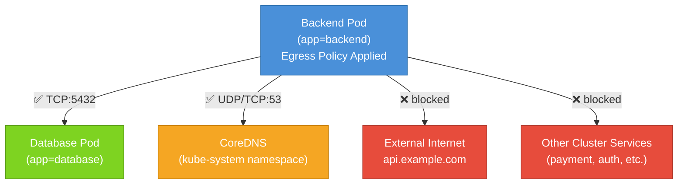

# Egress Rules , Controlling Outbound Traffic

So far we've focused on controlling who can reach your Pods. But security isn't just about keeping unwanted visitors out , it's also about controlling what your Pods can reach when they initiate connections. That's what egress rules are for. An egress rule defines which outbound connections a selected Pod is permitted to make. Any attempt to connect to a destination not covered by a rule is silently dropped.

Think of egress restrictions as the permissions on an outgoing mail system. Most mail rooms let employees send letters to anyone. But a high-security facility might restrict outgoing mail: you can only send to specific approved addresses, and anything else gets held at the door.

In Kubernetes, a compromised Pod that has no egress restrictions can freely call external APIs, exfiltrate data, establish reverse shells, or probe other services across the cluster. Egress policies prevent that by limiting exactly what a Pod is allowed to reach.

## Egress Mirrors Ingress

The structure of egress rules is almost identical to ingress rules, with one key difference: you use `to` instead of `from` to describe destinations rather than sources.

```yaml
egress:
  - to:
      - podSelector:
          matchLabels:
            app: database
    ports:
      - protocol: TCP
        port: 5432
```

This rule allows the selected Pods to make outbound TCP connections on port 5432 to Pods labeled `app=database`. All other outbound connections are denied. The same three selector types apply: `podSelector`, `namespaceSelector`, and `ipBlock`. The same AND-vs-OR logic applies. Everything you learned about ingress applies here, just mirrored for the outbound direction.

## A Critical Warning: Never Forget DNS

Here's a trap that catches nearly everyone writing their first egress policy: **blocking all egress will also block DNS**.

Your applications almost certainly resolve hostnames , connecting to other services by name like `postgres-service.default.svc.cluster.local` or even just `postgres-service`. DNS resolution happens by sending a UDP (or TCP) query to the cluster's DNS service, which is CoreDNS running in the `kube-system` namespace on port 53.

If your egress policy doesn't explicitly allow connections to CoreDNS on port 53, DNS lookups will time out silently. Your application will try to connect to a service by name, fail to resolve it, and likely crash or behave erratically. The error message you get will often be something misleading like "connection refused" or "no such host" , not "DNS blocked" , making this very hard to debug.

:::warning
**Always include a DNS egress rule** whenever you restrict egress. Without it, your application will fail to resolve any hostname, breaking virtually all service-to-service communication inside the cluster. This is one of the most common NetworkPolicy mistakes.
:::

## A Complete Egress Policy With DNS

Here's a real-world example of a backend Pod that should only be allowed to talk to its database and resolve DNS , nothing else:

```yaml
apiVersion: networking.k8s.io/v1
kind: NetworkPolicy
metadata:
  name: backend-egress
  namespace: default
spec:
  podSelector:
    matchLabels:
      app: backend
  policyTypes:
    - Egress
  egress:
    - to:
        - podSelector:
            matchLabels:
              app: database
      ports:
        - protocol: TCP
          port: 5432
    - to:
        - namespaceSelector:
            matchLabels:
              kubernetes.io/metadata.name: kube-system
      ports:
        - protocol: UDP
          port: 53
        - protocol: TCP
          port: 53
```

Reading this: "Pods labeled `app=backend` may only make outbound connections to `app=database` Pods on port 5432/TCP, or to any Pod in the `kube-system` namespace on port 53 (UDP or TCP) for DNS. All other outbound traffic is blocked."

Notice that DNS allows both UDP and TCP on port 53. Standard DNS uses UDP, but falls back to TCP for large responses. You should allow both to be safe.

## Visualizing Restricted Egress



## The Deny-All Egress Pattern

Just as with ingress, you can create a blanket "deny all outbound traffic" policy for an entire namespace. The pattern is symmetric:

```yaml
apiVersion: networking.k8s.io/v1
kind: NetworkPolicy
metadata:
  name: default-deny-egress
  namespace: default
spec:
  podSelector: {}
  policyTypes:
    - Egress
  egress: []
```

An empty `podSelector: {}` selects all Pods in the namespace. The `policyTypes` declares that egress is now governed by policy. The empty `egress: []` means no outbound connections of any kind are permitted , not even DNS.

After applying this, any Pod in the namespace that tries to make a network connection will be silently dropped. This is typically the first step in a "default deny all" namespace lockdown, after which you add targeted allow policies for each service's legitimate traffic.

## Allowing Access to External Services

Sometimes a Pod needs to connect to something outside the cluster , a third-party API, an on-premise database, or an object storage service. For those cases, use `ipBlock` with the external CIDR:

```yaml
egress:
  - to:
      - ipBlock:
          cidr: 203.0.113.0/24
    ports:
      - protocol: TCP
        port: 443
```

This allows HTTPS connections to the IP range `203.0.113.0/24`. If you need to allow internet access broadly (which you should think carefully about), you can use `0.0.0.0/0` , but that effectively removes the benefit of egress restriction and is rarely recommended.

## Combining Ingress and Egress in One Policy

A single NetworkPolicy can declare both ingress and egress rules for the same set of Pods. When you list both in `policyTypes`, both directions are now managed.

```yaml
apiVersion: networking.k8s.io/v1
kind: NetworkPolicy
metadata:
  name: frontend-policy
  namespace: default
spec:
  podSelector:
    matchLabels:
      app: frontend
  policyTypes:
    - Ingress
    - Egress
  ingress:
    - from:
        - ipBlock:
            cidr: 0.0.0.0/0
      ports:
        - protocol: TCP
          port: 80
        - protocol: TCP
          port: 443
  egress:
    - to:
        - podSelector:
            matchLabels:
              app: backend
      ports:
        - protocol: TCP
          port: 8080
    - to:
        - namespaceSelector:
            matchLabels:
              kubernetes.io/metadata.name: kube-system
      ports:
        - protocol: UDP
          port: 53
```

This policy for the frontend says: accept inbound HTTP/HTTPS from anywhere; send outbound traffic only to the backend on port 8080, plus DNS.

:::info
It's perfectly valid , and often cleaner , to split ingress and egress rules into separate NetworkPolicy objects. Multiple policies applying to the same Pod are additive, so you can manage ingress rules in one policy and egress rules in another without any conflict.
:::

## Hands-On Practice

Let's observe how egress restrictions work and practice including the critical DNS rule. Use the terminal on the right panel.

**1. Create a test Pod that will have its egress restricted:**

```bash
kubectl run restricted-pod --image=busybox:1.36 --labels="app=restricted" -- sleep 3600
```

**2. Before any policy, verify the Pod can reach the internet and resolve DNS:**

```bash
kubectl exec restricted-pod -- nslookup kubernetes.default
kubectl exec restricted-pod -- wget -qO- --timeout=5 http://1.1.1.1
```

Both should work in a default cluster.

**3. Apply a deny-all egress policy:**

```bash
kubectl apply -f - <<EOF
apiVersion: networking.k8s.io/v1
kind: NetworkPolicy
metadata:
  name: deny-all-egress
  namespace: default
spec:
  podSelector:
    matchLabels:
      app: restricted
  policyTypes:
    - Egress
  egress: []
EOF
```

**4. Try DNS resolution and external access now:**

```bash
kubectl exec restricted-pod -- nslookup kubernetes.default
kubectl exec restricted-pod -- wget -qO- --timeout=5 http://1.1.1.1
```

Both should now fail , DNS is broken too, which you can see from the `nslookup` timeout.

**5. Update the policy to re-allow DNS only:**

```bash
kubectl apply -f - <<EOF
apiVersion: networking.k8s.io/v1
kind: NetworkPolicy
metadata:
  name: deny-all-egress
  namespace: default
spec:
  podSelector:
    matchLabels:
      app: restricted
  policyTypes:
    - Egress
  egress:
    - to:
        - namespaceSelector:
            matchLabels:
              kubernetes.io/metadata.name: kube-system
      ports:
        - protocol: UDP
          port: 53
        - protocol: TCP
          port: 53
EOF
```

**6. Test again:**

```bash
kubectl exec restricted-pod -- nslookup kubernetes.default
kubectl exec restricted-pod -- wget -qO- --timeout=5 http://1.1.1.1
```

DNS should now work again (the `nslookup` resolves), but the external HTTP request should still be blocked.

**7. Inspect the applied policy:**

```bash
kubectl get networkpolicies
kubectl describe networkpolicy deny-all-egress
```

**8. Clean up:**

```bash
kubectl delete pod restricted-pod
kubectl delete networkpolicy deny-all-egress
```

You've now experienced firsthand why the DNS exception is non-negotiable. In the next lesson, we'll cover advanced patterns including combining policies, ipBlock with exceptions, port ranges, and defense-in-depth strategies for real production namespaces.
