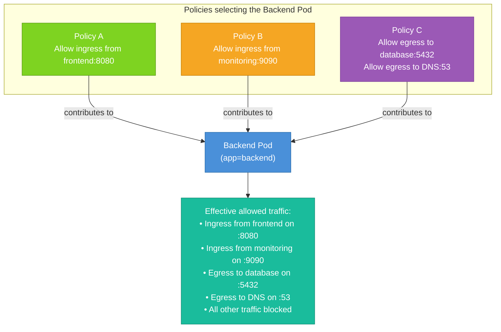

# Advanced NetworkPolicy Patterns

You now understand the building blocks of NetworkPolicies: how they select Pods, how ingress rules work, and how egress rules work. In this lesson, we put it all together. Real production clusters don't use a single simple policy — they use layered strategies, multiple overlapping policies, and nuanced selectors. This lesson covers the patterns you'll reach for when you need to go beyond the basics.

## The Default Deny All Pattern: Defense in Depth

The most effective security posture for a production namespace isn't to write careful allow rules for every service and trust that you got them all right. It's to start from zero trust — deny everything by default — and then add explicit allow rules for every traffic flow your application actually needs.

This is called **defense in depth**, and it means that if you forget to lock down a service, it's unreachable by default rather than wide open.

The implementation is straightforward: apply a single policy per namespace that denies all ingress and all egress.

```yaml
apiVersion: networking.k8s.io/v1
kind: NetworkPolicy
metadata:
  name: default-deny-all
  namespace: production
spec:
  podSelector: {}
  policyTypes:
    - Ingress
    - Egress
  ingress: []
  egress: []
```

One policy. Selects all Pods. No rules. Result: nothing can reach anything, and nothing can reach out. From here, you add granular allow policies for each specific service: let the frontend receive HTTP traffic, let the backend reach the database, let everything reach DNS, and so on.

:::warning
Don't forget DNS! The moment you apply a deny-all egress policy, DNS resolution breaks for all Pods in the namespace. Always add a follow-up egress policy allowing UDP/TCP port 53 to the `kube-system` namespace immediately after applying deny-all. Treat it as a mandatory companion.
:::

## Combining podSelector and namespaceSelector: AND Logic

We touched on this in the structure lesson, but it's worth reinforcing with a concrete scenario because it's both powerful and confusing.

Suppose you have a `monitoring` namespace and a `production` namespace. You want to allow your Prometheus scraper to collect metrics from the production Pods — but only the Prometheus Pod, not just anything running in the monitoring namespace.

Using two separate items in the `from` array would be wrong here:

```yaml
from:
  - podSelector:
      matchLabels:
        app: prometheus
  - namespaceSelector:
      matchLabels:
        kubernetes.io/metadata.name: monitoring
```

This is OR logic: it allows any Pod labeled `app=prometheus` in the same namespace, **OR** anything from the monitoring namespace. An attacker who compromises any Pod in the monitoring namespace could now reach your production Pods.

The correct approach uses a single item with both selectors — AND logic:

```yaml
from:
  - podSelector:
      matchLabels:
        app: prometheus
    namespaceSelector:
      matchLabels:
        kubernetes.io/metadata.name: monitoring
```

Now only Pods labeled `app=prometheus` that also reside in the `monitoring` namespace are allowed. The combination is precise and tight. This is the pattern you want whenever you're opening a cross-namespace path.

## ipBlock: CIDR Ranges and Exceptions

The `ipBlock` selector allows you to express policies in terms of IP address ranges rather than Pod labels. This is primarily useful for two scenarios: allowing traffic from outside the cluster (ingress from an external load balancer or office VPN), or allowing Pods to reach external destinations (egress to a third-party API).

```yaml
ingress:
  - from:
      - ipBlock:
          cidr: 172.16.0.0/12
          except:
            - 172.16.1.0/24
```

This allows inbound traffic from the entire `172.16.0.0/12` range — a typical private network range for an office VPN — except for the specific subnet `172.16.1.0/24`. The `except` field is useful when you need to allow a broad range but exclude a known segment that shouldn't have access, such as a guest network or a legacy system.

:::info
`ipBlock` matches the source IP of the packet as seen at the node level, not the Pod's internal IP. For traffic entering through a load balancer or NodePort, the source IP may be the load balancer's IP rather than the original client's IP, depending on your cluster's configuration. Always test your `ipBlock` rules carefully.
:::

## Port Ranges With endPort

Starting in Kubernetes 1.25, you can specify a range of ports in a single rule using the `endPort` field alongside `port`. This is useful for applications that use a range of ephemeral or data ports.

```yaml
ports:
  - protocol: TCP
    port: 8000
    endPort: 8999
```

This matches any TCP connection on ports 8000 through 8999 inclusive. Without `endPort`, you'd need to list each port individually or write multiple rules. The `endPort` must always be greater than or equal to `port`, and the `protocol` field is required when using `endPort`.

## NetworkPolicies Are Additive: The Union Model

A Pod can be selected by multiple NetworkPolicies simultaneously. When that happens, the effective rule set for that Pod is the **union** of all the policies that select it. Traffic is allowed if *any* applicable policy permits it.

This is an important architectural property. It means you can compose your security posture from many small, focused policies rather than one massive, hard-to-read policy. Each team or service can own its own policy, and the overall behavior is the sum of all of them.



This union model also means you can safely split a large policy into several smaller ones without worrying about interaction effects. There's no way to use one policy to "block" what another policy has allowed — once traffic is permitted by any policy, it goes through.

## The Limitation: No Logging or Auditing

NetworkPolicies are binary: traffic either passes or it doesn't. There's no built-in mechanism to log blocked connections, audit policy hits, or alert when unusual traffic patterns are detected. The policies themselves are silent enforcers.

For observability into policy decisions, you need a CNI plugin that provides these capabilities as an extension. **Cilium** is the most capable option here — it offers a tool called **Hubble** that provides a real-time, graphical view of all traffic flows in your cluster, including which connections were allowed or dropped by policy, and which network policy made the decision. **Calico** offers similar capabilities through its flow log export features.

If visibility into network policy decisions is important to you (and in production, it should be), factor CNI capabilities into your cluster design from the start. Retrofitting observability is much harder than building it in.

## A Full Multi-Service Namespace Example

Let's look at how you'd compose policies for a realistic three-tier application: a frontend, a backend, and a database. Start with a deny-all, then open each necessary path.

```yaml
# 1. Default deny everything
apiVersion: networking.k8s.io/v1
kind: NetworkPolicy
metadata:
  name: default-deny-all
  namespace: app
spec:
  podSelector: {}
  policyTypes:
    - Ingress
    - Egress
  ingress: []
  egress: []
---
# 2. Allow DNS for all Pods
apiVersion: networking.k8s.io/v1
kind: NetworkPolicy
metadata:
  name: allow-dns
  namespace: app
spec:
  podSelector: {}
  policyTypes:
    - Egress
  egress:
    - to:
        - namespaceSelector:
            matchLabels:
              kubernetes.io/metadata.name: kube-system
      ports:
        - protocol: UDP
          port: 53
        - protocol: TCP
          port: 53
---
# 3. Frontend accepts inbound HTTP from anywhere
apiVersion: networking.k8s.io/v1
kind: NetworkPolicy
metadata:
  name: frontend-ingress
  namespace: app
spec:
  podSelector:
    matchLabels:
      app: frontend
  policyTypes:
    - Ingress
  ingress:
    - ports:
        - protocol: TCP
          port: 80
---
# 4. Frontend can reach backend
apiVersion: networking.k8s.io/v1
kind: NetworkPolicy
metadata:
  name: frontend-to-backend
  namespace: app
spec:
  podSelector:
    matchLabels:
      app: frontend
  policyTypes:
    - Egress
  egress:
    - to:
        - podSelector:
            matchLabels:
              app: backend
      ports:
        - protocol: TCP
          port: 8080
---
# 5. Backend accepts from frontend only
apiVersion: networking.k8s.io/v1
kind: NetworkPolicy
metadata:
  name: backend-ingress
  namespace: app
spec:
  podSelector:
    matchLabels:
      app: backend
  policyTypes:
    - Ingress
  ingress:
    - from:
        - podSelector:
            matchLabels:
              app: frontend
      ports:
        - protocol: TCP
          port: 8080
---
# 6. Backend can reach database
apiVersion: networking.k8s.io/v1
kind: NetworkPolicy
metadata:
  name: backend-to-database
  namespace: app
spec:
  podSelector:
    matchLabels:
      app: backend
  policyTypes:
    - Egress
  egress:
    - to:
        - podSelector:
            matchLabels:
              app: database
      ports:
        - protocol: TCP
          port: 5432
---
# 7. Database accepts from backend only
apiVersion: networking.k8s.io/v1
kind: NetworkPolicy
metadata:
  name: database-ingress
  namespace: app
spec:
  podSelector:
    matchLabels:
      app: database
  policyTypes:
    - Ingress
  ingress:
    - from:
        - podSelector:
            matchLabels:
              app: backend
      ports:
        - protocol: TCP
          port: 5432
```

Seven policies, clearly named, each responsible for one specific traffic path. The database is now completely unreachable except from the backend. The backend is completely unreachable except from the frontend. The frontend only accepts HTTP. Any path not described above is silently blocked.

## Hands-On Practice

Let's apply a multi-policy setup to a real namespace and verify isolation. Use the terminal on the right panel.

**1. Create a dedicated namespace and set up test Pods:**

```bash
kubectl create namespace secured-app
kubectl run frontend -n secured-app --image=nginx:1.25 --labels="app=frontend"
kubectl run backend -n secured-app --image=nginx:1.25 --labels="app=backend"
kubectl run intruder -n secured-app --image=busybox:1.36 --labels="app=intruder" -- sleep 3600
```

**2. Get the backend IP within the namespace:**

```bash
kubectl get pods -n secured-app -o wide
```

**3. Confirm the intruder can reach the backend before any policy:**

```bash
kubectl exec -n secured-app intruder -- wget -qO- --timeout=3 <BACKEND-IP>
```

**4. Apply a deny-all policy:**

```bash
kubectl apply -f - <<EOF
apiVersion: networking.k8s.io/v1
kind: NetworkPolicy
metadata:
  name: default-deny-all
  namespace: secured-app
spec:
  podSelector: {}
  policyTypes:
    - Ingress
    - Egress
  ingress: []
  egress: []
EOF
```

**5. Now apply a selective allow: frontend can reach backend:**

```bash
kubectl apply -f - <<EOF
apiVersion: networking.k8s.io/v1
kind: NetworkPolicy
metadata:
  name: frontend-to-backend
  namespace: secured-app
spec:
  podSelector:
    matchLabels:
      app: backend
  policyTypes:
    - Ingress
  ingress:
    - from:
        - podSelector:
            matchLabels:
              app: frontend
      ports:
        - protocol: TCP
          port: 80
EOF
```

**6. Test access from frontend (should work) and intruder (should fail):**

```bash
kubectl exec -n secured-app frontend -- curl -s --connect-timeout 3 <BACKEND-IP>
kubectl exec -n secured-app intruder -- wget -qO- --timeout=3 <BACKEND-IP>
```

**7. List all policies in the namespace:**

```bash
kubectl get networkpolicies -n secured-app
```

**8. Clean up the entire namespace:**

```bash
kubectl delete namespace secured-app
```

Deleting the namespace removes all resources inside it — Pods, policies, and all. This makes namespace-based cleanup very convenient.

You've now seen how advanced patterns come together: deny-all as a baseline, targeted allows for each traffic flow, AND logic for cross-namespace precision, and the additive union model that lets you compose policies independently. These patterns are the foundation of a secure, understandable Kubernetes network architecture.
