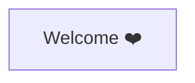

# How to Use This Platform



Welcome and thank you so much for using KubeMastery. We work hard to make a pleasing experience for you. If anything is not working as expected, please let us know.

# Let's get into it

Think back to the first time you learned to ride a bicycle. You probably didn't master it by reading a manual. You got on the bike, wobbled, fell a few times, and eventually found your balance. Kubernetes is no different. The fastest path to real understanding is to type commands, watch what happens, and build muscle memory along the way.

## Navigating the Interface

The screen is split into two panels. The **left panel** is where you are right now, displaying lessons in order, organized into modules. Work through them in sequence, especially if Kubernetes is new to you. On the bottom left of your screen you'll find a button to collapse the course outline.

The **right panel** is a fully functional terminal connected to a simulated Kubernetes cluster. Below the terminal you'll find a few icons:

- The **telescope icon** opens the cluster visualizer, a live diagram that shows your nodes, Pods, and containers updating in real time. It's a great way to see the effect of your commands visually, for example watching three Pods appear the moment you create a Deployment. You can hover the visualizer to see the details of the objects.
- The **reload icon** resets the terminal and the cluster to their initial state: it clears the terminal output and recreates the environment from scratch. Use it when you want to start over or when something gets stuck.
- The **speech bubble icon** lets you send feedback or report anything that seems off in a lesson.

:::info
On mobile, not every keyboard works well with the terminal. **Gboard** works reliably if you need to practice on the go.
:::

## Hands-On Practice

Let's confirm your terminal is working. Run:

```bash
kubectl version
```

You should see the client and server versions of Kubernetes. If both are displayed, your environment is healthy and you're ready to start.
