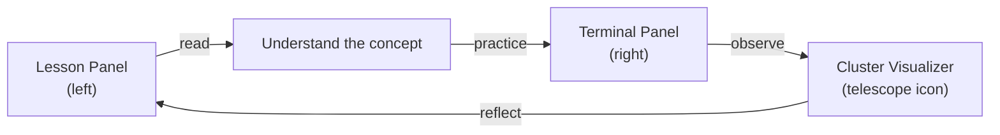

# How to Use This Platform

Think back to the first time you learned to ride a bicycle. You probably didn't master it by reading a manual — you got on the bike, wobbled, fell a few times, and eventually found your balance. Kubernetes is no different. You can read every page of documentation and still feel completely lost the moment a real cluster misbehaves. The only way to truly build confidence with Kubernetes is to get your hands on it, run real commands, and observe what actually happens.

That's exactly what Kube Mastery is designed for. Every lesson you read here is paired with a live, working environment so you can immediately apply what you learn. This first lesson is a quick tour of the platform itself, so you know where everything is before you dive in.

## Reading Lessons on the Left

The left side of your screen is where you are right now — the lesson panel. It displays the course content in order, and you can navigate between lessons using the sidebar. Lessons are organized into modules, and modules build on each other, so it is generally a good idea to follow them in sequence, especially if you are new to Kubernetes.

Each lesson covers one focused topic. You will find explanations, diagrams, code examples, and at the end of every lesson, a hands-on section with concrete commands to run. Reading the lesson first and then practicing in the terminal is the most effective loop.

## Running Commands on the Right

The right panel is a fully functional terminal connected to a real Kubernetes cluster. When you see a command in a lesson, you can type it directly into that terminal and see the actual output. There is no simulation happening — the cluster is live, and the results are genuine.

This is a significant advantage over platforms that only show you static screenshots. When you run `kubectl get pods` and the output appears right in front of you, the information sticks in a way that reading alone cannot achieve. You also get to see error messages, which are arguably the most educational output Kubernetes can produce.

:::info
If the terminal panel is not visible, look for a toggle or resize handle along the right edge of the screen. On wider displays, both panels are shown side by side by default.
:::

## The Cluster Visualizer

In the toolbar, you will notice a telescope icon. Clicking it opens the cluster visualizer — a live diagram that shows you the current state of your practice cluster. You can see your nodes, the pods running on them, and how containers are grouped inside those pods.

This view is invaluable when you are learning concepts like scheduling, deployments, or namespaces. Rather than just reading that "a Deployment creates three Pods on worker nodes," you can actually see those three pods appear in the diagram the moment you create the Deployment. The cluster visualizer updates in real time, so use it freely whenever you want a visual confirmation of what your commands are doing.

## The Feedback and Chat Icon

If something is unclear, broken, or you just want to share a thought, look for the chat or feedback icon in the interface. We genuinely read every piece of feedback and use it to improve lessons. Do not hesitate to report confusing explanations or suggest topics you would like to see covered.

## Using the Platform on Mobile

Kube Mastery works on mobile devices — the layout adapts to a single column so the lesson content and terminal stack vertically. If you are typing commands on a phone or tablet, Gboard (the Google keyboard) works particularly well because it handles special characters like hyphens, slashes, and square brackets cleanly, which you will use constantly in Kubernetes commands.

:::warning
The full hands-on experience is significantly better on a laptop or desktop. Mobile is great for reading lessons while commuting, but you will want a real keyboard for the practice sections.
:::

## Alignment with Official Kubernetes Documentation

All course content on this platform is aligned with the official Kubernetes documentation, available at [https://kubernetes.io/docs/home/](https://kubernetes.io/docs/home/). Kubernetes evolves quickly, and the official docs are always the authoritative source. Whenever we introduce a concept, we aim to use the same terminology and structure that you will find there. This means that as you learn here, you are also building familiarity with the documentation you will reach for on the job — and in certification exams.

Think of the official docs as the reference manual and this platform as the practice track alongside it. Both are useful, and they complement each other well.



## Hands-On Practice

Let's make sure your terminal is working. Click into the right panel and run the following command:

```
kubectl version --short
```

You should see output similar to this:

```
Client Version: v1.30.0
Server Version: v1.30.0
```

This tells you the version of the `kubectl` command-line tool (the client) and the version of the Kubernetes API server running in your cluster (the server). If both lines appear, your environment is healthy and you are ready to go.

Next, try listing the nodes in your cluster:

```
kubectl get nodes
```

Expected output:

```
NAME           STATUS   ROLES           AGE   VERSION
controlplane   Ready    control-plane   10m   v1.30.0
node01         Ready    <none>          9m    v1.30.0
```

You are looking at the machines that make up your practice cluster. The `controlplane` node manages the cluster, and `node01` is where your application workloads will run. You will learn exactly what this means in the architecture lessons ahead.

## Wrapping Up

Now that you know where everything lives — the lesson panel, the terminal, the cluster visualizer, and the feedback icon — you are ready to start learning Kubernetes for real. In the next lesson, we will take a closer look at your practice environment: what it provides, what commands are available, and how to reset it when things go sideways.
