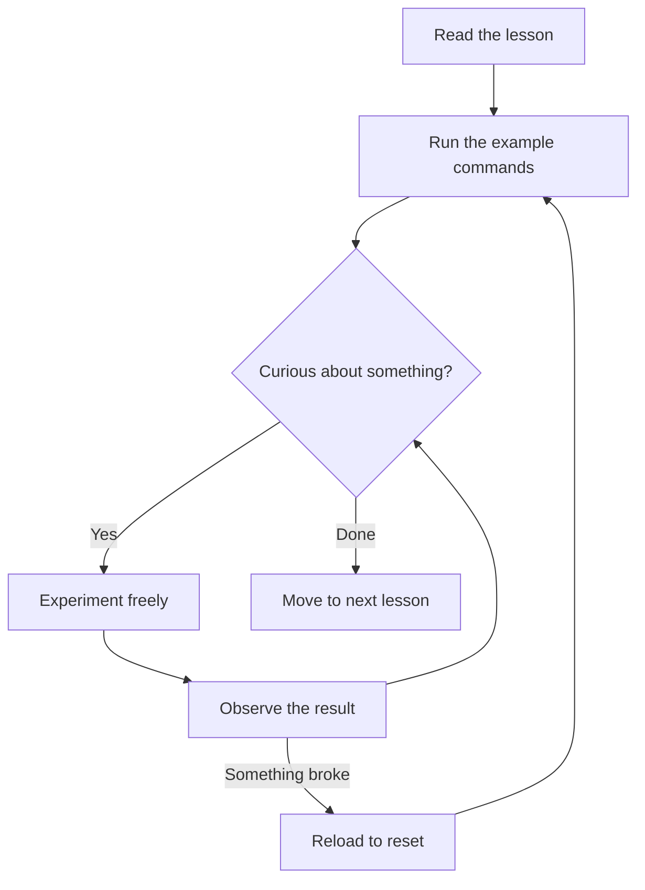

# Your Practice Environment

One of the biggest barriers to learning Kubernetes is simply getting a cluster up and running. Setting up a local environment — installing tools, configuring networks, troubleshooting driver conflicts — can easily eat up an entire afternoon before you have written a single line of configuration. Kube Mastery removes that barrier entirely. Everything you need is already running, right here in your browser.

This lesson explains exactly what your practice environment provides, which commands are available, and how to recover gracefully when experiments go in an unexpected direction (which they will, and that is perfectly fine).

## A Real Cluster in Your Browser

What you have access to is not a simulation or a mock environment. The right panel connects you to a genuine Kubernetes cluster running on real infrastructure. There is a control plane node managing the cluster and at least one worker node ready to receive workloads. When you create a Pod, it actually gets scheduled. When you delete a Deployment, the cluster genuinely reconciles the change.

Alongside the Kubernetes cluster, you also have access to a virtual Linux filesystem. This means you can create files, edit manifests with a text editor, organize directories, and use standard Unix tools as part of your workflow — just as you would on a real Linux system. The two pieces work together: you write a YAML manifest in the filesystem, then apply it to the cluster with `kubectl`.

:::info
Your environment is personal to your session. Other learners on the platform have their own isolated clusters, so there is no risk of someone else's experiments interfering with yours.
:::

## Available Commands

The terminal gives you access to a curated set of commands. You do not have root access to the underlying host machines, but you have everything you need to complete every exercise on this platform.

Here is a reference of the most important commands you will use:

**Navigation and filesystem commands**

| Command | Purpose |
|---------|---------|
| `pwd` | Print the current working directory |
| `ls` | List files and directories |
| `cd` | Change directory |
| `mkdir` | Create a new directory |
| `cat` | Display the contents of a file |
| `touch` | Create an empty file |
| `rm` | Remove a file or directory |
| `nano` | Open a simple text editor |

**Kubernetes commands**

| Command | Purpose |
|---------|---------|
| `kubectl get` | List resources (pods, nodes, services, etc.) |
| `kubectl describe` | Show detailed information about a resource |
| `kubectl apply` | Create or update resources from a YAML file |
| `kubectl delete` | Remove resources |
| `kubectl logs` | View container logs |
| `kubectl exec` | Run a command inside a running container |
| `kubectl explain` | Get documentation for any resource field |

`kubectl` is the command-line tool for interacting with Kubernetes. Think of it as the remote control for your cluster — almost everything you do with Kubernetes goes through `kubectl`. You will become very comfortable with it over the course of these lessons.

## Mistakes Are Free — Resetting Is Easy

Here is something that takes a lot of pressure off: if you make a mistake, break something, or just want to start fresh, you can reset your environment simply by reloading the page. The cluster will be restored to its initial state within a few seconds, and you can begin again from scratch.

This is one of the most underrated aspects of a managed learning environment. In a real production cluster, mistakes can have consequences. Here, the cost of an experiment gone wrong is zero. Delete that namespace. Crash that pod. Apply the broken YAML and watch the error message roll in. Every failure is feedback, and in this environment you can fail as many times as you need to without any risk.

:::warning
Reloading the page will discard any files you have created in the terminal and reset the cluster state. If you write a YAML manifest you want to keep, copy the text somewhere safe before reloading.
:::

## Limitations

The practice environment is intentionally focused. It gives you what you need to learn core Kubernetes concepts without unnecessary complexity. This means there are a few things you will not find here:

Not every Kubernetes API or add-on is available. Some advanced features — certain admission webhooks, specific storage drivers, or cloud-provider-specific resources like managed LoadBalancers — require infrastructure that is beyond the scope of a learning environment. When a lesson involves such a feature, we will call it out explicitly and explain the concept without requiring you to run the command live.

The environment also does not persist between long sessions. If you step away for an extended period, your session may time out and reset. This is by design — it keeps the infrastructure clean and responsive for everyone.

Despite these constraints, the environment covers the vast majority of what you need for the KCNA, CKAD, and CKA certifications. Every core concept — pods, deployments, services, namespaces, configmaps, secrets, RBAC, network policies, persistent volumes, and more — can be explored right here.

## Explore Without Fear

The best way to use this environment is with curiosity. After each lesson, do not just run the commands exactly as shown. Ask yourself "what happens if I change this?" and then try it. What happens if you set replicas to zero? What error do you get if you reference a ConfigMap that does not exist? What does the cluster visualizer show when a pod is in a Pending state?



The learners who make the fastest progress are not the ones who follow instructions most carefully — they are the ones who break things the most deliberately.

## Hands-On Practice

Let's verify your environment is fully operational. Run each of these commands in the terminal on the right and compare your output.

First, confirm you are in the home directory:

```
pwd
```

Expected output:

```
/root
```

Create a directory and a simple file to confirm filesystem access works:

```
mkdir practice
touch practice/hello.txt
echo "Hello, Kubernetes!" > practice/hello.txt
cat practice/hello.txt
```

Expected output:

```
Hello, Kubernetes!
```

Now confirm that `kubectl` can reach the cluster:

```
kubectl get nodes -o wide
```

Expected output (details may vary):

```
NAME           STATUS   ROLES           AGE   VERSION   INTERNAL-IP   EXTERNAL-IP   OS-IMAGE             KERNEL-VERSION   CONTAINER-RUNTIME
controlplane   Ready    control-plane   15m   v1.30.0   192.168.0.2   <none>        Ubuntu 22.04.3 LTS   5.15.0           containerd://1.7.0
node01         Ready    <none>          14m   v1.30.0   192.168.0.3   <none>        Ubuntu 22.04.3 LTS   5.15.0           containerd://1.7.0
```

The `-o wide` flag adds extra columns, including the container runtime. Notice it shows `containerd` — that is the software actually responsible for starting and stopping containers on each node. You will learn more about container runtimes in the node components lesson.

Finally, check that no workloads are currently running in the default namespace (your clean starting point):

```
kubectl get pods
```

Expected output:

```
No resources found in default namespace.
```

A clean slate. You are ready to start building.

## Wrapping Up

Your practice environment gives you a real Kubernetes cluster, a Linux filesystem, and a safe space to experiment without consequences. In the next lesson, we will look at the Kubernetes certifications — KCNA, CKAD, and CKA — so you understand where this Common Core course fits into the bigger picture.
