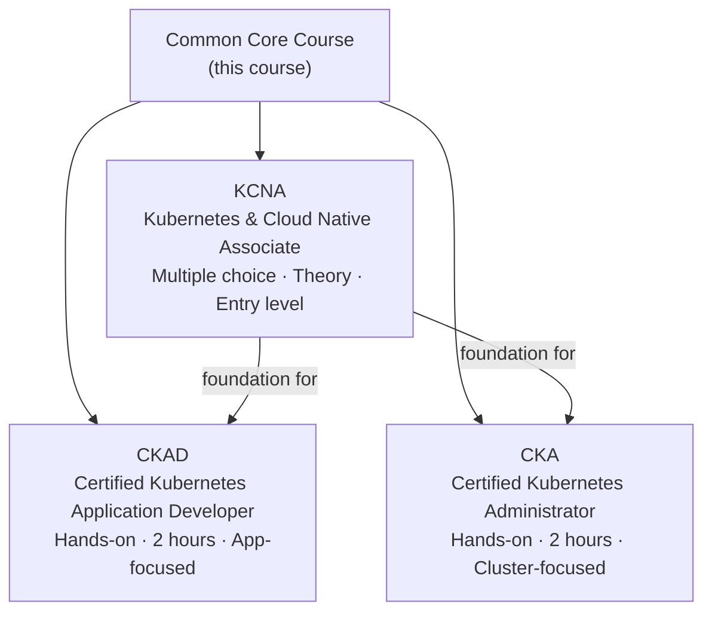

# Overview of Kubernetes Certifications

In the technology industry, certifications are not just pieces of paper — they are a shared language. When a hiring manager sees "CKA" on a resume, they immediately know that person has demonstrated they can operate a Kubernetes cluster under real pressure. When a team is evaluating a new hire for a developer role, "CKAD" signals that the candidate understands how to deploy and manage applications on Kubernetes, not just read about it. Certifications cut through the noise and give both employers and engineers a common benchmark.

The Cloud Native Computing Foundation (CNCF) — the organization that stewards the Kubernetes project — offers a family of certifications designed to recognize different levels of expertise. This lesson introduces the three most relevant ones: the KCNA, the CKAD, and the CKA. Understanding how they relate to each other will help you see exactly how the content in this course fits into your learning journey.

## KCNA — Kubernetes and Cloud Native Associate

The KCNA is the entry point into the CNCF certification ecosystem. It is a multiple-choice exam, which means it tests conceptual understanding rather than hands-on speed. You do not need to run commands during the KCNA — you need to understand what things are, why they exist, and how they fit together.

This certification is ideal if you are completely new to Kubernetes and cloud-native technologies. It covers topics like container fundamentals, Kubernetes architecture, the role of the CNCF landscape, and basic concepts like pods, deployments, and services. The KCNA validates that you can hold an intelligent conversation about Kubernetes and navigate the cloud-native ecosystem confidently.

Think of the KCNA as passing your theory test before getting behind the wheel. It proves you understand the rules of the road, even if you have not yet driven on the highway.

:::info
The KCNA exam is 90 minutes long and consists of approximately 60 multiple-choice questions. It is a great starting point before pursuing the more demanding hands-on certifications.
:::

## CKAD — Certified Kubernetes Application Developer

The CKAD is a hands-on, performance-based exam. There are no multiple-choice questions — you sit in front of a real Kubernetes cluster and complete tasks within a two-hour time limit. The tasks are focused on the perspective of an application developer: defining pods, configuring deployments, setting resource limits, working with ConfigMaps and Secrets, creating services, managing jobs, and so on.

If your role involves developing or deploying software that runs on Kubernetes, the CKAD is the natural target. It demonstrates that you can take an application from a container image to a running, properly configured workload on a cluster — and that you can do it efficiently under time pressure.

The CKAD is fast-paced. Success requires not just knowledge but fluency — you need to know `kubectl` commands well enough that writing them feels natural rather than effortful. This is exactly why hands-on practice matters so much.

## CKA — Certified Kubernetes Administrator

The CKA is also a two-hour, hands-on exam, but it shifts perspective from the application layer to the infrastructure layer. While the CKAD asks "how do I deploy and configure this application?", the CKA asks "how do I install, maintain, and troubleshoot this cluster?". Tasks include managing nodes, configuring RBAC (role-based access control), backing up etcd, troubleshooting cluster components, setting up networking, and handling storage.

The CKA is aimed at platform engineers, site reliability engineers, and anyone responsible for keeping a Kubernetes cluster healthy in production. It is widely regarded as one of the more challenging certifications in the cloud-native space, because it requires a deep understanding of how the cluster itself works at a component level.

:::warning
Both the CKAD and CKA exams are open-book — you can access the official Kubernetes documentation during the exam. However, the time pressure is significant, so knowing where to find information quickly is just as important as understanding it.
:::

## How This Common Core Course Fits In

All three certifications — KCNA, CKAD, and CKA — share a foundation. Before you can excel at any of them, you need to understand what Kubernetes is, how its architecture works, and what problems it solves. That shared foundation is exactly what this Common Core course covers.

The modules in this course — Kubernetes basics, cluster architecture, pods, deployments, services, networking fundamentals, and configuration — form the bedrock on which all three certification tracks are built. If you are targeting the KCNA, much of your exam content is covered right here. If you are targeting the CKAD or CKA, this course gives you the conceptual grounding you need before diving into the more specialized practice that each exam demands.



The diagram above shows the relationship clearly. The Common Core is not just the beginning of the KCNA path — it is the beginning of every path. Whatever certification you are aiming for, you are in the right place.

## Choosing Your Path

If you are asking yourself which certification to pursue, here is a simple heuristic: think about your job. If you write code and deploy it to Kubernetes, aim for the CKAD. If you manage the infrastructure that code runs on, aim for the CKA. If you are new to the field and want to validate foundational knowledge before committing to a hands-on exam, start with the KCNA.

There is no wrong order. Many engineers pursue all three over time, and the skills genuinely compound — knowledge from the CKAD makes you a better CKA candidate and vice versa.

## Hands-On Practice

The best preparation for any Kubernetes certification starts with getting comfortable at the command line. Let's run a few commands that will appear frequently across all three exams.

List all resources in the current namespace:

```
kubectl get all
```

Expected output:

```
NAME                 TYPE        CLUSTER-IP   EXTERNAL-IP   PORT(S)   AGE
service/kubernetes   ClusterIP   10.96.0.1    <none>        443/TCP   20m
```

Even with nothing deployed yet, there is already one service — the `kubernetes` service, which exposes the API server internally within the cluster.

Use `kubectl explain` to read built-in documentation for any resource:

```
kubectl explain pod
```

Expected output (truncated):

```
KIND:       Pod
VERSION:    v1

DESCRIPTION:
    Pod is a collection of containers that can run on a host. This resource is
    created by clients and scheduled onto hosts.

FIELDS:
  apiVersion    <string>
  kind          <string>
  metadata      <ObjectMeta>
  spec          <PodSpec>
  status        <PodStatus>
```

`kubectl explain` is one of the most useful tools in a certification exam. You can drill into any field:

```
kubectl explain pod.spec.containers
```

This shows you the full schema for the `containers` field inside a Pod spec — available to you without leaving the terminal.

## Wrapping Up

You now understand the three major Kubernetes certifications, what each one tests, and how the Common Core course lays the groundwork for all of them. In the next module, we get into the substance: what Kubernetes actually is, the problem it was built to solve, and where it came from.
