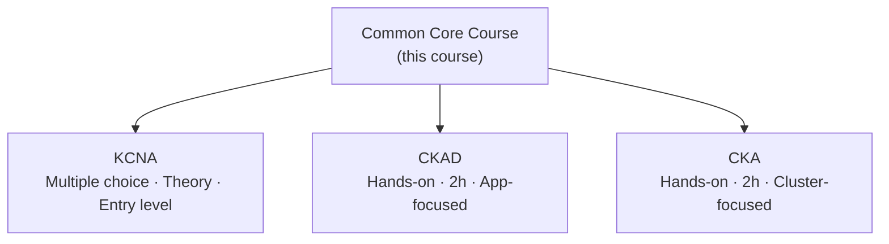

# Overview of Kubernetes Certifications

Certifications give employers and engineers a common benchmark. The Cloud Native Computing Foundation (CNCF) offers several Kubernetes-related certifications. This lesson introduces the three most relevant: KCNA, CKAD, and CKA, and how the content in this course fits into each path.

## KCNA: Kubernetes and Cloud Native Associate

The KCNA is the entry point. It is a multiple-choice exam that tests conceptual understanding, not hands-on speed. You need to understand what things are, why they exist, and how they fit together.

It covers container fundamentals, Kubernetes architecture, the CNCF landscape, and basics like pods, deployments, and services. Ideal if you are new to Kubernetes and want to validate foundational knowledge before tackling hands-on exams.

:::info
The KCNA is 90 minutes, about 60 multiple-choice questions. A good starting point before CKAD or CKA.
:::

## CKAD: Certified Kubernetes Application Developer

The CKAD is hands-on and performance-based. You work on a real cluster for two hours, completing tasks from an application developer's perspective:

- Defining pods and configuring deployments
- Working with ConfigMaps, Secrets, and environment variables
- Exposing applications with services
- Running batch jobs

If your role involves developing or deploying software on Kubernetes, the CKAD is the natural target. Success requires fluency with `kubectl`, which is why hands-on practice matters so much.

## CKA: Certified Kubernetes Administrator

The CKA is also a two-hour hands-on exam, but focused on the infrastructure layer. Tasks include:

- Managing nodes and cluster components
- Configuring RBAC and network policies
- Backing up etcd and troubleshooting failures
- Setting up storage and persistent volumes

It is aimed at platform engineers and SREs responsible for keeping clusters healthy in production. It is widely regarded as one of the more challenging certifications in the cloud-native space.

:::warning
CKAD and CKA are open-book: you can use the official Kubernetes documentation during the exam. Time pressure is still significant, so knowing where to find information quickly matters.
:::

## How This Common Core Fits In

All three certifications share a foundation: what Kubernetes is, how its architecture works, and what problems it solves. That foundation is what this Common Core course covers.

Whatever certification you are aiming for, you are in the right place. Next, we get into the substance: what Kubernetes is and the problem it was built to solve.
