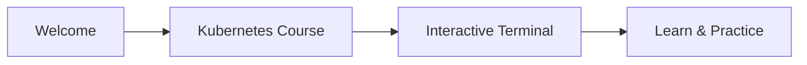

# How to use this platform



Welcome to KubeMastery! We're excited to have you here. This platform allows you to learn Kubernetes in a fast and secure environment, all from your browser.

:::info
You can follow the course without logging in, but we recommend creating an account to save your progress.
:::

## The interface

On the right side of your screen, you'll find an **emulated terminal**. This terminal allows you to run commands and manipulate a simulated Kubernetes cluster, exactly like in production. It's your playground to experiment and learn.

Below the terminal, there's a **cluster viewer** panel that displays your cluster as a visual diagram. You can expand or collapse it using the button at the bottom right. It shows nodes, pods, and containers in a nested view, helping you visualize the state of your cluster at a glance.

On the left side, you'll find an **overview panel** that lets you jump between lessons easily. You can show or hide it anytime with the button at the bottom left. It might not be visible if you're on a smaller screen.

## Test the environment

Let's make sure everything is working. Try this command in the terminal:

To verify kubectl is working, run:

```bash
kubectl version
```

Throughout this course, everything we explain here is based on the official Kubernetes documentation. It's essential that you learn to navigate it effectively—it's an indispensable tool, especially when preparing for certification exams like the CKA or CKAD.

## Practice with quizzes

At the end of each lesson, you'll find a **quiz** to practice what you've learned, you will have to complete it to move to the next lesson.
