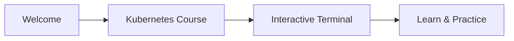

# How to use this platform



Welcome to KubeMastery! We're excited to have you here. This platform allows you to learn Kubernetes in a fast and secure environment, all from your browser.

## The interface

On the right side of your screen, you'll find an **emulated terminal**. This terminal allows you to run commands and manipulate a simulated Kubernetes cluster, exactly like in production. It's your playground to experiment and learn.

Below the terminal, you'll find buttons: the **telescope icon** opens the **cluster visualizer**, which displays your cluster as a diagram (nodes, pods, containers); the **chat icon** lets you send feedback, suggestions, or report bugs.

On the left side, you'll find an **overview panel** that lets you jump between lessons easily. You can show or hide it anytime with the button at the bottom left.

**On smartphone**, the layout differs. Note that not all mobile keyboards work well with the terminal; we recommend **Gboard**, which has been tested.

## Test the environment

Let's make sure everything is working. Try this command in the terminal:

To verify kubectl is working, run:

```bash
kubectl version
```

Throughout this course, everything we explain here is based on the official Kubernetes documentation. It's essential that you learn to navigate it effectively, it's an indispensable tool, especially when preparing for certification exams like the CKA or CKAD.

## Practice with quizzes

At the end of each lesson, you'll find a **quiz** to practice what you've learned, you will have to complete it to move to the next lesson.
