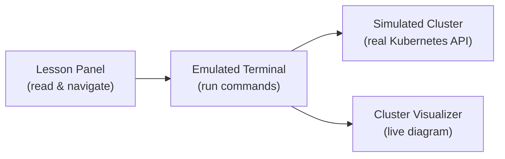

# How to Use This Platform

## Why Hands-On Practice?

Imagine learning to ride a bicycle by only reading about it. You might understand the theory, but you would never develop the balance and instincts that come from actually pedaling. Kubernetes works the same way. The fastest path to real understanding is to type commands, watch what happens, and build muscle memory. That is exactly what this platform gives you: a safe, browser-based workspace where every command runs against a real Kubernetes API. Nothing you do here can break a production system, so feel free to experiment as much as you like.

## Navigating the Interface

Let's take a quick tour of your workspace. The screen is split into two main areas:

- **Left panel** — Lessons and navigation. This is where you read content, move between lessons, and track your progress through the course.
- **Right panel** — Emulated terminal. This is your command line. You can run `kubectl` and other shell commands here, just like you would on a real machine.

Below the terminal you will find two small icons. The **telescope icon** opens the **cluster visualizer**, a live diagram of the nodes, Pods, and containers currently running in your cluster. The **chat icon** lets you send feedback or report issues.

Think of the visualizer as a control tower view of an airport: instead of watching planes on runways, you see Pods landing on nodes. It is a wonderful way to confirm that your commands had the expected effect.



:::info
On mobile devices the layout adapts to a single column. Not every on-screen keyboard works perfectly with the terminal. Gboard has been tested and works well.
:::

## Quizzes and Course Material

At the end of each lesson you will find a short quiz. These are not exams. They are friendly checkpoints designed to reinforce the key ideas before you move on. All course content is aligned with the <a target="_blank" href="https://kubernetes.io/docs/home/">official Kubernetes documentation</a>, which means the concepts you learn here map directly to what is expected on certifications like the CKA or CKAD.

:::warning
The simulator covers the core Kubernetes features used in this course, but it may not support every advanced API or addon. If something behaves unexpectedly, check the platform documentation or use the feedback button.
:::

---

## Hands-On Practice

### Step 1: Verify Your Setup

```bash
kubectl version
```

This confirms that `kubectl` is installed and can communicate with the cluster. Think of it as your remote control for the cluster.

### Step 2: Explore What Is Running

```bash
kubectl get nodes
kubectl get pods -A
kubectl cluster-info
```

`get nodes` lists the machines in your cluster. `get pods -A` shows every Pod across all namespaces. `cluster-info` prints the API server address. If any command returns an error, give the platform a few seconds to finish initializing, then try again.

### Step 3: Create Your First Pod

Create a file called `pod.yaml` with the following content:

```yaml
apiVersion: v1
kind: Pod
metadata:
  name: test-nginx
spec:
  containers:
    - name: nginx
      image: nginx
```

Apply it to the cluster and verify:

```bash
kubectl apply -f pod.yaml
kubectl get pods
```

You should see `test-nginx` appear with a status that eventually becomes **Running**. This *define in YAML, apply, verify* workflow is the heartbeat of working with Kubernetes.

## Wrapping Up

You now have a working environment and your first Pod running in the cluster. Every lesson from here follows the same rhythm: read a concept, try it in the terminal, and confirm the result. In the next lesson, we will explore the practice environment itself in more depth, including the filesystem, the available tools, and how to reset when you want a fresh start.
