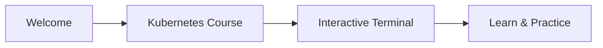

# Comment utiliser cette plateforme



Bienvenue sur KubeMastery ! Nous sommes ravis de vous accueillir. Cette plateforme vous permet d'apprendre Kubernetes dans un environnement rapide et sécurisé, le tout depuis votre navigateur.

:::info
Vous pouvez suivre le cours sans vous connecter, mais nous recommandons de créer un compte pour sauvegarder votre progression.
:::

## L'interface

Sur le côté droit de votre écran, vous trouverez un **terminal émulé**. Ce terminal vous permet d'exécuter des commandes et de manipuler un cluster Kubernetes simulé, exactement comme en production. C'est votre terrain de jeu pour expérimenter et apprendre.

Sous le terminal, il y a un panneau **cluster viewer** qui affiche votre cluster sous forme de diagramme visuel. Vous pouvez l'agrandir ou le réduire en utilisant le bouton en bas à droite. Il affiche les nœuds, les pods et les conteneurs dans une vue imbriquée, vous aidant à visualiser l'état de votre cluster d'un coup d'œil.

Sur le côté gauche, vous trouverez un **panneau de vue d'ensemble** qui vous permet de naviguer facilement entre les leçons. Vous pouvez l'afficher ou le masquer à tout moment avec le bouton en bas à gauche. Il pourrait ne pas être visible si vous êtes sur un écran plus petit.

## Tester l'environnement

Assurons-nous que tout fonctionne. Essayez cette commande dans le terminal :

Pour vérifier que kubectl fonctionne, exécutez :

```bash
kubectl version
```

Tout au long de ce cours, tout ce que nous expliquons ici est basé sur la documentation officielle de Kubernetes. Il est essentiel que vous appreniez à la naviguer efficacement, c'est un outil indispensable, surtout lors de la préparation aux examens de certification comme le CKA ou le CKAD.

## S'exercer avec les quiz

À la fin de chaque leçon, vous trouverez un **quiz** pour pratiquer ce que vous avez appris, vous devrez le compléter pour passer à la leçon suivante.
