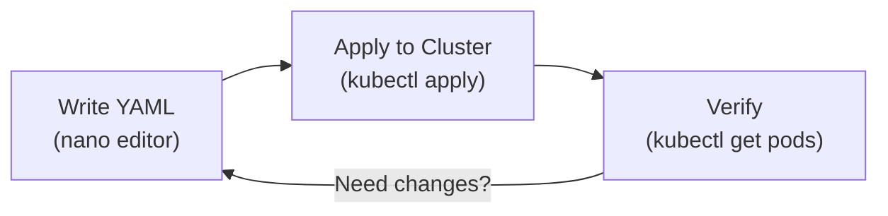

# Your Practice Environment

## Why a Simulated Cluster?

Setting up a real Kubernetes cluster traditionally meant either spinning up cloud resources (and paying for them) or wrestling with a local installation. This platform removes that barrier entirely. You get a fully functional cluster and a virtual filesystem, all running inside your browser. Think of it as a flight simulator for pilots: the controls behave like the real thing, but crashing costs nothing and you can reset in seconds.

The environment implements the essentials from the official Kubernetes API specification, so the skills you build here transfer directly to real clusters.

## What You Have Access To

The practice environment gives you two main tools:

1. **A virtual filesystem** where you can create directories, write files, and navigate just like on a Linux machine.
2. **A Kubernetes cluster** that accepts standard `kubectl` commands and behaves like a minimal production cluster.

Here are the everyday commands available in the terminal:

| Category | Commands |
|---|---|
| Navigation | `cd`, `ls`, `pwd`, `mkdir` |
| File operations | `cat`, `touch`, `rm`, `nano` |
| Terminal | `clear`, `help`, history with arrow keys |
| Kubernetes | `kubectl` and its subcommands |

:::info
Since this is a browser-based simulation, some advanced features might behave slightly differently than on a full Linux machine. If you notice an issue in the course, click the **pen icon** at the bottom right of the window to suggest a correction.
:::

The workflow you will use throughout the course is: write YAML in the editor, apply it to the cluster, and verify the result. This loop repeats for every resource you create or change:



## Starting Fresh

Here is one of the biggest advantages of a simulated environment: mistakes are completely free. If you ever want to reset everything, the filesystem, the cluster state, all of it, simply **reload the browser page**. You will get a clean environment, ready for the next experiment. Think of it like an Etch A Sketch: shake it, and you have a blank canvas again.

:::warning
The environment covers the features used in this course, but not every Kubernetes API or addon is present. Stick to documented commands, and consult the platform documentation if something behaves unexpectedly.
:::

---

## Hands-On Practice

### Step 1: Explore the filesystem

```bash
ls
pwd
```

### Step 2: Create a directory for your manifests

```bash
mkdir manifests
ls
```

### Step 3: Check the cluster nodes

```bash
kubectl get nodes
```

You should see a control-plane node and two worker nodes.

### Step 4: List system Pods

```bash
kubectl get pods -n kube-system
```

These are the components that keep Kubernetes running.

## Wrapping Up

You now have a solid grasp of your workspace: a virtual filesystem for writing manifests, a simulated Kubernetes cluster for running them, and the ability to reset everything with a page reload. Work at your own pace, experiment freely, and remember that every mistake here is a free lesson with zero consequences. With this foundation in place, you are ready to dive into the core concepts of Kubernetes in the next chapter.
