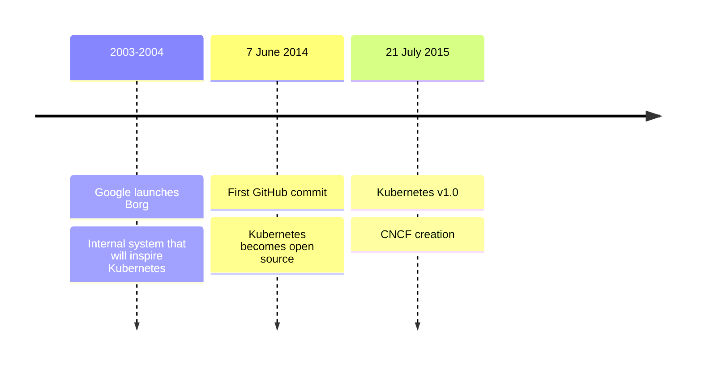
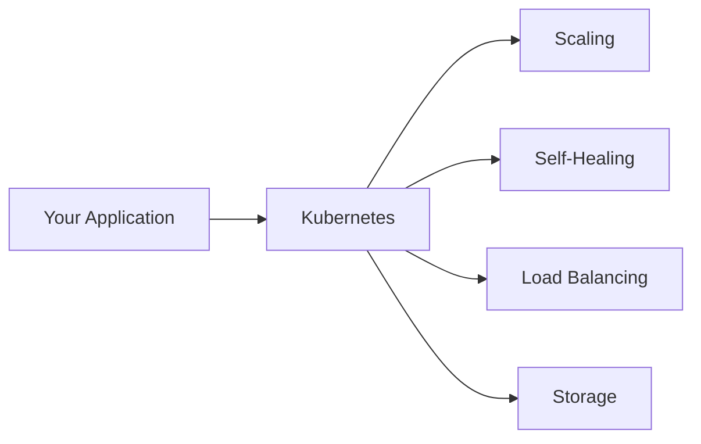

# What is Kubernetes?

Kubernetes is a portable, extensible, open-source platform for managing containerized workloads and services. It provides a framework to run distributed systems in a reliable way, even when individual components fail.



The name Kubernetes comes from Greek, meaning "helmsman" or "pilot". You might also see it abbreviated as **K8s** (count the eight letters between "K" and "s"). Originally developed by Google, Kubernetes is now maintained by the Cloud Native Computing Foundation (CNCF).

:::info
The **Cloud Native Computing Foundation (CNCF)** is a Linux Foundation project that hosts tons of open-source tools and projects, including Kubernetes, Prometheus, and many others. If you're curious about what else is out there in the cloud-native world, check out the <a target="_blank" href="https://landscape.cncf.io/">CNCF Landscape</a>.
:::

## Why Kubernetes?

Containers are useful for bundling applications, but in production you need to manage them and ensure no downtime. If a container crashes, another needs to start automatically. Kubernetes handles this for you.

Think of Kubernetes as a manager that watches over your containers. It provides:

- **Service discovery and load balancing**: Exposes containers using DNS names or IP addresses, and distributes traffic across containers
- **Storage orchestration**: Automatically mounts storage systems of your choice
- **Automated rollouts and rollbacks**: Changes actual state to desired state at a controlled rate
- **Self-healing**: Restarts failed containers and replaces unresponsive ones
- **Automatic bin packing**: Places containers onto nodes to make the best use of resources
- **Secret management**: Stores sensitive information securely without rebuilding images



## Key Capabilities

Kubernetes provides horizontal scaling, scale your application up and down with a simple command or automatically based on CPU usage. It supports batch execution for CI workloads and is designed for extensibility without changing core source code.

To check your cluster's capabilities, run:

```bash
kubectl api-resources
```

This command shows you all the different types of things Kubernetes can manage in your cluster. Don't worry about understanding what each one means yet, we'll cover them throughout the course.

## What Kubernetes is Not

Kubernetes is not a traditional PaaS system (Platform as a Service). It operates at the container level and provides building blocks, but preserves your choice and flexibility.

- Does not limit application types, supports stateless, stateful, and data-processing workloads
- Does not deploy source code or build applications, that's handled by CI/CD
- Does not provide application-level services like databases or message buses as built-ins
- Does not dictate logging, monitoring, or alerting solutions

:::info
Kubernetes's flexibility extends to game development too. It's used for hosting and scaling multiplayer game servers. Projects like <a target="_blank" href="https://agones.dev/">Agones</a> (by Google and Ubisoft) are specifically designed for game servers on Kubernetes.
:::
