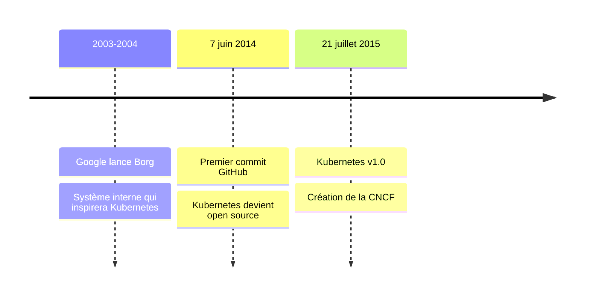
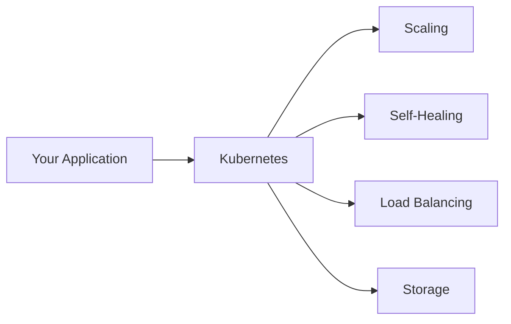

# Qu'est-ce que Kubernetes ?

Kubernetes est une plateforme portable, extensible et open source pour gérer des charges de travail et des services conteneurisés. Il fournit un framework pour exécuter des systèmes distribués de manière fiable, même lorsque des composants individuels échouent.



Le nom Kubernetes vient du grec, signifiant "timonier" ou "pilote". Vous pourriez aussi le voir abrégé en **K8s** (comptez les huit lettres entre "K" et "s"). Développé à l'origine par Google, Kubernetes est maintenant maintenu par la Cloud Native Computing Foundation (CNCF).

:::info
La **Cloud Native Computing Foundation (CNCF)** est un projet de la Linux Foundation qui héberge des tonnes d'outils et de projets open source, notamment Kubernetes, Prometheus et bien d'autres. Si vous êtes curieux de savoir ce qui existe d'autre dans le monde cloud-native, consultez le <a target="_blank" href="https://landscape.cncf.io/">CNCF Landscape</a>.
:::

## Pourquoi Kubernetes ?

Les conteneurs sont utiles pour regrouper des applications, mais en production, vous devez les gérer et garantir aucune interruption de service. Si un conteneur plante, un autre doit démarrer automatiquement. Kubernetes gère cela pour vous.

Pensez à Kubernetes comme un gestionnaire qui surveille vos conteneurs. Il fournit :

- **Découverte de services et équilibrage de charge** : Expose les conteneurs en utilisant des noms DNS ou des adresses IP, et distribue le trafic entre les conteneurs
- **Orchestration du stockage** : Monte automatiquement les systèmes de stockage de votre choix
- **Déploiements et retours en arrière automatisés** : Modifie l'état réel vers l'état souhaité à un rythme contrôlé
- **Auto-guérison** : Redémarre les conteneurs en échec et remplace ceux qui ne répondent pas
- **Emballage automatique** : Place les conteneurs sur les nœuds pour faire le meilleur usage des ressources
- **Gestion des secrets** : Stocke les informations sensibles de manière sécurisée sans reconstruire les images



## Capacités clés

Kubernetes fournit une mise à l'échelle horizontale, mettez à l'échelle votre application de haut en bas avec une simple commande ou automatiquement basé sur l'utilisation du CPU. Il prend en charge l'exécution par lots pour les charges de travail CI et est conçu pour l'extensibilité sans modifier le code source principal.

:::command
Pour vérifier les capacités de votre cluster, exécutez :

```bash
kubectl api-resources
```

Cette commande vous montre tous les différents types de choses que Kubernetes peut gérer dans votre cluster. Ne vous inquiétez pas de comprendre ce que chacun signifie pour l'instant, nous les couvrirons tout au long du cours. Cliquez sur 'en savoir plus' et essayez d'expérimenter avec les flags pour voir les différents formats de sortie.

<a target="_blank" href="https://kubernetes.io/docs/reference/kubectl/generated/kubectl_api-resources/">En savoir plus</a>
:::

## Ce que Kubernetes n'est pas

Kubernetes n'est pas un système PaaS traditionnel (Platform as a Service). Il opère au niveau des conteneurs et fournit des blocs de construction, mais préserve votre choix et votre flexibilité.

- Ne limite pas les types d'applications, prend en charge les charges de travail sans état, avec état et de traitement de données
- Ne déploie pas le code source ni ne construit d'applications, c'est géré par CI/CD
- Ne fournit pas de services au niveau de l'application comme des bases de données ou des bus de messages comme intégrés
- Ne dicte pas de solutions de journalisation, de surveillance ou d'alerte

:::info
La flexibilité de Kubernetes s'étend aussi au développement de jeux. Il est utilisé pour héberger et mettre à l'échelle des serveurs de jeux multijoueurs. Des projets comme <a target="_blank" href="https://agones.dev/">Agones</a> (par Google et Ubisoft) sont spécifiquement conçus pour les serveurs de jeux sur Kubernetes.
:::
