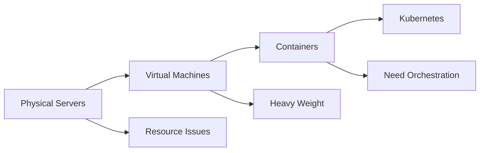
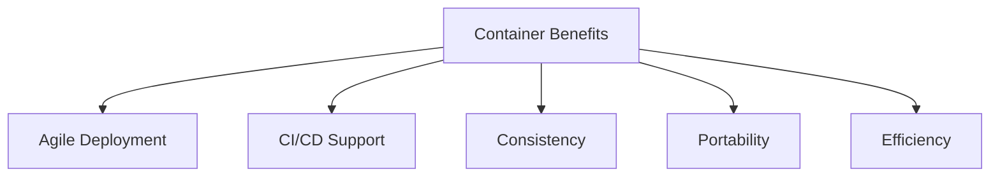

# Evolution of Deployment

Understanding how we moved from physical servers to containers helps explain why Kubernetes exists. Each approach solved problems but created new challenges.

## Traditional Deployment Era

Early organizations ran applications directly on physical servers. There was no way to define resource boundaries, causing allocation problems. If multiple applications ran on one server, one could consume most resources, causing others to underperform.

Running each application on separate servers didn't scale well. Resources were underutilized, a server might run at only 10% capacity. It was expensive to maintain many servers, and adding applications required buying new hardware.

## Virtualized Deployment Era

Virtualization allowed multiple Virtual Machines (VMs) to run on a single physical server's CPU. This provided:

- **Application isolation**: One application couldn't access another's information
- **Better resource utilization**: Many applications on the same hardware
- **Improved scalability**: Add or update applications without new hardware
- **Reduced costs**: Better use of existing infrastructure

:::info
Each VM runs a full operating system, making VMs relatively heavy. They need to boot an entire OS, which takes time and consumes resources.
:::

## Container Deployment Era

Containers solve the VM weight problem by sharing the Operating System among applications. Think of it this way: a VM is like a whole house, while a container is like a room in a shared house, you have your own space but share utilities.

Containers have their own filesystem, CPU share, memory, and process space, but are decoupled from underlying infrastructure. This makes them portable across clouds and operating systems.

## Container Benefits

Containers provide several key benefits:

- **Faster creation**: Container images are much faster to create than VM images
- **Immutable images**: Once created, images don't change, making rollbacks safe
- **Environmental consistency**: Run the same on laptop, test, and production
- **Cloud portability**: Move easily between cloud providers
- **High resource utilization**: Run many more containers than VMs on the same hardware

This evolution created the need for Kubernetes, which provides the orchestration layer to manage containers at scale.
