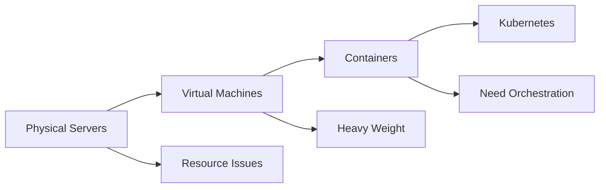
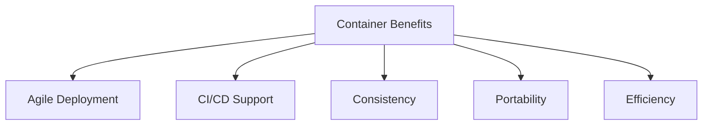

# Évolution du déploiement

Comprendre comment nous sommes passés des serveurs physiques aux conteneurs aide à expliquer pourquoi Kubernetes existe. Chaque approche a résolu des problèmes mais a créé de nouveaux défis.

## Ère du déploiement traditionnel

Les premières organisations exécutaient des applications directement sur des serveurs physiques. Il n'y avait aucun moyen de définir les limites des ressources, causant des problèmes d'allocation. Si plusieurs applications s'exécutaient sur un serveur, une pouvait consommer la plupart des ressources, causant une sous-performance des autres.

Exécuter chaque application sur des serveurs séparés ne s'adaptait pas bien. Les ressources étaient sous-utilisées, un serveur pouvait fonctionner à seulement 10% de sa capacité. Il était coûteux de maintenir de nombreux serveurs, et ajouter des applications nécessitait d'acheter de nouveaux matériels.

## Ère du déploiement virtualisé

La virtualisation a permis à plusieurs machines virtuelles (VMs) de s'exécuter sur le CPU d'un seul serveur physique. Cela a fourni :

- **Isolation des applications** : Une application ne pouvait pas accéder aux informations d'une autre
- **Meilleure utilisation des ressources** : De nombreuses applications sur le même matériel
- **Amélioration de la scalabilité** : Ajouter ou mettre à jour des applications sans nouveau matériel
- **Réduction des coûts** : Meilleure utilisation de l'infrastructure existante

:::info
Chaque VM exécute un système d'exploitation complet, rendant les VMs relativement lourdes. Elles doivent démarrer un OS entier, ce qui prend du temps et consomme des ressources.
:::

## Ère du déploiement par conteneurs

Les conteneurs résolvent le problème de poids des VMs en partageant le système d'exploitation entre les applications. Pensez-y ainsi : une VM est comme une maison entière, tandis qu'un conteneur est comme une chambre dans une maison partagée, vous avez votre propre espace mais partagez les utilitaires.

Les conteneurs ont leur propre système de fichiers, partage de CPU, mémoire et espace de processus, mais sont découplés de l'infrastructure sous-jacente. Cela les rend portables entre les clouds et les systèmes d'exploitation.

## Avantages des conteneurs

Les conteneurs fournissent plusieurs avantages clés :

- **Création plus rapide** : Les images de conteneurs sont beaucoup plus rapides à créer que les images de VM
- **Images immuables** : Une fois créées, les images ne changent pas, rendant les retours en arrière sûrs
- **Cohérence environnementale** : Fonctionne de la même manière sur ordinateur portable, test et production
- **Portabilité cloud** : Déplacez facilement entre les fournisseurs de cloud
- **Utilisation élevée des ressources** : Exécutez beaucoup plus de conteneurs que de VMs sur le même matériel

Cette évolution a créé le besoin de Kubernetes, qui fournit la couche d'orchestration pour gérer les conteneurs à grande échelle.
