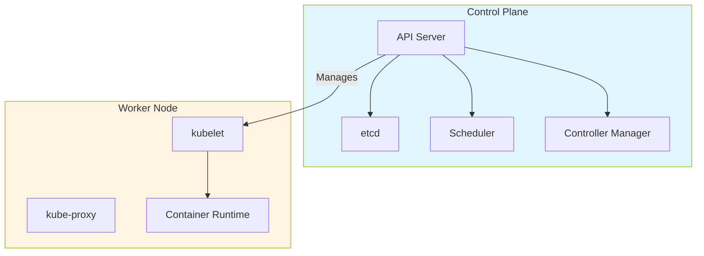
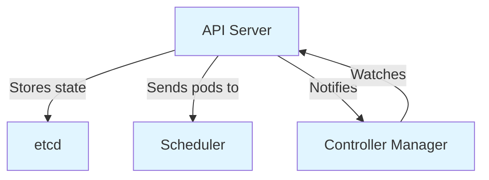
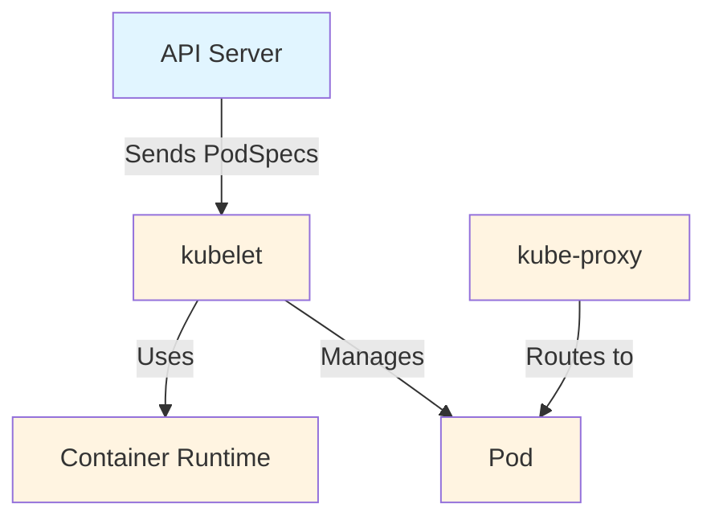

# Cluster Architecture

A Kubernetes cluster consists of two main parts: a **control plane** and one or more **worker nodes**. Think of the control plane as the brain that makes decisions, and worker nodes as the workers that run your applications.



Every cluster needs at least one worker node to run Pods. In production, the control plane usually runs across multiple computers for fault tolerance.

## Control Plane Components

The control plane makes global decisions and responds to cluster events, like scheduling Pods or starting new ones when needed.

**kube-apiserver** exposes the Kubernetes HTTP API. All communication goes through it - users, cluster components, and external systems. It validates requests and stores state in etcd.

**etcd** is a highly-available key-value store that holds all cluster data. Think of it as the cluster's memory.

**kube-scheduler** assigns Pods to suitable nodes. It considers resource requirements, hardware constraints, and affinity rules.

**kube-controller-manager** runs controllers that watch cluster state and make changes to match the desired state. Examples include the Node controller and Job controller.

**cloud-controller-manager** (optional) runs cloud provider-specific controllers. Not needed for on-premises or learning environments.


:::info
In high-availability setups, the etcd database should be isolated elsewhere to avoid consistency issues and improve performance.
:::

:::warning
For simplicity, setup scripts typically start all control plane components on the same machine. In production, spread them across multiple machines for better reliability.
:::

## Node Components

Worker nodes run components that maintain Pods and provide the Kubernetes runtime environment.

**kubelet** is an agent on each node that ensures Pods and containers are running. It takes PodSpecs (Pod specifications defining container images, resources, and configuration) and ensures containers are running and healthy.

**kube-proxy** (optional) maintains network rules to implement Services. Some network plugins provide their own implementation, so kube-proxy may not be needed.

**container runtime** is the software that runs containers (e.g., <a target="_blank" href="https://containerd.io/">containerd</a>, <a target="_blank" href="https://cri-o.io/">CRI-O</a>). Kubernetes supports any runtime that implements the Container Runtime Interface (CRI).

:::command
To view the nodes in your cluster, run:

```bash
kubectl get nodes
```
<a target="_blank" href="https://kubernetes.io/docs/reference/kubectl/kubectl/">Learn more</a>
:::



## Cluster Addons

Addons extend Kubernetes functionality using Kubernetes resources. They belong in the `kube-system` namespace.

All clusters should have **cluster DNS**, which serves DNS records for Kubernetes services. Containers automatically include this DNS server in their searches.

Other common addons include:
- Web UI (Dashboard) for cluster management
- Container resource monitoring tools
- Cluster-level logging solutions

:::command
To see cluster addons, try:

```bash
kubectl get pods -n kube-system
```

This shows system pods including DNS and other addons.

<a target="_blank" href="https://kubernetes.io/docs/concepts/overview/working-with-objects/namespaces/">Learn more</a>
:::

:::info
Addons are optional but can make managing and monitoring your cluster much easier.
:::
