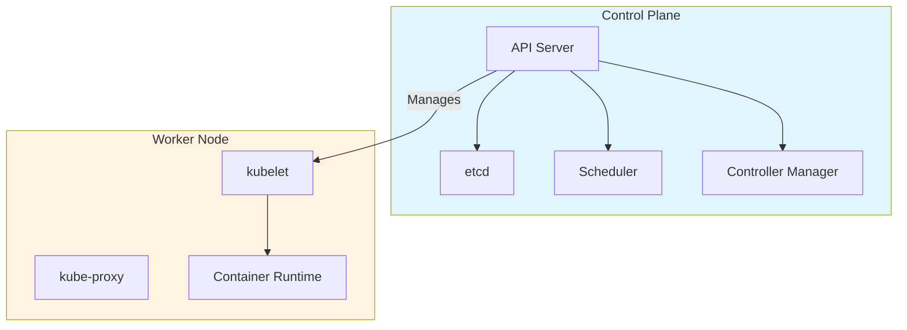
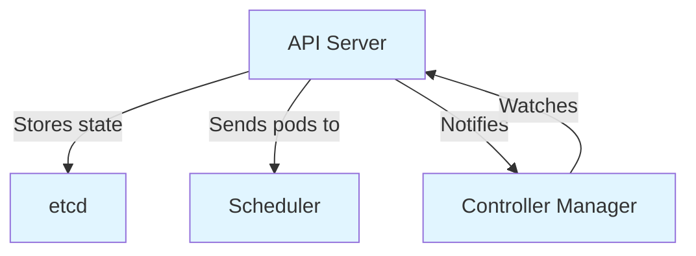
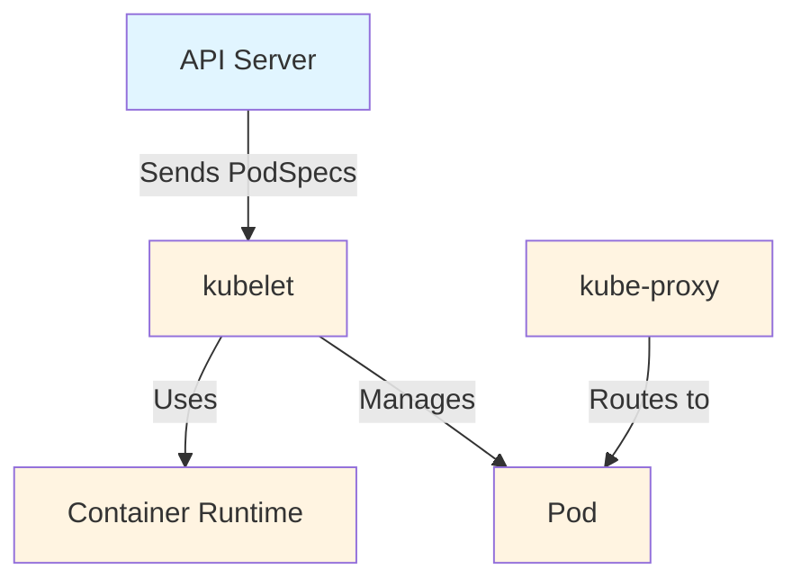

# Architecture du cluster

Un cluster Kubernetes se compose de deux parties principales : un **plan de contrôle** et un ou plusieurs **nœuds de travail**. Pensez au plan de contrôle comme au cerveau qui prend les décisions, et aux nœuds de travail comme aux travailleurs qui exécutent vos applications.



Chaque cluster a besoin d'au moins un nœud de travail pour exécuter des Pods. En production, le plan de contrôle s'exécute généralement sur plusieurs ordinateurs pour la tolérance aux pannes.

## Composants du plan de contrôle

Le plan de contrôle prend des décisions globales et répond aux événements du cluster, comme planifier des Pods ou en démarrer de nouveaux lorsque nécessaire.

**kube-apiserver** expose l'API HTTP de Kubernetes. Toute communication passe par lui - utilisateurs, composants du cluster et systèmes externes. Il valide les requêtes et stocke l'état dans etcd.

**etcd** est un magasin clé-valeur hautement disponible qui contient toutes les données du cluster. Pensez-y comme à la mémoire du cluster.

**kube-scheduler** assigne les Pods aux nœuds appropriés. Il considère les exigences de ressources, les contraintes matérielles et les règles d'affinité.

**kube-controller-manager** exécute des contrôleurs qui surveillent l'état du cluster et apportent des changements pour correspondre à l'état souhaité. Des exemples incluent le contrôleur de nœud et le contrôleur de travail.

**cloud-controller-manager** (optionnel) exécute des contrôleurs spécifiques au fournisseur de cloud. Non nécessaire pour les environnements sur site ou d'apprentissage.


:::info
Dans les configurations haute disponibilité, la base de données etcd devrait être isolée ailleurs pour éviter les problèmes de cohérence et améliorer les performances.
:::

:::warning
Pour simplifier, les scripts de configuration démarrent généralement tous les composants du plan de contrôle sur la même machine. En production, répartissez-les sur plusieurs machines pour une meilleure fiabilité.
:::

## Composants des nœuds

Les nœuds de travail exécutent des composants qui maintiennent les Pods et fournissent l'environnement d'exécution Kubernetes.

**kubelet** est un agent sur chaque nœud qui garantit que les Pods et les conteneurs fonctionnent. Il prend des PodSpecs (spécifications de Pod définissant les images de conteneurs, les ressources et la configuration) et garantit que les conteneurs fonctionnent et sont sains.

**kube-proxy** (optionnel) maintient les règles réseau pour implémenter les Services. Certains plugins réseau fournissent leur propre implémentation, donc kube-proxy peut ne pas être nécessaire.

**container runtime** est le logiciel qui exécute les conteneurs (par exemple, <a target="_blank" href="https://containerd.io/">containerd</a>, <a target="_blank" href="https://cri-o.io/">CRI-O</a>). Kubernetes prend en charge tout runtime qui implémente l'interface Container Runtime Interface (CRI).

:::command
Pour voir les nœuds dans votre cluster, exécutez :

```bash
kubectl get nodes
```
<a target="_blank" href="https://kubernetes.io/docs/reference/kubectl/kubectl/">En savoir plus</a>
:::



## Modules complémentaires du cluster

Les modules complémentaires étendent la fonctionnalité de Kubernetes en utilisant les ressources Kubernetes. Ils appartiennent au namespace `kube-system`.

Tous les clusters devraient avoir **cluster DNS**, qui sert les enregistrements DNS pour les services Kubernetes. Les conteneurs incluent automatiquement ce serveur DNS dans leurs recherches.

D'autres modules complémentaires courants incluent :
- Interface Web (Dashboard) pour la gestion du cluster
- Outils de surveillance des ressources de conteneurs
- Solutions de journalisation au niveau du cluster

:::command
Pour voir les modules complémentaires du cluster, essayez :

```bash
kubectl get pods -n kube-system
```

Cela montre les pods système incluant DNS et d'autres modules complémentaires.

<a target="_blank" href="https://kubernetes.io/docs/concepts/overview/working-with-objects/namespaces/">En savoir plus</a>
:::

:::info
Les modules complémentaires sont optionnels mais peuvent rendre la gestion et la surveillance de votre cluster beaucoup plus faciles.
:::
