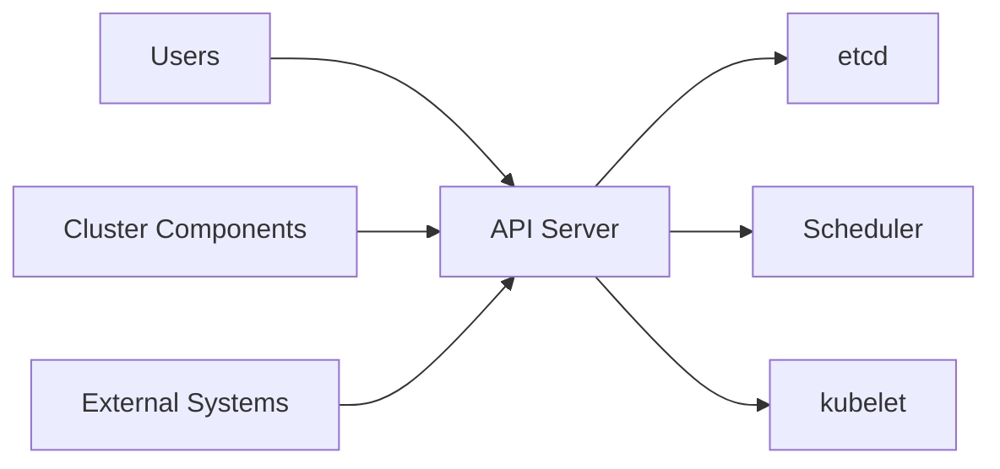
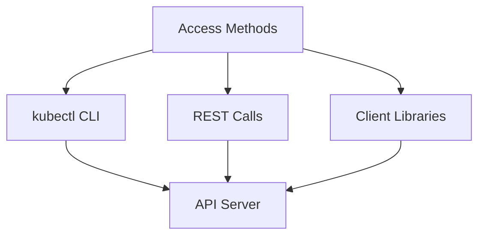

# The Kubernetes API

The Kubernetes API is the core of Kubernetes' control plane. The API server exposes an HTTP API that enables communication between users, cluster components, and external systems. Think of the API as the language everything in Kubernetes uses to communicate.



The API lets you query and manipulate API objects like Pods, Namespaces, ConfigMaps, and Events. Every action - creating a Pod, updating a Deployment, checking status - goes through the API server.

## API Server

The kube-apiserver is the central hub of your cluster. It validates and processes requests, stores state in etcd, and handles authentication and authorization.

When you create a Pod, the API server validates your specification, stores it in etcd, and other components like the scheduler and kubelet respond to this change.

## Accessing the API

Most operations use **kubectl**, a command-line interface. When you run `kubectl get pods`, kubectl translates that into an API request and displays results.

You can also access the API directly using **REST calls** with tools like curl or from your applications. This is useful for integrating Kubernetes with other systems.

Kubernetes provides **client libraries** for Go, Python, Java, and other languages. These handle authentication and request formatting, making it easier to build operators or controllers.



## API Discovery

Each cluster publishes API specifications so tools can discover what's available. There are two mechanisms:

**Discovery API** provides a brief summary of available APIs, resources, versions, and operations. It's like a directory of what's available.

**OpenAPI Document** provides full OpenAPI v2.0 and v3.0 schemas for all endpoints. It includes complete schemas showing fields, types, and valid values. OpenAPI v3 is preferred for a more comprehensive view.

:::info
The kubectl tool fetches and caches the API specification for command-line completion and validation. When you type `kubectl get`, it shows available resources based on the API specification.
:::

To explore the API versions available, you can run:

```bash
kubectl api-versions
```

This shows all API groups and versions supported by your cluster.

This discovery mechanism makes Kubernetes flexible. When new resources are added (like through CustomResourceDefinitions), they automatically appear in API discovery, and tools like kubectl can work with them without updates.
