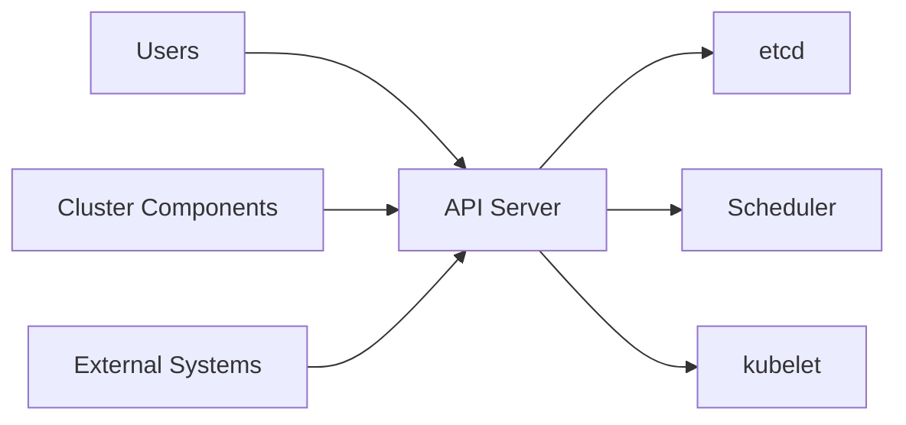
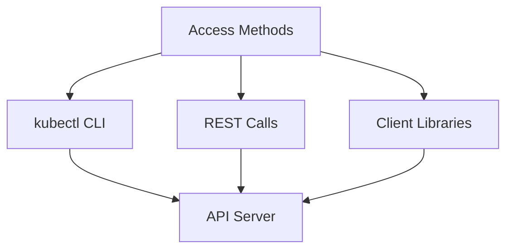

# L'API Kubernetes

L'API Kubernetes est le cœur du plan de contrôle de Kubernetes. Le serveur API expose une API HTTP qui permet la communication entre les utilisateurs, les composants du cluster et les systèmes externes. Pensez à l'API comme au langage que tout dans Kubernetes utilise pour communiquer.



L'API vous permet d'interroger et de manipuler des objets API comme les Pods, les Namespaces, les ConfigMaps et les Events. Chaque action - créer un Pod, mettre à jour un Deployment, vérifier le statut - passe par le serveur API.

## Serveur API

Le kube-apiserver est le hub central de votre cluster. Il valide et traite les requêtes, stocke l'état dans etcd, et gère l'authentification et l'autorisation.

Lorsque vous créez un Pod, le serveur API valide votre spécification, la stocke dans etcd, et d'autres composants comme le scheduler et le kubelet répondent à ce changement.

## Accéder à l'API

La plupart des opérations utilisent **kubectl**, une interface en ligne de commande. Lorsque vous exécutez `kubectl get pods`, kubectl traduit cela en une requête API et affiche les résultats.

Vous pouvez également accéder à l'API directement en utilisant des **appels REST** avec des outils comme curl ou depuis vos applications. C'est utile pour intégrer Kubernetes avec d'autres systèmes.

Kubernetes fournit des **bibliothèques client** pour Go, Python, Java et d'autres langages. Celles-ci gèrent l'authentification et le formatage des requêtes, facilitant la construction d'opérateurs ou de contrôleurs.



## Découverte de l'API

Chaque cluster publie des spécifications API pour que les outils puissent découvrir ce qui est disponible. Il y a deux mécanismes :

**Discovery API** fournit un résumé bref des API, ressources, versions et opérations disponibles. C'est comme un répertoire de ce qui est disponible.

**Document OpenAPI** fournit des schémas OpenAPI v2.0 et v3.0 complets pour tous les endpoints. Il inclut des schémas complets montrant les champs, types et valeurs valides. OpenAPI v3 est préféré pour une vue plus complète.

:::info
L'outil kubectl récupère et met en cache la spécification API pour la complétion en ligne de commande et la validation. Lorsque vous tapez `kubectl get`, il montre les ressources disponibles basées sur la spécification API.
:::

:::command
Pour explorer les versions API disponibles, vous pouvez exécuter :

```bash
kubectl api-versions
```

Cela montre tous les groupes API et versions supportés par votre cluster.

<a target="_blank" href="https://kubernetes.io/docs/reference/using-api/api-overview/#api-versioning">En savoir plus</a>
:::

Ce mécanisme de découverte rend Kubernetes flexible. Lorsque de nouvelles ressources sont ajoutées (comme via CustomResourceDefinitions), elles apparaissent automatiquement dans la découverte API, et des outils comme kubectl peuvent travailler avec elles sans mises à jour.
