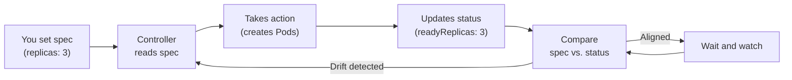

# Spec and Status

## The Question Every System Must Answer

When you ask Kubernetes to run three replicas of your application, how do you know it actually did? And if one crashes five minutes later, how does Kubernetes know to fix it? The answer lies in two fields that almost every Kubernetes object carries: **spec** and **status**. Together, they form a feedback loop that is fundamental to how Kubernetes operates.

## Desired State vs. Current State

Think of a thermostat in your home. You set the desired temperature (say, 21°C) — that is the **spec**. The thermostat reads the actual room temperature — that is the **status**. If the room is too cold, the heater turns on. If it is too warm, the heater turns off. The thermostat never stops checking, and it never stops adjusting.

Kubernetes works the same way:

- **spec** (specification) — You define what you want. For a Deployment, this might include the number of replicas, the container image, resource limits, and environment variables. You are the one who sets the spec; Kubernetes never changes it on its own.

- **status** — Kubernetes and its controllers populate this field with what is actually happening. How many replicas are running? Which Pods are ready? Are there any errors? When you run `kubectl get deployment`, the columns you see — READY, UP-TO-DATE, AVAILABLE — all come from the status.

## The Reconciliation Loop

The magic happens in the space between spec and status. Kubernetes runs a continuous loop — sometimes called the **reconciliation loop** or **control loop** — that works like this:

1. You set the spec (e.g., `replicas: 3`).
2. The controller reads the spec and takes action (creates Pods).
3. The controller updates the status (e.g., `readyReplicas: 3`).
4. Kubernetes compares spec and status. If they match, all is well.
5. If they diverge (a Pod crashes, reducing `readyReplicas` to 2), the controller detects the gap and creates a replacement.

This loop never stops. It runs continuously, keeping the cluster aligned with your intent — even when things go wrong.



Here is what the spec and status might look like for a healthy Deployment:

```yaml
spec:
  replicas: 3
  template:
    spec:
      containers:
        - name: web
          image: nginx:latest
```

```yaml
status:
  replicas: 3
  readyReplicas: 3
  availableReplicas: 3
```

If a Pod crashes, `readyReplicas` drops to 2. The Deployment controller detects the mismatch and starts a replacement. Within seconds, `readyReplicas` climbs back to 3 — without any action from you.

:::info
The status field can temporarily lag behind reality during reconciliation. For example, right after you scale a Deployment, the status may still show the old replica count for a moment. This is normal — the controller needs a few seconds to catch up.
:::

:::warning
Never manually edit the status field. It is managed entirely by Kubernetes controllers. If you try to change it, your modifications will be rejected or silently overwritten.
:::

## Why This Pattern Matters

The spec/status pattern shows up everywhere in Kubernetes — in Pods, Deployments, Services, ReplicaSets, Jobs, and nearly every other object type. Once you understand it, you have a mental model that applies universally:

- When something is broken, compare spec to status. The gap tells you what Kubernetes is trying to fix.
- When you want to change behavior, update the spec. Kubernetes handles the rest.
- When you need to monitor health, watch the status.

---

## Hands-On Practice

### Step 1: Get a Pod Name

```bash
kubectl get pods
```

Note the name of any Running Pod (e.g. `test-nginx`). If none exists, create one with `kubectl run demo-pod --image=nginx` and wait for it to reach Running status.

### Step 2: Inspect Spec vs Status

```bash
kubectl get pod test-nginx -o yaml
```

Replace `test-nginx` with your Pod name. Look for the `spec` section — your desired configuration. Then look for the `status` section — what Kubernetes has actually achieved (phase, conditions, container statuses).

### Step 3: Extract Status with jsonpath

```bash
kubectl get pod test-nginx -o jsonpath='{.status.phase}'
```

Replace `test-nginx` with your Pod name. This extracts just the phase (e.g. `Running`) from the status. The `jsonpath` flag lets you query specific fields without parsing the full YAML.

## Wrapping Up

Spec is your intent; status is Kubernetes's report card. The reconciliation loop bridges the gap between them, continuously adjusting the cluster to match what you asked for. This is not just a technical detail — it is the core philosophy of Kubernetes: declare what you want and let the system figure out how to get there. With this understanding, you are ready to learn about the different ways to manage objects — how to create, update, and maintain them in practice.
