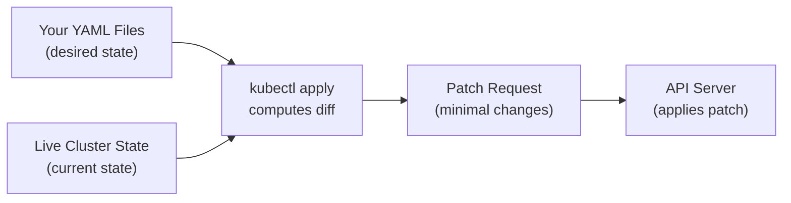

# Declarative Object Configuration

## From Commands to Contracts

In the previous lesson, you learned how imperative commands let you make quick changes with a single line. That speed is great for experimenting, but what happens when you need to reproduce an environment, collaborate with a team, or roll back a change? You need a written record — a contract that describes exactly what the cluster should look like. That is what declarative configuration provides.

Think of it like the difference between giving verbal directions and handing someone a detailed map. Both get you to the destination, but the map can be shared, reviewed, versioned, and reused. Declarative configuration turns your cluster's desired state into files that serve as that map.

## How Declarative Configuration Works

When you run `kubectl apply -f`, something clever happens. Instead of blindly creating or replacing objects, `kubectl` computes a **diff** between three things:

1. The content of your file (what you want).
2. The live object in the cluster (what currently exists).
3. The last-applied configuration annotation (what you applied previously).

From this comparison, it generates a **patch** — a minimal set of changes — and sends it to the API server. This means fields that Kubernetes manages on its own (like a Service's `clusterIP` or an object's `resourceVersion`) are preserved. You only change what your file describes; everything else stays intact.



## Why This Matters for Teams

Declarative configuration shines in collaborative workflows:

- **Version control** — Your manifest files live in Git. Every change is tracked, reviewed in pull requests, and reversible by reverting a commit.
- **Reproducibility** — Anyone can recreate the same environment by running `kubectl apply -f` against the same files.
- **Safety** — `kubectl diff` shows you exactly what will change *before* you apply, so surprises are rare.
- **Automation** — CI/CD pipelines can apply manifests automatically, and GitOps tools like Flux or ArgoCD build on this pattern.

This is the foundation of **infrastructure-as-code**: your files are the source of truth, and the cluster always reflects what those files describe.

:::info
Declarative configuration uses the **patch API**, which only updates the differences between your desired state and the current state. This is fundamentally different from `kubectl replace`, which overwrites the entire object and can accidentally remove fields that Kubernetes set.
:::

## The Recommended Workflow

For production environments, the pattern looks like this:

1. **Edit** your manifest files locally.
2. **Diff** against the cluster to see what will change: `kubectl diff -f configs/`
3. **Apply** the changes: `kubectl apply -f configs/`
4. **Verify** that the changes took effect: `kubectl get all`

This four-step cycle — edit, diff, apply, verify — keeps you in control and prevents accidental changes.

## Common Gotchas

- **Mixing approaches** — If you use `kubectl scale` to change replicas and then `kubectl apply` a manifest, the manifest's replica count wins. Avoid mixing imperative and declarative management on the same object.
- **Immutable fields** — Some fields, like a Deployment's `selector`, cannot be changed after creation. If you need to modify them, delete the object and recreate it.
- **Conflict errors** — If someone else modified the object since your last apply, you may see a conflict. Fetch the current state with `kubectl get -o yaml`, merge your changes, and reapply.
- **Namespace mismatches** — Make sure `metadata.namespace` in your file (or the `-n` flag) matches where you intend the object to live. Run `kubectl diff` before applying to catch these mistakes.

:::warning
If you manually edit live objects with `kubectl edit`, those changes are not reflected in your manifest files. The next `kubectl apply` may overwrite your edits. Always prefer editing files and reapplying — it keeps your files and the cluster in sync.
:::

---

## Hands-On Practice

### Step 1: Create a manifest file

```bash
nano nginx-decl.yaml
```

```yaml
apiVersion: v1
kind: Pod
metadata:
  name: nginx-decl
spec:
  containers:
    - name: nginx
      image: nginx:1.25
```

### Step 2: Apply the manifest

```bash
kubectl apply -f nginx-decl.yaml
```

### Step 3: Preview a change with diff

Edit the file to change the image to `nginx:1.27`, then:

```bash
kubectl diff -f nginx-decl.yaml
```

The diff shows exactly what will change before you commit.

### Step 4: Apply the updated manifest

```bash
kubectl apply -f nginx-decl.yaml
```

### Step 5: Verify

```bash
kubectl get pod nginx-decl -o jsonpath='{.spec.containers[0].image}'
```

It should show `nginx:1.27`.

### Step 6: Clean up

```bash
kubectl delete -f nginx-decl.yaml
```

## Wrapping Up

Declarative configuration is the approach that scales from a solo developer to large organizations. Your files describe the desired state, `kubectl apply` reconciles the cluster to match, and `kubectl diff` gives you a safety net before every change. Combined with version control, this pattern makes your infrastructure reproducible, auditable, and collaborative. As you continue through the course, you will use `kubectl apply` as your primary tool for managing cluster resources — and it all builds on the foundation you have learned here.
