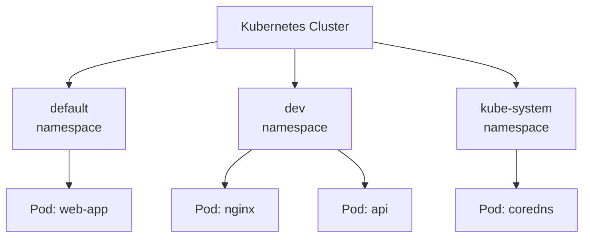

# What Is a Namespace?

## The Problem: Everything in One Pile

Imagine a large office where every employee stores their files in a single shared folder — no subfolders, no organization. Quickly, you would have naming collisions ("report.pdf" from accounting vs. "report.pdf" from marketing), no way to set permissions per team, and no ability to track who is using how much storage. That is what a Kubernetes cluster looks like without namespaces.

## Namespaces: Virtual Clusters Inside Your Cluster

A **namespace** is a way to divide a single Kubernetes cluster into multiple logical sections. Think of namespaces as floors in an office building. Everyone shares the same building (the cluster), but each floor (namespace) has its own rooms, its own names, and its own access rules. A meeting room called "Room A" can exist on the 3rd floor *and* on the 5th floor without any conflict.

In Kubernetes terms:
- Resources in one namespace are isolated from resources in another.
- You can have an `nginx` Deployment in the `dev` namespace and another `nginx` Deployment in the `prod` namespace without any naming conflict.
- You can apply quotas, policies, and access controls per namespace.

## Namespaced vs. Cluster-Scoped Resources

Not everything in Kubernetes lives inside a namespace. Most resources — Pods, Services, Deployments, ConfigMaps — are **namespaced**, meaning they belong to exactly one namespace. A few resources are **cluster-scoped**, meaning they exist across the entire cluster and are not tied to any namespace. Examples include Nodes, PersistentVolumes, and Namespaces themselves.

You can check which resources are namespaced:

```bash
kubectl api-resources --namespaced=true
```

And which are cluster-scoped:

```bash
kubectl api-resources --namespaced=false
```

## The Built-In Namespaces

Every Kubernetes cluster starts with four namespaces:

| Namespace | Purpose |
|---|---|
| `default` | Where objects go if you do not specify a namespace |
| `kube-system` | Kubernetes system components (DNS, proxy, etc.) |
| `kube-public` | Public resources readable by everyone (rarely used) |
| `kube-node-lease` | Node heartbeat data for health monitoring |

When you run `kubectl get pods` without specifying a namespace, you are looking at the `default` namespace. This is convenient for getting started, but as your cluster grows, you will want to create custom namespaces to organize your workloads.

:::info
Resource names must be unique *within* a namespace, but the same name can be reused across different namespaces. This is why namespaces are the first line of organizational structure in most clusters.
:::



:::warning
Do not create or modify resources in `kube-system` unless you know exactly what you are doing. These components are critical for cluster operation, and accidental changes can break the entire cluster.
:::

## When to Use Namespaces

Namespaces are most useful when:
- Multiple teams share the same cluster and need isolated areas.
- You want separate environments (dev, staging, production) within one cluster.
- You need to apply resource quotas or network policies to a specific group of workloads.

For small clusters with a few users, namespaces are optional — you can work entirely in `default`. But as complexity grows, they become essential for keeping things organized and secure.

---

## Hands-On Practice

### Step 1: List Namespaces

```bash
kubectl get namespaces
```

You will see the built-in namespaces: `default`, `kube-system`, and others.

### Step 2: Create a Namespace

```bash
kubectl create namespace dev
```

### Step 3: Run a Pod in the New Namespace

```bash
kubectl run nginx --image nginx -n dev
```

The `-n dev` flag targets the `dev` namespace.

### Step 4: Verify and Compare

```bash
kubectl get pods -n dev
kubectl get pods
```

Pods in `dev` do not appear when you run `kubectl get pods` without `-n` — you are looking at `default` by default. Namespaces keep things separated.

### Step 5: Clean Up

```bash
kubectl delete pod nginx -n dev
kubectl delete namespace dev
```

## Wrapping Up

Namespaces give you a way to partition a single cluster into logical sections, each with its own names, quotas, and access rules. Most resources are namespaced; a few are cluster-scoped. Kubernetes provides four built-in namespaces, and you can create as many custom ones as you need. In the next lesson, you will learn the practical commands for working with namespaces day-to-day — listing resources, switching contexts, and safely cleaning up.
