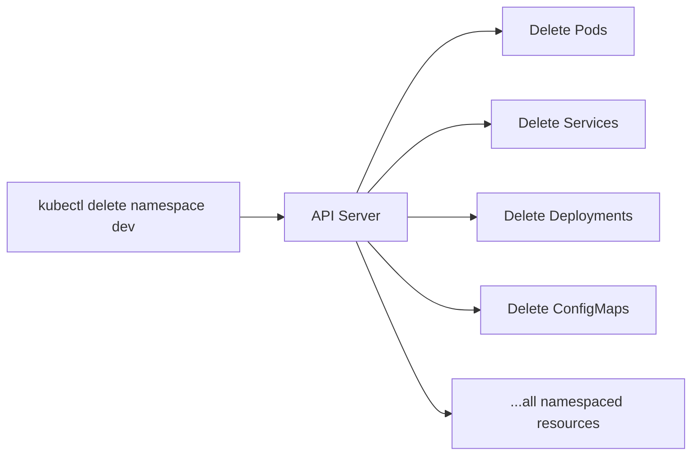

# Working with Namespaces

## From Concept to Daily Workflow

In the previous lesson, you learned what namespaces are and why they matter. Now let's focus on the practical side: how to navigate between namespaces, set a default so you do not have to type `-n` on every command, create namespaces from manifests, and safely delete them when you are done.

Think of switching namespaces like changing floors in an office building. Most of the time you work on one floor, so you want the elevator to default to that floor instead of making you press the button every trip.

## Targeting a Specific Namespace

Every `kubectl` command for namespaced resources accepts the `-n` (or `--namespace`) flag:

```bash
kubectl get pods -n dev
kubectl get services -n staging
kubectl describe deployment nginx -n prod
```

To see resources across *all* namespaces at once, use `-A` (or `--all-namespaces`):

```bash
kubectl get pods -A
kubectl get deployments -A
```

This is useful when you are looking for something but are not sure which namespace it lives in.

## Setting a Default Namespace

If you spend most of your time in one namespace, you can set it as the default for your current context. After that, every command runs against that namespace unless you override with `-n`:

```bash
kubectl config set-context --current --namespace=dev
```

Now `kubectl get pods` shows Pods in `dev`, not `default`. You can verify your current settings:

```bash
kubectl config view --minify | grep namespace
```

:::info
Setting a default namespace saves time and reduces mistakes. If you frequently switch between namespaces, consider tools like `kubens` (part of the <a target="_blank" href="https://github.com/ahmetb/kubectx">kubectx project</a>) that make switching even faster.
:::

## Creating Namespaces from Manifests

While `kubectl create namespace` is great for quick tasks, you can also define namespaces in YAML — which fits naturally into a declarative workflow:

```yaml
apiVersion: v1
kind: Namespace
metadata:
  name: staging
  labels:
    env: staging
```

Apply it:

```bash
kubectl apply -f namespace.yaml
```

Labels on namespaces are useful for applying policies or quotas to groups of namespaces. For example, you could apply a network policy to all namespaces labeled `env: staging`.

## Deleting a Namespace

When a namespace is no longer needed, you can delete it:

```bash
kubectl delete namespace dev
```

This removes the namespace **and everything inside it** — all Pods, Services, Deployments, ConfigMaps, and other namespaced resources. It is a cascade operation, and it can take time if there are many resources or if finalizers need to be processed.



:::warning
Deleting a namespace is irreversible and removes all namespaced resources inside it. Always double-check the target before running the command. Never delete `kube-system` — it will break your cluster.
:::

## A Practical Workflow

Here is a typical sequence for working with namespaces:

```bash
# Create a namespace
kubectl create namespace my-app

# Set it as your default
kubectl config set-context --current --namespace=my-app

# Deploy resources (they go into my-app automatically)
kubectl apply -f deployment.yaml
kubectl apply -f service.yaml

# Verify
kubectl get all

# When done, clean up everything at once
kubectl delete namespace my-app
```

## Handling Common Issues

- **"Resource not found"** — The most common cause is looking in the wrong namespace. Add `-n <namespace>` or use `-A` to search everywhere.
- **Namespace stuck in "Terminating"** — This usually means a finalizer is blocking deletion. Inspect the namespace with `kubectl get namespace dev -o yaml` and look for stuck finalizers.
- **Accidentally working in the wrong namespace** — Always verify your current context with `kubectl config view --minify` before running destructive commands.

## Wrapping Up

Namespaces become second nature once you build a few habits: use `-n` to target specific namespaces, set a default for your most-used one, and use `-A` when you need a cluster-wide view. Deleting a namespace is a powerful cleanup tool, but it deserves caution since everything inside is removed. With these commands in your toolkit, you can navigate and manage multi-namespace clusters confidently. Next, you will learn about labels — the tagging system that lets you organize and select resources within and across namespaces.
