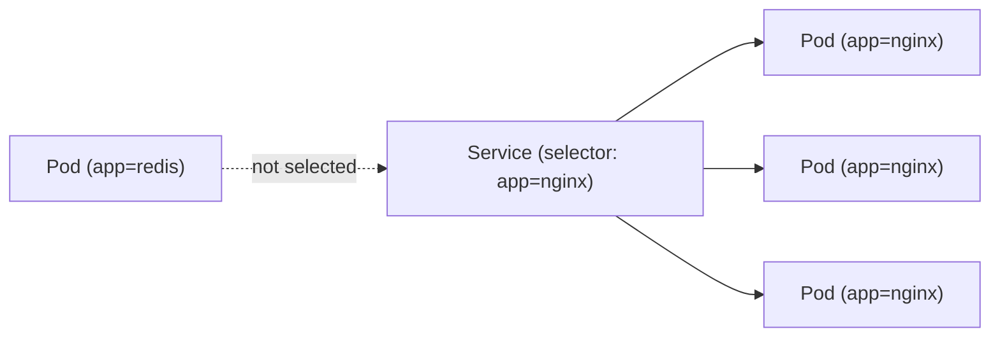

# What Are Labels?

Imagine managing hundreds of Pods in a cluster. How do you tell Kubernetes "route traffic to these specific Pods" or "scale only this group"? You can't do it by name alone — names are unique but they don't describe relationships or categories.

**Labels** are the answer. They're simple key-value pairs you attach to any Kubernetes object, and they're the primary mechanism for organizing, selecting, and connecting resources.

## Labels Are Like Tags

Think of labels as sticky notes on file folders. A folder might have tags saying `project: website`, `env: production`, and `team: frontend`. You can then ask for "all folders tagged `env: production`" and get exactly what you need — without knowing each folder's individual name.

In Kubernetes, labels work the same way:

```yaml
metadata:
  labels:
    app: nginx
    env: production
    tier: frontend
```

This Pod is now searchable, filterable, and targetable by any combination of those labels.

## Why Labels Are Everywhere

Labels aren't just for organization — they're the glue that holds Kubernetes together:

- **Services** use labels to discover which Pods to route traffic to
- **Deployments** use labels to identify which Pods they manage
- **ReplicaSets** use labels to count how many replicas are running
- **Network Policies** use labels to define which Pods can communicate

Without labels, none of these connections would work. When you create a Service with `selector: app: nginx`, it automatically finds every Pod with that label and routes traffic to them. Add a new Pod with the same label, and the Service picks it up automatically.



:::info
Labels enable you to map your own organizational structure onto Kubernetes objects. You decide what matters — environment, team, version, region — and labels carry that information.
:::

## Label Rules

Labels have a few constraints to keep them fast and efficient:

- **Keys**: max 63 characters, must start and end with an alphanumeric character, can contain dots, hyphens, and underscores
- **Values**: same rules, or can be empty
- **Prefixes**: keys can have an optional prefix (like `app.kubernetes.io/name`), separated by a `/`

Reserved prefixes like `kubernetes.io/` and `k8s.io/` are for Kubernetes itself — use your own domain (like `mycompany.com/team`) for custom labels.

## Viewing Labels

To see labels on your resources:

```bash
# Show all labels as an extra column
kubectl get pods --show-labels

# Show specific labels as columns
kubectl get pods -L app,env

# Filter by label
kubectl get pods -l app=nginx
kubectl get pods -l 'env=production,tier=frontend'
```

The `-l` flag is your filter — it selects only resources that match the specified labels. You can combine multiple requirements with commas (all must match).

:::warning
Don't put large or structured data in labels — they're meant to be small and indexed. For longer metadata like documentation links, build info, or JSON config, use **annotations** instead. We'll cover those in the next chapter.
:::

## Wrapping Up

Labels are simple key-value pairs, but they power nearly every connection in Kubernetes — from Service routing to controller management to policy enforcement. Keep them consistent across your resources, and they'll make your cluster organized and queryable. In the next lesson, we'll learn how to add and manage labels on both new and existing resources.
