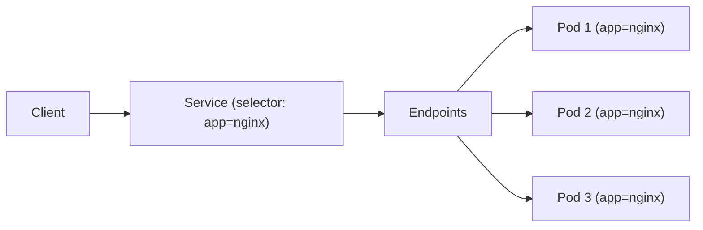

# Label Selectors

Labels alone are just metadata. **Selectors** are what make them powerful — they're the query language that lets you say "give me all objects matching these criteria." Services, Deployments, ReplicaSets, and even `kubectl` commands use selectors to target the right set of resources.

## Two Types of Selectors

Kubernetes supports two selector syntaxes:

**Equality-based** — Simple `key=value` matching. The most common type, used by Services and in `kubectl`:

```bash
# Pods where app equals nginx
kubectl get pods -l app=nginx

# Pods where app equals nginx AND env equals production
kubectl get pods -l 'app=nginx,env=production'

# Pods where env is NOT staging
kubectl get pods -l 'env!=staging'
```

Multiple requirements separated by commas are ANDed — all must match.

**Set-based** — More expressive, using operators like `in`, `notin`, and `exists`:

```bash
# Pods where env is dev OR staging
kubectl get pods -l 'env in (dev,staging)'

# Pods where tier is NOT cache
kubectl get pods -l 'tier notin (cache)'

# Pods that have a "version" label (any value)
kubectl get pods -l 'version'
```

Set-based selectors are powerful for filtering across multiple values or checking for label presence.

## Selectors in Manifests

In YAML manifests, selectors appear in two forms. Services use simple equality-based selectors:

```yaml
apiVersion: v1
kind: Service
metadata:
  name: web-service
spec:
  selector:
    app: nginx
    tier: frontend
  ports:
    - port: 80
```

This Service routes traffic to Pods that have **both** `app: nginx` AND `tier: frontend`. Missing either label means the Pod is not selected.

Deployments and ReplicaSets can use the more expressive `matchLabels` and `matchExpressions`:

```yaml
spec:
  selector:
    matchLabels:
      app: nginx
    matchExpressions:
      - key: env
        operator: In
        values: [production, staging]
```

:::info
In YAML, set-based selectors use `matchExpressions`. On the command line, the `-l` flag uses the shorthand syntax (`env in (dev,staging)`). Both do the same thing — just different syntax for different contexts.
:::

## How Services Use Selectors

When a Service has a selector, Kubernetes automatically creates an **Endpoints** object that lists all Pods matching the selector. Traffic is distributed across those Pods.



You can inspect this with:

```bash
# See which Pods the Service selects
kubectl get endpoints web-service
```

If the endpoints list is empty, no Pods match the selector — check your labels.

## Verifying Selectors

```bash
# Does this selector match any Pods?
kubectl get pods -l app=nginx

# What does the Service actually select?
kubectl get endpoints web-service

# Detailed view of selector matching
kubectl describe service web-service
```

:::warning
Inconsistent labels are one of the most common causes of "why isn't my Service routing traffic?" If a selector expects `app: nginx` but your Pods have `app: web`, the Service finds nothing. Always verify both sides — the selector and the Pod labels.
:::

## Common Pitfalls

- **Empty endpoints** — The selector doesn't match any Pods. Double-check label keys and values on both the Service and the Pods.
- **Too many matches** — A broad selector like `app=nginx` might match Pods from different Deployments. Narrow the selector with additional labels.
- **Orphaned Pods** — Changing a Deployment's selector after creation can disconnect it from its existing Pods, leaving them orphaned while new ones are created.

## Wrapping Up

Selectors are the bridge between labels and Kubernetes functionality. Equality-based selectors handle most cases; set-based selectors provide additional flexibility. Services, Deployments, and ReplicaSets all depend on selectors to find the right Pods — so keeping labels consistent across your resources is essential. With labels and selectors mastered, you're ready to explore annotations — metadata that serves a different but equally important purpose.
