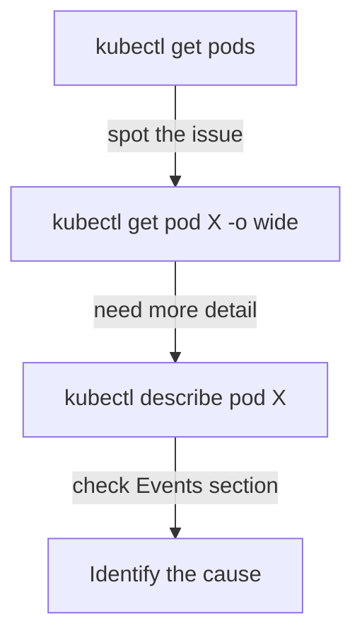

# Viewing Resources

Two kubectl commands will become your daily companions: `kubectl get` and `kubectl describe`. Together, they cover the vast majority of "What's happening in my cluster?" questions. Let's explore how to use them effectively.

## kubectl get — The Quick Overview

`kubectl get` shows resources in a concise table format. It's your first stop when you want to see what's running:

```bash
# List Pods in the current namespace
kubectl get pods

# List Deployments
kubectl get deployments

# List common resource types at once
kubectl get all
```

The output is compact — name, status, age, and a few key fields. Perfect for scanning dozens of resources quickly.

## Making get More Useful

The basic output is just the beginning. Several flags transform `kubectl get` into a more powerful tool:

```bash
# Add node and IP columns
kubectl get pods -o wide

# Show all namespaces at once
kubectl get pods -A

# Filter by label
kubectl get pods -l app=nginx

# Output as YAML (great for debugging or piping)
kubectl get pod nginx-pod -o yaml

# Output as JSON (for scripting)
kubectl get pods -o json
```

The `-o wide` flag is particularly useful — it shows which node each Pod is running on and its IP address, which is essential for networking troubleshooting.

:::info
`kubectl get all` doesn't actually list **all** resource types — it covers Pods, Services, Deployments, ReplicaSets, and a few others. For a complete list of available resource types, use `kubectl api-resources`.
:::

## kubectl describe — The Full Picture

When you need to understand **why** something is happening (or not happening), `describe` is your go-to:

```bash
kubectl describe pod nginx-pod
kubectl describe deployment nginx
kubectl describe node worker-1
```

The output includes everything `get` shows, plus:

- **Conditions** — Is the Pod scheduled? Are containers ready?
- **Events** — Recent activity: scheduling decisions, image pulls, restarts, errors
- **Full configuration** — All labels, annotations, volumes, resource requests

The **Events** section at the bottom is especially valuable. When a Pod is stuck in `Pending` or `CrashLoopBackOff`, the events tell you why — image pull failures, insufficient resources, scheduling conflicts.

## A Practical Debugging Workflow

When something looks wrong, here's a reliable investigation pattern:

```bash
# Step 1: Quick overview — what's the status?
kubectl get pods

# Step 2: More detail on the problem Pod
kubectl get pod problem-pod -o wide

# Step 3: Full diagnostic — events, conditions, config
kubectl describe pod problem-pod
```



## Discovering Resource Types

Kubernetes has many resource types beyond Pods and Deployments. To explore what's available:

```bash
# List all resource types in the cluster
kubectl api-resources

# Filter for a specific type
kubectl api-resources | grep -i ingress

# See which resources are namespaced vs cluster-scoped
kubectl api-resources --namespaced=true
kubectl api-resources --namespaced=false
```

:::warning
If you run `kubectl get pods` and see nothing, check two things: Are you in the right **namespace**? (`kubectl config get-contexts`) And is the resource type correct? A common mistake is looking for Pods in `default` when they're in a different namespace. Use `-A` to search all namespaces.
:::

## Wrapping Up

`kubectl get` gives you fast, tabular overviews. `kubectl describe` gives you the full picture with events and conditions. Use `-o wide` for extra columns, `-A` for all namespaces, `-l` for label filtering, and `-o yaml` for machine-readable output. Together, these commands are your primary window into the cluster. In the next lesson, we'll look at `kubectl logs` and `kubectl exec` — the tools for looking inside running containers.
