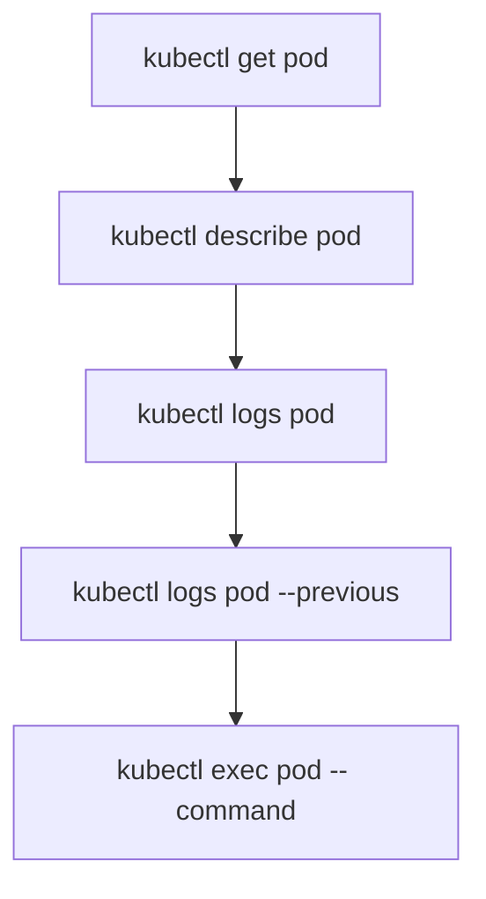

# Logs and Exec

You can see that a Pod is running with `kubectl get`. You can see its events with `kubectl describe`. But what's happening **inside** the container? For that, you need two more essential commands: `kubectl logs` and `kubectl exec`.

## kubectl logs — Reading Container Output

Containers write their output to stdout and stderr, and `kubectl logs` lets you read it:

```bash
# View logs from a Pod
kubectl logs nginx-pod

# Follow logs in real time (like tail -f)
kubectl logs nginx-pod -f

# Show only the last 20 lines
kubectl logs nginx-pod --tail=20

# Show logs from the last hour
kubectl logs nginx-pod --since=1h
```

This is usually your first debugging tool when an application isn't behaving as expected. Application errors, startup messages, request logs — they all show up here.

## Multi-Container Pods

When a Pod has more than one container, you need to specify which container's logs you want:

```bash
# Logs from a specific container
kubectl logs nginx-pod -c nginx

# Logs from the sidecar
kubectl logs nginx-pod -c log-collector

# Logs from ALL containers
kubectl logs nginx-pod --all-containers=true
```

Without `-c`, kubectl will either pick the first container or ask you to specify one — depending on the version.

## Logs from Previous Instances

When a container crashes and restarts, the current logs belong to the new instance. To see what happened before the crash:

```bash
kubectl logs nginx-pod --previous
```

This is invaluable for debugging crash loops — the cause of the crash is usually in the previous instance's logs.

## kubectl exec — Running Commands Inside Containers

Sometimes you need to look inside a running container — check a configuration file, test network connectivity, or inspect the filesystem. `kubectl exec` lets you run commands directly:

```bash
# Run a single command
kubectl exec nginx-pod -- ls /usr/share/nginx/html

# Read a config file
kubectl exec nginx-pod -- cat /etc/nginx/nginx.conf

# Check network connectivity
kubectl exec nginx-pod -- curl -s http://backend-service:8080/health
```

:::info
The `--` separator is important. Everything before `--` is a kubectl option; everything after is passed to the container as the command. Without it, kubectl might interpret your command's flags as its own.
:::

## Interactive Shells

For more exploratory debugging, open an interactive shell:

```bash
kubectl exec -it nginx-pod -- /bin/sh
```

The `-i` flag keeps stdin open, and `-t` allocates a terminal. Together, they give you a shell session inside the container. Exit with `exit` or Ctrl+D.

Not all images have `/bin/sh` — minimal images like `distroless` may not include a shell at all. In those cases, consider using `kubectl debug` (Kubernetes 1.25+) to attach a debug container with the tools you need.

## A Debugging Workflow

Here's a practical sequence for investigating a misbehaving Pod:

```bash
# 1. Check the status
kubectl get pod problem-pod

# 2. Read the events
kubectl describe pod problem-pod

# 3. Check the logs
kubectl logs problem-pod --tail=50

# 4. If it crashed, check previous logs
kubectl logs problem-pod --previous

# 5. If it's running but wrong, look inside
kubectl exec problem-pod -- cat /app/config.yaml
kubectl exec -it problem-pod -- /bin/sh
```



:::warning
`kubectl exec` gives you direct access to a running container with whatever permissions that container has. In production, use it carefully — and prefer read-only operations (checking files, running diagnostics) over modifying state. For sensitive environments, RBAC can restrict who can exec into Pods.
:::

## Wrapping Up

`kubectl logs` reads container output — use `-f` to follow, `--tail` for recent lines, `--previous` for crashed containers, and `-c` for multi-container Pods. `kubectl exec` runs commands inside containers — use `--` to separate kubectl flags from the command, and `-it` for interactive shells. These two commands, combined with `get` and `describe`, give you a complete toolkit for understanding what's happening in your cluster from the outside in.
