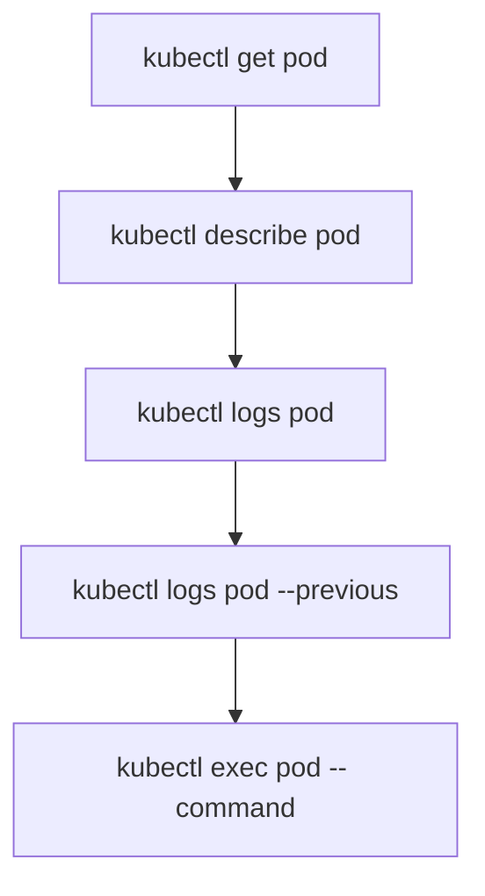

# Logs and Exec

You can see that a Pod is running with `kubectl get`. You can see its events with `kubectl describe`. But what's happening **inside** the container? For that, you need two more essential commands: `kubectl logs` and `kubectl exec`.

## kubectl logs — Reading Container Output

Containers write their output to stdout and stderr, and `kubectl logs` lets you read it. Use `-f` to follow in real time, `--tail=N` for the last N lines, and `--since=1h` for recent logs. This is usually your first debugging tool when an application isn't behaving as expected — application errors, startup messages, and request logs all show up here.

## Multi-Container Pods

When a Pod has more than one container, use `-c <container-name>` to specify which container's logs you want, or `--all-containers=true` for all of them. Without `-c`, kubectl picks the first container or asks you to specify one.

## Logs from Previous Instances

When a container crashes and restarts, the current logs belong to the new instance. Use `kubectl logs <pod> --previous` to see what happened before the crash — invaluable for debugging crash loops.

## kubectl exec — Running Commands Inside Containers

Sometimes you need to look inside a running container — check a configuration file, test network connectivity, or inspect the filesystem. `kubectl exec` lets you run commands directly. The `--` separator is important: everything before it is a kubectl option; everything after is passed to the container.

:::info
The `-i` flag keeps stdin open, and `-t` allocates a terminal for interactive shells. Not all images have `/bin/sh` — minimal images like `distroless` may not include a shell.
:::



:::warning
`kubectl exec` gives you direct access to a running container with whatever permissions that container has. In production, use it carefully — and prefer read-only operations (checking files, running diagnostics) over modifying state. For sensitive environments, RBAC can restrict who can exec into Pods.
:::

---

## Hands-On Practice

You need a Running Pod. Use `kubectl run nginx-pod --image=nginx` or an existing Pod from earlier lessons.

### Step 1: View Logs

```bash
kubectl logs nginx-pod
kubectl logs nginx-pod --tail=20
```

Application output goes to stdout/stderr and appears here. Use `-f` to follow logs in real time.

### Step 2: Run a Command in the Container

```bash
kubectl exec nginx-pod -- ls /usr/share/nginx/html
kubectl exec nginx-pod -- cat /etc/nginx/nginx.conf
```

The `--` separates kubectl options from the command passed to the container.

### Step 3: Open an Interactive Shell

```bash
kubectl exec -it nginx-pod -- /bin/sh
```

You are now inside the container. Run commands like `ls`, `pwd`, `curl`. Exit with `exit` or Ctrl+D.

## Wrapping Up

`kubectl logs` reads container output — use `-f` to follow, `--tail` for recent lines, `--previous` for crashed containers, and `-c` for multi-container Pods. `kubectl exec` runs commands inside containers — use `--` to separate kubectl flags from the command, and `-it` for interactive shells. These two commands, combined with `get` and `describe`, give you a complete toolkit for understanding what's happening in your cluster from the outside in.
