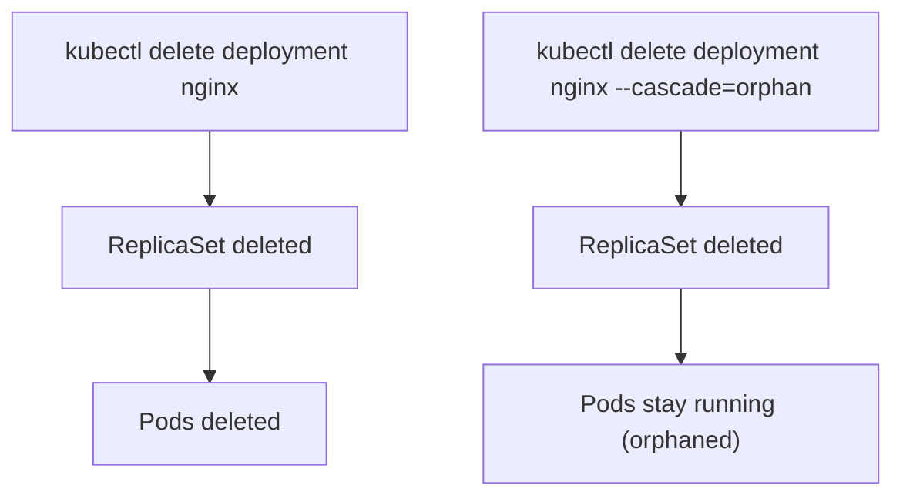

# Edit and Delete

You can view resources, read logs, and exec into containers. Now let's cover the last two essential operations: modifying live resources with `kubectl edit` and removing them with `kubectl delete`.

Both are powerful — and both come with important caveats for production use.

## kubectl edit — Quick Live Changes

`kubectl edit` opens a resource in your default text editor (usually `vim` or `nano`). When you save and close, the changes are applied immediately:

```bash
kubectl edit deployment nginx
kubectl edit pod nginx-pod
```

This is convenient for quick experiments — changing an environment variable, adjusting a replica count, or tweaking a label. You see the full resource definition and can modify any mutable field.

## Why Edit Has a Tradeoff

Here's the catch: `kubectl edit` modifies the **live object** in the cluster, but it doesn't update your manifest files on disk. The next time someone runs `kubectl apply -f deployment.yaml`, your manual edits could be overwritten.

Think of it like editing a shared Google Doc directly while someone else has a local copy. Your changes are live, but their copy is out of date — and when they upload theirs, your changes disappear.

For production workflows, the recommended approach is:

1. Edit your manifest files
2. Run `kubectl diff -f deployment.yaml` to preview changes
3. Run `kubectl apply -f deployment.yaml` to apply

:::warning
`kubectl edit` is great for debugging and experimentation, but avoid it for production changes. Your manifest files should always be the source of truth. If you use edit in production, immediately update your files to match.
:::

## kubectl delete — Removing Resources

`kubectl delete` removes objects from the cluster:

```bash
# Delete a specific Pod
kubectl delete pod nginx-pod

# Delete a Deployment (cascades to ReplicaSets and Pods)
kubectl delete deployment nginx

# Delete using a manifest file
kubectl delete -f deployment.yaml

# Delete all Pods in a namespace
kubectl delete pods --all -n dev
```

## Cascade Behavior

When you delete a Deployment, Kubernetes cascades the deletion — it also deletes the ReplicaSets and Pods that the Deployment manages. This is the default behavior and usually what you want.

But sometimes you want to delete a controller while keeping its Pods running (for debugging or migration):

```bash
# Delete the Deployment but keep its Pods
kubectl delete deployment nginx --cascade=orphan
```

The Pods continue running but are now "orphaned" — no controller manages them. They won't be recreated if they crash.



## Verifying After Changes

Always verify that your edit or delete had the expected effect:

```bash
# After editing
kubectl get deployment nginx -o yaml
kubectl describe deployment nginx

# After deleting
kubectl get deployment nginx
kubectl get pods -l app=nginx
```

If a delete seems stuck, check for **finalizers** — some resources block deletion until a controller finishes cleanup:

```bash
kubectl get pod stuck-pod -o jsonpath='{.metadata.finalizers}'
```

## Important Safety Notes

**Deleting a namespace** removes everything inside it — all Pods, Services, ConfigMaps, Secrets, PVCs, everything. This is irreversible:

```bash
# This deletes ALL resources in the namespace
kubectl delete namespace dev
```

**Deleting PVCs** may delete the underlying storage (depending on the reclaim policy). Check before you delete.

**Force deletion** should be a last resort:

```bash
# Only use when a Pod is truly stuck
kubectl delete pod stuck-pod --force --grace-period=0
```

:::info
If you accidentally delete something managed by a controller (like a Pod owned by a Deployment), don't panic — the controller will recreate it automatically. That's the beauty of the declarative model. The controller continuously reconciles desired state with actual state.
:::

## Wrapping Up

`kubectl edit` provides quick in-place modifications — useful for experimentation, but not recommended for production where manifest files should be the source of truth. `kubectl delete` removes resources, with cascade behavior that propagates through the ownership chain. Use `--cascade=orphan` when you need to keep child resources alive. Together with `get`, `describe`, `logs`, and `exec`, you now have the complete set of essential kubectl operations for day-to-day Kubernetes work.
