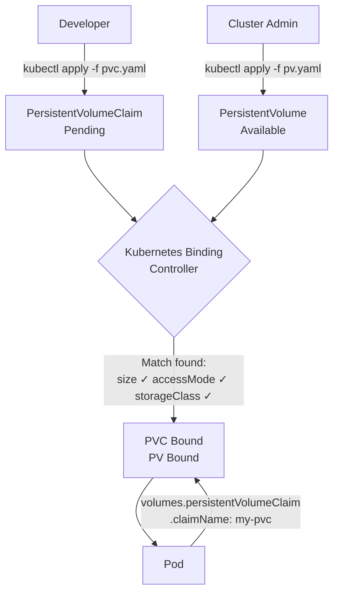

# PersistentVolumes and PersistentVolumeClaims

One of the most fundamental rules of running applications in Kubernetes is that Pods are ephemeral. They get created, they run for a while, and then they disappear — whether because of a crash, a rolling update, or a rescheduling event. When a Pod disappears, everything inside its container filesystem disappears with it. For a stateless web server, that is perfectly fine. But for a database, a message broker, or any application that needs to preserve state between restarts, this is a serious problem.

Kubernetes provides several ways to attach storage to a Pod. The simplest approaches — `emptyDir` and `hostPath` — are quick to set up but come with significant limitations that make them unsuitable for most real-world stateful workloads.

## The Problem with Inline Volumes

An `emptyDir` volume is created fresh every time a Pod is scheduled onto a node. It shares the Pod's lifetime: when the Pod is deleted, the `emptyDir` is deleted too. This makes it useful for temporary scratch space or sharing files between containers in the same Pod, but completely useless for durable storage.

A `hostPath` volume is slightly better — it mounts a directory from the node's own filesystem into the container. The data survives a Pod restart as long as the Pod comes back to the *same node*. But Kubernetes makes no such guarantee. If the Pod is rescheduled to a different node (which happens during maintenance windows, node failures, or cluster autoscaling events), it starts with an empty `hostPath` directory on the new node. Worse, `hostPath` tightly couples your application to the infrastructure of a specific machine, making it fragile and difficult to manage at scale.

Both of these approaches share a deeper design flaw: the storage configuration lives *inside the Pod spec*. This means the developer writing the Pod manifest needs to know details about the underlying infrastructure — which node has the data, what the path is, whether NFS is available, and so on. This violates the principle of separation of concerns that makes Kubernetes so powerful.

## Enter PersistentVolumes and PersistentVolumeClaims

Kubernetes solves these problems with a two-object model: the **PersistentVolume (PV)** and the **PersistentVolumeClaim (PVC)**. These two objects work together to decouple storage infrastructure from application code.

A **PersistentVolume** is a piece of storage that has been provisioned in the cluster. It could be an NFS share on a file server, a cloud block storage disk (like an AWS EBS volume or a GCP Persistent Disk), a local SSD on a node, or any other storage backend that Kubernetes supports. The PV is a cluster-level resource: it exists independently of any namespace or Pod. Typically, a cluster administrator creates and manages PVs, handling all the low-level infrastructure details.

A **PersistentVolumeClaim** is a *request* for storage made by a user or developer. When you write a PVC, you're not saying "give me this specific NFS share at this IP address." You're saying "I need 10 gigabytes of storage that I can mount as read-write from a single node." Kubernetes then goes looking for a PV that satisfies your requirements and binds the two together.

## The Parking Lot Analogy

A helpful way to think about this is to imagine a large parking structure. The parking lot itself — with all its numbered spaces — is like the pool of PersistentVolumes. The parking lot manager (the cluster administrator) maintains the structure, paints the lines, and decides how many spaces there are.

When you arrive, you don't pick a specific space yourself. Instead, you present your parking permit — that's the PersistentVolumeClaim. Your permit says "I need a space large enough for an SUV." The parking attendant (Kubernetes) finds a suitable space that matches your requirements and reserves it for you. You drive in and park. You — the driver, or in our analogy, the Pod — don't need to know which specific space you're in. You just need to know you have one.

When you leave, your permit becomes available again (or is retired, depending on the policy). The space might be re-assigned to another driver, or it might be held in reserve for you to return.

:::info
This separation of roles is one of the most important design decisions in Kubernetes storage. Cluster administrators manage the infrastructure (PVs); application developers consume it (PVCs). Neither needs to know the details of the other's world.
:::

## How Binding Works

When you create a PVC, Kubernetes immediately starts looking for a compatible PV. The matching algorithm checks three things:

First, the **access mode** must be compatible — if your PVC requests `ReadWriteOnce`, the PV must support it. Second, the **storage size** of the PV must be at least as large as what the PVC requests (a PV with 10Gi can satisfy a PVC requesting 5Gi, but not the other way around). Third, the **StorageClass** must match — both the PV and PVC need to reference the same StorageClass, or both must have none.

When a matching PV is found, Kubernetes binds the PVC to it. The PV's status changes from `Available` to `Bound`, and the PVC's status becomes `Bound` as well. From that point on, that PV is exclusively reserved for this PVC — no other PVC can claim it.



## Dynamic Provisioning: The Modern Approach

Manually creating PVs ahead of time works well in small clusters, but it doesn't scale. If you have dozens of teams submitting PVCs, someone has to provision the right storage in advance and keep up with demand. This is tedious and error-prone.

**Dynamic provisioning** solves this by automating PV creation entirely. When a PVC references a **StorageClass** that has a provisioner configured (for example, the AWS EBS provisioner or the GCP Persistent Disk provisioner), Kubernetes automatically creates a matching PV the moment the PVC is submitted. The PVC goes straight from `Pending` to `Bound` without any manual admin intervention.

Most modern Kubernetes environments — managed clusters on AWS, GCP, Azure, or platforms like GKE and EKS — come with StorageClasses pre-configured. In many cases, you can create a PVC and have it bound within seconds without ever thinking about the underlying PV.

:::warning
Even with dynamic provisioning, understanding PVs and PVCs is essential. You still need to know how to troubleshoot binding failures, understand reclaim policies (what happens to your data when the PVC is deleted), and choose the right StorageClass for your workload's performance and durability requirements.
:::

## Summary of the Model

The PV/PVC model gives you three important properties. **Durability**: the storage lifecycle is independent from the Pod lifecycle — data survives Pod restarts and rescheduling. **Portability**: application manifests reference PVCs by name, not by infrastructure-specific details, making them portable across environments. **Separation of concerns**: administrators handle infrastructure; developers handle application configuration.

## Hands-On Practice

In this exercise you will create a simple PersistentVolume backed by a `hostPath` (suitable for a single-node lab cluster), then inspect its state.

**Step 1: Create the PersistentVolume**

```bash
kubectl apply -f - <<EOF
apiVersion: v1
kind: PersistentVolume
metadata:
  name: demo-pv
spec:
  capacity:
    storage: 1Gi
  accessModes:
    - ReadWriteOnce
  persistentVolumeReclaimPolicy: Retain
  storageClassName: manual
  hostPath:
    path: /tmp/demo-pv-data
EOF
```

**Step 2: Check the PV status**

```bash
kubectl get pv demo-pv
```

Expected output:

```
NAME      CAPACITY   ACCESS MODES   RECLAIM POLICY   STATUS      CLAIM   STORAGECLASS   AGE
demo-pv   1Gi        RWO            Retain           Available           manual         5s
```

The status is `Available` — the PV exists and is waiting to be claimed.

**Step 3: Create a PersistentVolumeClaim**

```bash
kubectl apply -f - <<EOF
apiVersion: v1
kind: PersistentVolumeClaim
metadata:
  name: demo-pvc
  namespace: default
spec:
  accessModes:
    - ReadWriteOnce
  resources:
    requests:
      storage: 1Gi
  storageClassName: manual
EOF
```

**Step 4: Observe the binding**

```bash
kubectl get pv demo-pv
kubectl get pvc demo-pvc
```

Expected output:

```
NAME      CAPACITY   ACCESS MODES   RECLAIM POLICY   STATUS   CLAIM              STORAGECLASS   AGE
demo-pv   1Gi        RWO            Retain           Bound    default/demo-pvc   manual         30s

NAME       STATUS   VOLUME    CAPACITY   ACCESS MODES   STORAGECLASS   AGE
demo-pvc   Bound    demo-pv   1Gi        RWO            manual         10s
```

Both the PV and the PVC now show `Bound`. The PVC column on the PV shows which claim it is bound to, and the PVC shows which volume it has been assigned. Kubernetes matched them automatically based on the access mode, size, and storage class. Open the cluster visualizer (telescope icon) to see these objects represented graphically.
