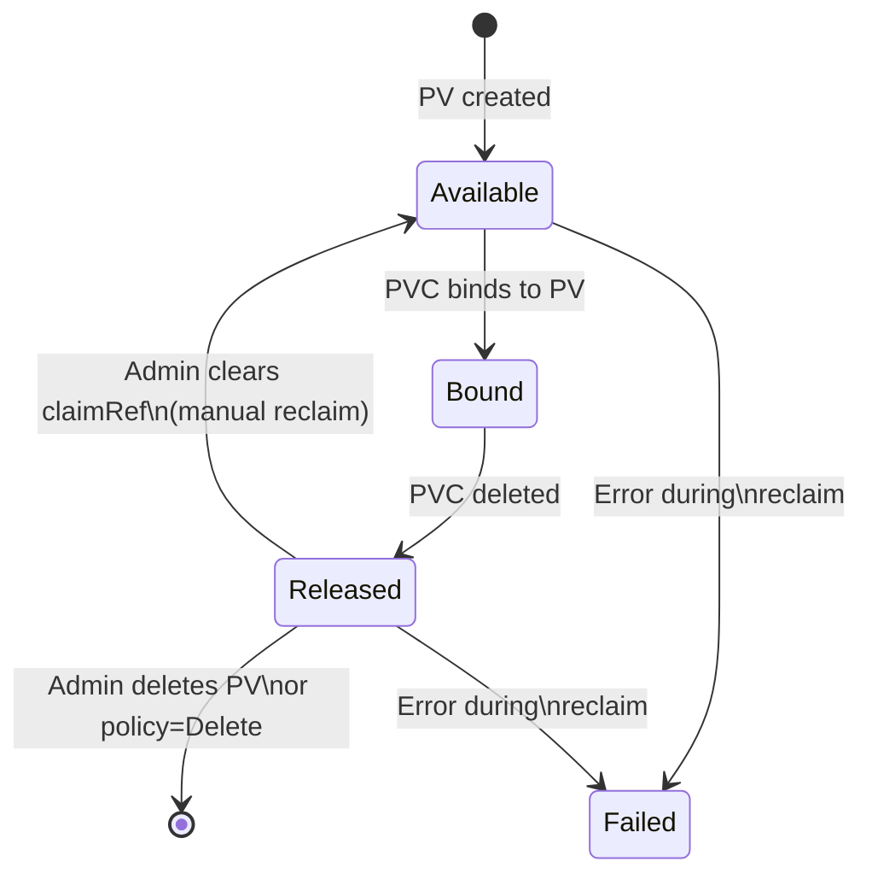

# Creating a PersistentVolume

Now that you understand the conceptual relationship between PersistentVolumes and PersistentVolumeClaims, it's time to look closely at what a PV manifest actually contains and what each field means. Creating PVs by hand is something you will do primarily in learning environments and on self-managed clusters, but understanding the structure is essential even when dynamic provisioning does the work for you, because troubleshooting storage problems always requires reading and interpreting PV objects.

## PVs Are Cluster-Scoped Resources

:::info
A PersistentVolume is a **cluster-scoped** resource, unlike Pods, Deployments, or Services, it does not belong to any namespace. When you run `kubectl get pv`, you see all PVs in the cluster regardless of your current namespace context. You do not need to pass `-n <namespace>`.
:::

This design makes sense: a storage resource is infrastructure, and infrastructure typically spans the entire cluster rather than being confined to one team's namespace.

## Anatomy of a PersistentVolume Manifest

Here is a complete example of a PV manifest:

```yaml
apiVersion: v1
kind: PersistentVolume
metadata:
  name: my-pv
spec:
  capacity:
    storage: 5Gi
  accessModes:
    - ReadWriteOnce
  persistentVolumeReclaimPolicy: Retain
  storageClassName: manual
  hostPath:
    path: /mnt/data
```

Let's walk through each field carefully.

### `capacity.storage`

This defines the size of the volume, in this case, 5 gibibytes. Kubernetes uses binary SI suffixes: `Ki`, `Mi`, `Gi`, `Ti`. When a PVC is evaluated against this PV, the PVC's requested size must be less than or equal to this value. A PVC requesting 3Gi would match this PV; one requesting 10Gi would not.

Note that the capacity field is declarative and informational. Kubernetes trusts what you write here, it does not independently verify that the underlying storage actually has that much space. If you provision a 2Gi disk on your infrastructure but declare `5Gi` in the manifest, Kubernetes will believe you until applications start failing with out-of-space errors.

### `accessModes`

Access modes describe how many nodes can mount the volume simultaneously and whether they can write to it. There are three classic modes (and one newer addition we'll cover in the access modes lesson):

- **ReadWriteOnce (RWO)**: The volume can be mounted read-write by a single node. This is the most common mode and is supported by nearly all block storage backends.
- **ReadOnlyMany (ROX)**: The volume can be mounted read-only by multiple nodes at the same time. Useful for distributing static configuration or data files.
- **ReadWriteMany (RWX)**: The volume can be mounted read-write by multiple nodes simultaneously. This requires networked storage (NFS, CephFS, etc.) and is not supported by most cloud block storage providers.

A PV can advertise multiple access modes. When binding, Kubernetes looks for a PV that supports at least the mode requested by the PVC.

:::info
Access modes describe capabilities at the **node** level, not the Pod level. `ReadWriteOnce` means one node at a time, multiple Pods on the _same_ node could theoretically mount it simultaneously if the underlying driver allows it.
:::

### `persistentVolumeReclaimPolicy`

This field determines what happens to the PV, and the underlying storage, when the PVC that claimed it is deleted. Think of it as the "what happens to the parking space when you return your permit" policy. There are three options:

**Retain** is the safest choice. When the PVC is deleted, the PV moves to a `Released` state with all its data intact. However, a `Released` PV cannot be automatically re-bound to a new PVC, an administrator must manually inspect the data and either delete the PV or clear the `claimRef` field to make it available again. This is ideal for databases and any data you cannot afford to lose accidentally.

**Delete** is the most common choice when using dynamic provisioning. When the PVC is deleted, Kubernetes automatically deletes the PV _and_ the underlying storage resource (calling the AWS or GCP API to delete the actual disk). This is convenient for ephemeral workloads but dangerous if you delete a PVC by mistake.

**Recycle** is deprecated and should not be used in new clusters. It used to scrub the volume with a basic `rm -rf /` and make it available again, but this approach was too crude and has been replaced by dynamic provisioning.

:::warning
If you are using `Delete` as your reclaim policy (which is the default for most dynamically provisioned StorageClasses), deleting a PVC **permanently destroys your data**. Always confirm the reclaim policy before deleting PVCs in production.
:::

### `storageClassName`

This field links the PV to a StorageClass. When a PVC specifies `storageClassName: manual`, Kubernetes only considers PVs that also have `storageClassName: manual` when trying to bind. Setting an empty string (`storageClassName: ""`) means the PV has no storage class and can only be bound by PVCs that also explicitly set `storageClassName: ""`. This is used for manual, pre-provisioned binding.

### The Volume Source

The last part of the spec defines where the storage actually comes from. In the example above we use `hostPath`, which mounts a directory from the node's local filesystem. This is useful for development and testing on single-node clusters but is not suitable for production because the data is tied to a specific node.

In production you would see fields like `nfs` (for an NFS share), `awsElasticBlockStore` (for an EBS volume, in older configurations), `csi` (for modern Container Storage Interface drivers), and many others. The specific fields vary by backend, consult the documentation for your storage provider.

## PV Lifecycle Phases

A PersistentVolume moves through a defined set of phases during its lifetime. Understanding these phases is critical for diagnosing storage problems.



- **Available**: The PV has been created and is not yet bound to any PVC. It is ready to be claimed.
- **Bound**: A PVC has been bound to this PV. The PV is exclusively reserved for that PVC and will not be given to another.
- **Released**: The PVC has been deleted. The PV still exists and its data is intact, but it cannot be claimed by a new PVC without administrator action.
- **Failed**: Something went wrong during the automatic reclaim process. This is rare but worth checking when a PV seems stuck.

## A Note on Production Workflows

In a real production cluster, you will rarely write PV manifests by hand, StorageClasses with dynamic provisioning handle PV creation automatically in response to PVC requests. Manual PVs are still relevant in specific scenarios: migrating data from an old system, using storage backends that don't have a CSI driver, or binding a PVC to a specific pre-existing disk for data recovery. Even if you never create a PV manually in production, you will absolutely need to read and interpret them: when a PVC is stuck in `Pending`, the first thing you check is whether any compatible PVs exist.

## Hands-On Practice

In this exercise you'll create a PV, inspect its details, and observe its phase.

**Step 1: Create the PersistentVolume**

```bash
kubectl apply -f - <<EOF
apiVersion: v1
kind: PersistentVolume
metadata:
  name: my-pv
spec:
  capacity:
    storage: 5Gi
  accessModes:
    - ReadWriteOnce
  persistentVolumeReclaimPolicy: Retain
  storageClassName: manual
  hostPath:
    path: /mnt/data
EOF
```

**Step 2: List PersistentVolumes**

```bash
kubectl get pv
```

Expected output:

```
NAME    CAPACITY   ACCESS MODES   RECLAIM POLICY   STATUS      CLAIM   STORAGECLASS   AGE
my-pv   5Gi        RWO            Retain           Available           manual         4s
```

**Step 3: Inspect the full PV spec**

```bash
kubectl describe pv my-pv
```

Expected output (abbreviated):

```
Name:            my-pv
Labels:          <none>
Annotations:     <none>
Finalizers:      [kubernetes.io/pv-protection]
StorageClass:    manual
Status:          Available
Claim:
Reclaim Policy:  Retain
Access Modes:    RWO
VolumeMode:      Filesystem
Capacity:        5Gi
...
Source:
    Type:          HostPath (bare host directory volume)
    Path:          /mnt/data
    HostPathType:
```

Notice the `Finalizers` field, Kubernetes adds `kubernetes.io/pv-protection` automatically to prevent accidental deletion of a PV while it is in use.

**Step 4: Try to delete the PV while it has a finalizer**

```bash
kubectl delete pv my-pv --wait=false
kubectl get pv my-pv
```

If the PV is not bound, deletion will proceed immediately. If it were bound to a PVC, the finalizer would block deletion until the PVC was removed first. This is a safety mechanism built into Kubernetes.

**Step 5: Check PV details in the cluster visualizer**

Open the cluster visualizer using the telescope icon in the right panel. Navigate to "PersistentVolumes" to see `my-pv` represented as a node in the cluster graph. You'll be able to see its status and any binding relationships visually.
