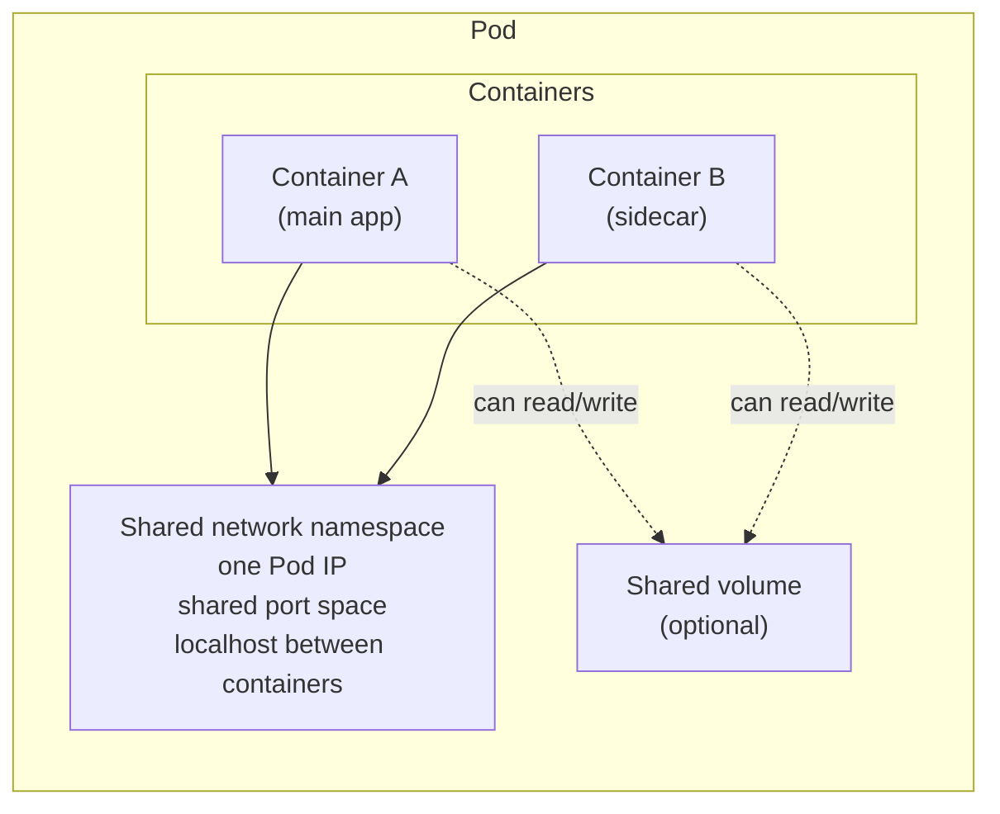

# What Is a Pod?

If you ask a Kubernetes newcomer what the basic building block of the platform is, they will often say "a container." That's understandable, containers are what you're running, after all. But Kubernetes doesn't schedule or manage containers directly. It manages something called a **Pod**, and understanding the difference is one of the most important conceptual steps in your Kubernetes journey.

## The Smallest Deployable Unit

A **Pod** is the smallest unit that Kubernetes schedules and manages, a wrapper around one or more containers. Every Pod gets its own IP address, its own filesystem, its own lifecycle, and its own resource allocation. Kubernetes doesn't interact with containers directly; it interacts with Pods, and the container runtime (like containerd) inside each node handles the actual container execution.

The reason Pods exist is **co-location**: sometimes you need two or more processes to run so tightly together that they must share resources, specifically, a network interface and optionally a storage volume. Containers in the same Pod share the same network namespace: the same IP address, the same port space, and `localhost` for inter-container communication.

Think of it like an apartment building. Each **apartment** is a Pod; the **roommates** inside are containers. They share the same street address (the Pod's IP) and the same mailbox. When the building manager (the scheduler) assigns an apartment, all roommates move in together, always on the same floor, always on the same node.



## Single vs. Multi-Container Pods

Most Pods contain exactly one container, and that should be the default. However, there are well-established patterns where multiple containers per Pod make sense, specifically when two processes need to share the same network or storage.

The most common is the **sidecar pattern**: your main app writes logs to a file on disk, and a second container reads from the same shared volume and ships those logs to a centralized backend. Other examples include:

- A proxy container (like Envoy in a service mesh) that intercepts all network traffic
- A metrics agent that collects and exposes data for scraping
- **Init containers** that run setup tasks before the main container starts (covered in the next lesson)

The key question: _does this second process need to share the same network namespace or storage as the main process?_ If yes, a multi-container Pod is appropriate. If the two processes are independent, they should be separate Pods.

Don't put containers in the same Pod just because they're part of the same application. A web frontend and a backend API communicate over the network using Services, they don't need to share `localhost`. Putting them together means they always scale and restart together, which is almost never what you want. Similarly, databases belong in their own Pods with their own storage lifecycle.

:::info
A helpful mental test: if you scaled this Pod to five replicas, would it make sense to have five of container A and five of container B together? If container B doesn't need to scale with container A, they should be in different Pods.
:::

## Pods Are Ephemeral

Perhaps the most important thing to understand about Pods is that **they are ephemeral**. A Pod can be evicted from a node if resources run out, deleted during a Deployment update, or die if the container crashes with a `Never` restart policy. Pods are not self-healing by themselves, if a Pod dies, nothing automatically creates a new one unless a **controller** (like a Deployment or ReplicaSet) is managing it.

:::warning
Never run a standalone Pod in production and expect it to be automatically replaced if it dies. Always use a Deployment (or another appropriate controller) so that the cluster can maintain the desired number of running Pods. Standalone Pods are useful for learning, debugging, and one-off tasks, not for production workloads.
:::

Think of Pods like cattle, not pets. If one dies, the controller creates another. It doesn't mourn the old Pod; it just ensures the count is right.

## Hands-On Practice

Let's get familiar with Pods in your cluster. Open the terminal on the right.

**1. Create a simple single-container Pod:**

```bash
kubectl run nginx-pod --image=nginx:1.28
```

**2. Check that it's running:**

```bash
kubectl get pods
kubectl get pod nginx-pod -o wide
```

The `-o wide` flag shows you which node the Pod landed on and what IP address it was assigned.

**3. Inspect the Pod's details:**

```bash
kubectl describe pod nginx-pod
```

Look at the `IP:` field (the Pod's IP address), the `Node:` field (where it's scheduled), and the `Containers:` section showing the nginx container.

**4. Create a multi-container Pod using a manifest:**

Save the following to a file called `multi-container.yaml`:

```yaml
# multi-container.yaml
apiVersion: v1
kind: Pod
metadata:
  name: multi-container-pod
spec:
  containers:
    - name: main-app
      image: nginx:1.28
    - name: sidecar
      image: redis:7.0
```

Apply it:

```bash
kubectl apply -f multi-container.yaml
kubectl get pod multi-container-pod
```

**5. Check the logs of each container separately:**

```bash
kubectl logs multi-container-pod -c main-app --tail=5
kubectl logs multi-container-pod -c sidecar --tail=5
```

You should see different output patterns for nginx and redis. Notice you need to specify the container name with `-c` when a Pod has more than one container.

**6. Confirm they share the same IP:**

```bash
kubectl get pod multi-container-pod -o jsonpath='{.status.podIP}'
```

Both containers in this Pod communicate on this single IP address.

**7. Clean up:**

```bash
kubectl delete pod nginx-pod
kubectl delete pod multi-container-pod
```

You now understand what a Pod is, why it exists as a concept separate from containers, when multiple containers make sense, and why standalone Pods are not meant to be long-lived production entities. In the next lesson, we'll go deep into the anatomy of a Pod manifest.
